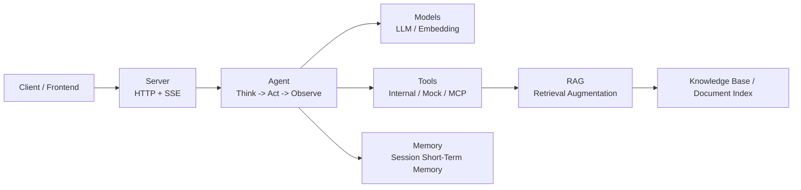

# Dubbo Admin AI Documentation

Dubbo Admin AI is a set of runtime and service capabilities that brings AI features into Dubbo Admin. It combines model inference, tool invocation, knowledge retrieval, session management, and streaming output into a deployable service. Its goal is not "just chatting", but giving the system actionable capabilities for operations, troubleshooting, and knowledge Q&A.

If this is your first time looking at the project, treat it as three layers:

- Access layer: HTTP API + SSE streaming output. It receives requests, manages sessions, and pushes intermediate results to the client.
- Orchestration layer: the Agent thinks, decides whether to call tools, merges results, and produces the final answer.
- Capability layer: Models, Tools, Memory, and RAG provide model access, tools, short-term memory, and knowledge retrieval.

## Where to start

- Want to run the service first: start with [Quick Start](quick-start.md).
- Want to understand the API and detailed YAML parameters: start with the [User Guide](wiki/user-guide/index.md).
- Want to understand the architecture and code: start with the [Developer Guide](wiki/developer-guide/architecture-overview.md).

## Documentation scope

- User-facing guidance: how to deploy, integrate, and troubleshoot the service.
- Developer-facing guidance: runtime lifecycle, component boundaries, Agent workflow, the RAG subsystem, the tool system, and configuration mechanics.
- Evolution-oriented notes: why the system is designed this way, what the current constraints are, and what may change next.

## Key facts

- The service listens on `http://localhost:8880` by default.
- The API base path prefix is `/api/v1/ai`.
- The streaming endpoint uses `text/event-stream`.
- Startup loads component config from `config.yaml`, then runtime creates and initializes components in factory registration order.
- The default component order is `logger -> memory -> models -> rag -> tools -> server -> agent`.

## Configuration overview

If you only want a high-level picture first, do not try to read every YAML file immediately. Focus on these files first:

- `config.yaml`: the top-level assembly entry that decides which component config files are loaded.
- `component/models/models.yaml`: controls the default model, embedding model, and provider credentials.
- `component/server/server.yaml`: controls listen address, port, and timeouts.
- `component/agent/agent.yaml`: controls the model, prompt paths, and max iterations used by the Agent.
- `component/tools/tools.yaml`: controls whether mock, internal, and MCP tools are enabled.
- `component/rag/rag.yaml`: controls embedding, splitting, indexing, retrieval, and reranking for the knowledge pipeline.

For field-by-field explanations and full YAML semantics, go straight to [YAML Configuration](wiki/user-guide/yaml-configuration.md) or the [Configuration Guide](wiki/developer-guide/configuration.md).

## Documentation structure

- Home: helps you build a fast mental model of the project.
- Quick Start: the shortest path to boot the service and send the first request.
- User Guide: focused on integration, deployment, and operations.
- Developer Guide: focused on architecture, maintenance, and capability extension.
