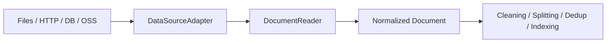

# 0001 Data Source Adapter Layer

## Status

Accepted

## 1. Why this proposal is needed

The final output of the current RAG pipeline is standardized documents, but real-world data sources are not uniform. Local files, HTTP, object storage, and databases all have different reading behavior, cleaning rules, and metadata shapes.

If the upper indexing pipeline depends directly on each data source's reading logic, several problems appear:

- every new data source duplicates part of the processing pipeline
- output formats differ across data sources
- testing has to rely on end-to-end verification instead of focused reader-layer tests
- data ingestion becomes too tightly coupled to the main RAG pipeline

So this proposal is not mainly about "supporting a few more data sources". It is about decoupling data reading from the main indexing workflow.

## 2. Goals

- provide a unified read abstraction for different data sources
- let the indexing pipeline operate only on standardized document streams
- reduce the cost of adding a new data source
- improve testability and observability

## 3. Non-goals

- do not rewrite retrieval logic in this proposal
- do not replace the existing vector backend in this proposal
- do not change the external HTTP API

## 4. Design overview

Introduce `DataSourceAdapter`, which converts raw data sources into a unified document-reading interface:

```go
type DataSourceAdapter interface {
    Name() string
    Validate(cfg map[string]any) error
    Open(ctx context.Context, cfg map[string]any) (DocumentReader, error)
}

type DocumentReader interface {
    Next(ctx context.Context) (*Document, error)
    Close() error
}
```

The point of this abstraction is not abstraction for its own sake. It draws a clear boundary between reading and post-processing:

- adapter layer: read and normalize
- post-processing layer: clean, split, deduplicate, index

## 5. Target architecture



## 6. Recommended standardized document model

The following core fields should be unified:

- `id`
- `title`
- `content`
- `source`
- `updated_at`
- `tags`

Additional fields should go into `metadata` to avoid growing the primary model too quickly.

## 7. Why this design is reasonable

### Better for the main RAG pipeline

Upper layers only need to care about how to process documents after they are read, not where they came from originally.

### Better for testing

Each data source can have its own adapter tests, and the normalized output can also be tested with a shared test suite.

### Better for extension

To add a new data source, you only implement an adapter instead of rewriting the whole indexing chain.

## 8. Risks

### Risk 1: over-abstraction

Trying too hard to unify everything may reduce the ability to express data-source-specific features.

Mitigation:

- keep core fields minimal
- move source-specific fields into `metadata`

### Risk 2: performance cost

If the abstraction only supports full loading, it will be inefficient for large data sources.

Mitigation:

- design around streaming `DocumentReader`
- leave room for batch-oriented extensions

### Risk 3: inconsistent migration behavior

Old logic and the new adapter layer may produce different outputs for the same data source.

Mitigation:

- run regression comparison on important datasets
- migrate data sources in batches

## 9. Migration recommendation

1. Implement a local-file adapter first as the baseline.
2. Refactor the existing indexing flow to consume `DocumentReader`.
3. Compare the output of old and new logic.
4. Then integrate other data sources incrementally.

## 10. Expected benefits

- clearer data ingestion boundaries
- a more stable main RAG pipeline
- finer-grained testing
- clearer module boundaries in both docs and code
