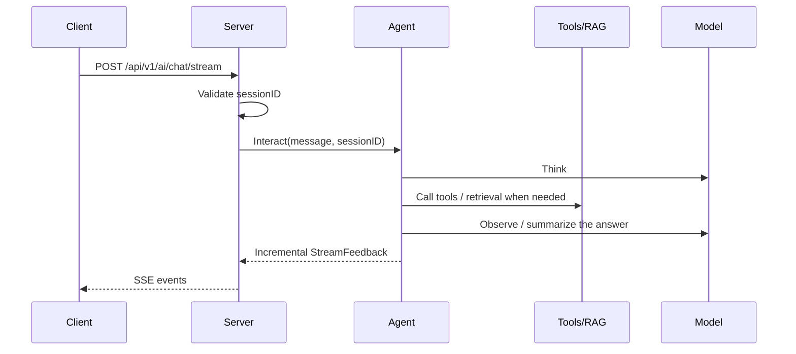

# Quick Start

This page has one goal: get Dubbo Admin AI running with the fewest possible steps, then complete one real streaming chat request.

## 1. Prerequisites

- Go `1.24.1+`
- At least one valid model API key
- Local network access to the target model provider

The default config already contains multiple provider definitions, but only the providers with real API keys will actually work. For the smallest usable setup, it is enough to make `DASHSCOPE_API_KEY` or any other provider key available.

## 2. Prepare environment variables

```bash
cp .env.example .env
```

Then fill in at least one key, for example:

```bash
DASHSCOPE_API_KEY=your_key_here
```

Sensitive fields in config are expanded from `${VAR}`, so `.env` is only a convenience for local development. In production, use real environment variables or a secret manager instead.

## 3. Key configuration files

If you only want to boot the service, you do not need to understand every YAML file first. You do need to know which ones directly affect whether the service starts and how it behaves after startup.

### 3.1 Main config

Config file: `config.yaml`

This is the top-level assembly file. It declares which component config files should be loaded.

The most important field is `components`:

```yaml
components:
  logger: component/logger/logger.yaml
  models: component/models/models.yaml
  server: component/server/server.yaml
  memory: component/memory/memory.yaml
  tools: component/tools/tools.yaml
  rag: component/rag/rag.yaml
  agent: component/agent/agent.yaml
```

If a path here is wrong, startup fails immediately.

### 3.2 Models config

Config file: `component/models/models.yaml`

This is the most critical config file because it decides whether models are actually usable.

At minimum, pay attention to:

- `default_model`: the default chat model
- `default_embedding`: the default embedding model
- `providers.*.api_key`: the credential for each provider
- `providers.*.base_url`: the upstream API address

Minimal example:

```yaml
spec:
  default_model: "dashscope/qwen-max"
  default_embedding: "dashscope/text-embedding-v4"
  providers:
    dashscope:
      api_key: "${DASHSCOPE_API_KEY}"
      base_url: "https://dashscope.aliyuncs.com/compatible-mode/v1"
```

If the provider behind `default_model` has no working key, the service may still start, but chat will not work.

### 3.3 Server config

Config file: `component/server/server.yaml`

This file decides where the service listens.

The most important fields are:

- `host`
- `port`
- `read_timeout`
- `write_timeout`

For example:

```yaml
spec:
  host: "localhost"
  port: 8880
```

If you want other machines to reach the service, `localhost` is usually not enough.

### 3.4 Agent config

Config file: `component/agent/agent.yaml`

This file decides which model the Agent uses, how many loops it can run, and where it reads prompts from.

The most important fields are:

- `model`
- `prompt_base_path`
- `max_iterations`
- `stages`

If `prompt_base_path` or a `prompt_file` does not match reality, Agent initialization fails.

### 3.5 Tools config

Config file: `component/tools/tools.yaml`

This file decides whether mock, internal, and MCP tools are enabled.

The most common switches are:

- `enable_mock_tools`
- `enable_internal_tools`
- `enable_mcp_tools`

For local development, a good starting point is:

```yaml
enable_mock_tools: true
enable_internal_tools: true
enable_mcp_tools: false
```

MCP depends on external tool processes, so it creates a much larger failure surface.

### 3.6 RAG config

Config file: `component/rag/rag.yaml`

This file decides whether knowledge retrieval is usable.

At minimum, pay attention to:

- `embedder.spec.model`
- `loader.type`
- `splitter.type`
- `indexer.type`
- `retriever.type`
- `reranker.spec.enabled`

If you only want chat first, leave RAG at its default settings. If you want document-based Q&A, inspect it carefully.

### 3.7 Memory config

Config file: `component/memory/memory.yaml`

This file mainly affects conversation history behavior.

Usually, you only need to know:

- `history_key`: the storage key for conversation context
- `max_turns`: the intended max number of retained turns

It affects multi-turn conversation quality, but it is not usually a startup blocker.

### 3.8 Pre-flight checks

Before the first startup, verify these four things first:

1. All paths in `config.yaml` are correct.
2. `models.yaml` has at least one usable provider.
3. The port in `server.yaml` is not already occupied.
4. The model name and prompt paths in `agent.yaml` are correct.

Leave everything else at defaults until the happy path works.

## 4. Start the service

```bash
go run main.go --config ./config.yaml
```

Default listen address:

```text
http://localhost:8880
```

After startup, check health first:

```bash
curl http://localhost:8880/health
```

Expected response:

```json
{"status":"ok"}
```

## 5. Start the frontend and chat from the page

If you want to use the chat UI directly instead of calling the API with `curl`, start the `ui-vue3` frontend in the repository.

For the frontend dev environment, see `ui-vue3/README.md`. At minimum you need:

- Node.js `18+`
- Yarn `1.22.x`

From the repository root:

```bash
cd ../ui-vue3
yarn
yarn dev
```

The frontend starts at:

```text
http://localhost:8881/admin
```

The local integration setup is:

- Frontend dev server: `http://localhost:8881`
- AI backend service: `http://localhost:8880`
- `ui-vue3` proxies `/api/v1/ai` to `http://localhost:8880`

After the page opens, click the AI floating button in the bottom-right corner to open the `Dubbo Admin AI` chat drawer. The frontend will automatically call:

- `POST /api/v1/ai/sessions` to create a session
- `POST /api/v1/ai/chat/stream` to start streaming chat

If the page opens but chat does not work, check these first:

- Whether the AI backend is already running on port `8880`
- Whether you opened `http://localhost:8881/admin`

## 6. Create a session

Dubbo Admin AI requires you to create a session before using the chat endpoint. The server keeps session metadata, while the Memory component manages the conversation history.

```bash
curl -sS -X POST http://localhost:8880/api/v1/ai/sessions
```

Typical response:

```json
{
  "message": "success",
  "data": {
    "session_id": "session_xxx",
    "created_at": "2026-03-06T12:00:00+08:00",
    "updated_at": "2026-03-06T12:00:00+08:00",
    "status": "active"
  },
  "request_id": "req_xxx",
  "timestamp": 1741233600
}
```

In development mode, the service also creates a default session named `session_test` at startup so you can test streaming quickly.

## 7. Start one streaming chat request

```bash
curl -N -X POST http://localhost:8880/api/v1/ai/chat/stream \
  -H "Content-Type: application/json" \
  -H "Accept: text/event-stream" \
  -d '{"message":"Help me analyze common causes of Dubbo service invocation failures","sessionID":"session_test"}'
```

Two things matter here:

- The field name is `sessionID`, not `session_id`.
- Use `curl -N`, or you may not see streaming output in real time.

You will see SSE events similar to this:

```text
event: message_start
data: {"type":"message_start", ...}

event: content_block_start
data: {"type":"content_block_start", ...}

event: content_block_delta
data: {"type":"content_block_delta", "delta":{"text":"Analyzing..."}}

event: message_delta
data: {"type":"message_delta", ...}

event: message_stop
data: {"type":"message_stop"}
```

## 8. Request flow



## 9. Common startup issues

- Service fails to start: check `.env`, `config.yaml`, and component YAML files first.
- Frontend fails to start: check Node and Yarn versions, and confirm `yarn` was run inside `ui-vue3`.
- The page does not open: confirm the frontend dev server is on `8881` and that you are using the `/admin` path.
- The page opens but chat fails: confirm the AI backend is running at `http://localhost:8880`, which is the Vite proxy target.
- Models are unavailable after startup: check `default_model`, `api_key`, and `base_url` in `component/models/models.yaml`.
- Agent initialization fails: check `model`, `prompt_base_path`, and `stages` in `component/agent/agent.yaml`.
- Session creation fails: first confirm the service is listening on port `8880`.
- The streaming endpoint produces no output: confirm the request includes `Accept: text/event-stream`, and check whether the model provider is reachable.
- Model requests fail: this is usually an invalid API key, a mismatched model name, or restricted outbound network access.

## 10. What to read next

- Want to integrate the API: read the [User Guide overview](wiki/user-guide/index.md)
- Want the request and SSE shapes: read [API Docs](wiki/user-guide/api.md)
- Want to understand why the system runs this way: read [Architecture Overview](wiki/developer-guide/architecture-overview.md)
- Want to change config: read the [Configuration Guide](wiki/developer-guide/configuration.md)
