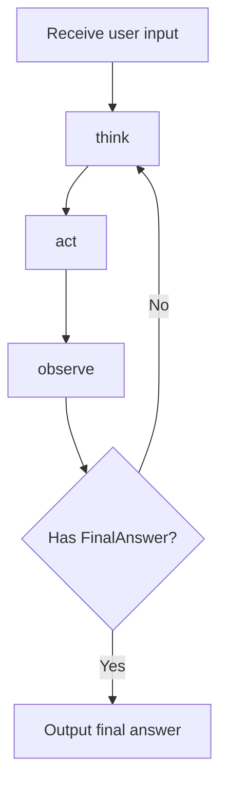
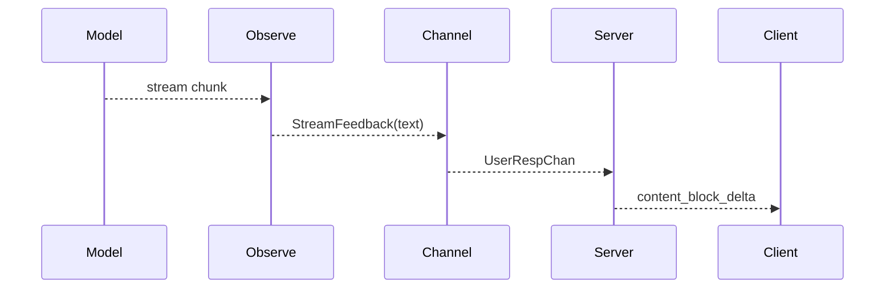

# Agent Workflow

This page stops looking at Agent as a component and focuses on how one conversation turn advances internally. In other words, this page is about behavior flow, not object structure.

## 1. Core workflow idea

Dubbo Admin AI currently uses a ReAct-style loop that breaks a complex question into:

- Think: understand the problem and decide whether external capabilities are needed
- Act: call tools or retrieval
- Observe: merge the results and generate intermediate summaries or the final answer

This design is better than a single monolithic prompt because it gives the system a controlled window for calling external capabilities.

## 2. Default workflow diagram

## 3. What each stage does

### think

- Understand the user question
- Determine the problem type
- Choose potentially useful tools
- Produce the next-step action suggestion

### act

- Decide whether to actually call tools based on the `think` result
- Execute tools and collect outputs
- Produce structured `ToolOutputs`

### observe

- Read tool results
- Generate an intermediate summary
- Stream content to the user progressively
- Produce the final answer when conditions are met

## 4. Termination conditions

The loop does not run forever. The current main stop conditions are:

- `observe` produces `FinalAnswer`
- `max_iterations` is reached

`max_iterations` is an important safety guard to avoid infinite loops where the model keeps trying to call tools without obtaining useful results.

## 5. Where streaming output is produced

Real streaming output is produced in the streaming flow inside the `observe` stage. It reads stream chunks from the model and pushes text to Server through `UserRespChan`.

## 6. How context enters the workflow

The Agent does not feed every stage only the raw user input. It also injects history-window messages into the prompt. That context comes from the Memory component and is read by `sessionID`.

So workflow quality depends not only on prompts and models, but also on:

- whether the session is reused
- whether the history window is reasonable
- whether turns advance correctly

## 7. Why tools are not called every time

The Agent workflow does not treat tool invocation as the default path. In the current implementation, `act` only tries to call a tool when `think` decides the problem is not ordinary Q&A and suggests a tool to use.

That avoids two issues:

- simple questions taking heavy external calls and wasting time and cost
- tools being overused by the model and making the loop unnecessarily complex

## 8. The most effective way to observe this workflow

During production troubleshooting, inspect logs and latency by stage:

- whether `think` produced a structured judgment successfully
- whether `act` actually issued a tool request
- whether `observe` started streaming output
- whether the workflow ends steadily after a certain iteration

If you only read the final answer, it is hard to tell whether the problem is "the model cannot reason", "the tool is not called", or "the result is not integrated correctly".
