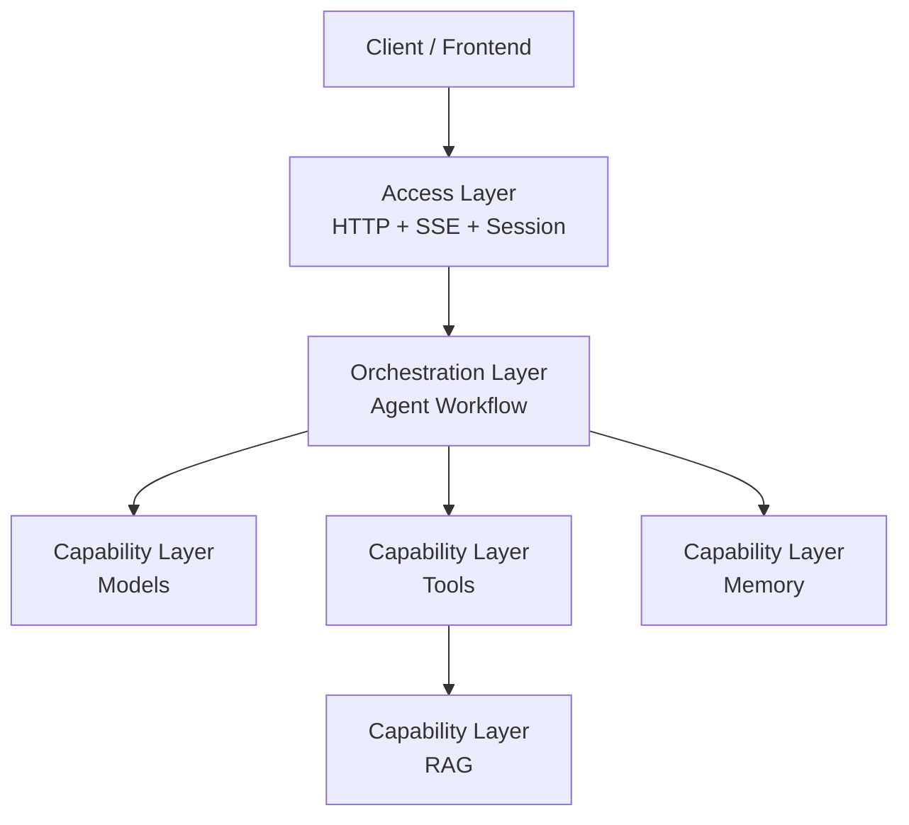
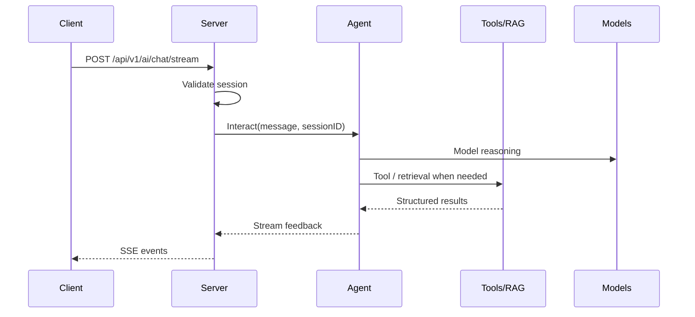

# Architecture Overview

This page explains Dubbo Admin AI from the top down. The point is not to list packages, but to answer three practical questions:

- What kind of system is this?
- How do requests actually flow through it?
- Where are the current architectural strengths and constraints?

## 1. What kind of system this is

Dubbo Admin AI is an AI-oriented runtime service inside Dubbo Admin. Externally it is an HTTP service. Internally it is a layered system built around:

- session management
- Agent orchestration
- model invocation
- tool invocation
- retrieval augmentation
- streaming output

This means it is not "an HTTP wrapper around an LLM". It is closer to a small orchestration runtime.

## 2. The layered view

You can understand the system as three layers:

### Access layer

Handled by `Server`. Responsible for:

- receiving requests
- validating sessions
- creating SSE output
- converting Agent feedback into client-visible protocol events

### Orchestration layer

Handled by `Agent`. Responsible for:

- understanding the user request
- deciding whether tools are needed
- driving the think/act/observe loop
- generating intermediate and final outputs

### Capability layer

Built from `Models`, `Tools`, `Memory`, and `RAG`. Responsible for:

- model and embedding access
- tool registration and invocation
- short-term conversation memory
- document retrieval

## 3. One request path

The streaming chat path looks roughly like this:

The key design point is that the HTTP layer does not directly understand "thinking" or "tool calls". It only consumes streaming feedback produced by the Agent.

## 4. How runtime assembles the system

The runtime entry is `runtime.Bootstrap(configPath, registerFactorys)`. It does four things:

1. Register component factories.
2. Read `config.yaml` and all component YAML files.
3. Create components in factory order and run `Validate -> Init`.
4. Put components into the registry and then run `Start()` across the registry.

The default factory registration order is defined in `main.go`:

1. `logger`
2. `memory`
3. `models`
4. `rag`
5. `tools`
6. `server`
7. `agent`

One important detail: the documented dependency graph and the actual startup order are not exactly the same thing. For example, `server` is registered before `agent`, but `server.Start()` retrieves `agent` from runtime, and the `Start()` traversal comes from `sync.Map.Range`, which is not a strict stable order.

## 5. Component responsibilities

### Server

- Exposes the HTTP API
- Manages sessions
- Converts Agent output into SSE

### Agent

- Runs the `think -> act -> observe` loop
- Decides whether to call tools
- Manages intermediate output and final answers

### Models

- Initializes the Genkit Registry
- Registers provider models and embeddings
- Provides a unified model invocation entry

### Tools

- Aggregates internal, mock, and MCP tools
- Exposes `ToolRef` objects to the Agent

### Memory

- Stores in-process short-term conversation history
- Provides session-scoped context windows

### RAG

- Handles document loading, splitting, indexing, retrieval, and optional reranking

## 6. Why this is a componentized runtime

The actual assembly unit of the project is not a package or an interface file. It is a component that follows the `runtime.Component` lifecycle:

- `Name()`
- `Validate()`
- `Init(*Runtime)`
- `Start()`
- `Stop()`

That model is clean, but it also creates some real constraints. For example, most components return fixed names from `Name()`, which makes the current design naturally single-instance-oriented.

## 7. Architectural strengths

- The config loading path is strict, which reduces the risk of "config looks right but silently behaves wrong".
- Component boundaries are clear, so docs and code line up well.
- Streaming output is a first-class capability, not a later patch.
- RAG, Tools, and Models can evolve relatively independently.

## 8. The most important architectural constraints today

- Session and Memory are in-process state and do not support natural shared context.
- `genkit.Init()` is currently only suitable to run once, so provider extension is still fairly centralized.
- The runtime registry stores components by component name, which limits multi-instance support.
- Some config fields already exist in schema but are not yet fully wired through execution.

## 9. Suggested reading order

- Want startup and lifecycle details: continue with [Runtime & Components](runtime-components.md)
- Want to drill down by module: go to [Component Overview](components/index.md)
- Want the exact Agent loop: go to [Agent Workflow](agent-workflow.md)
