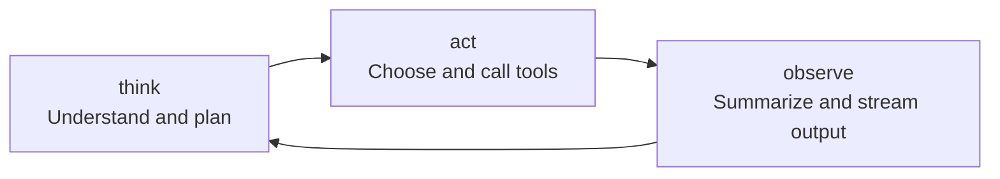
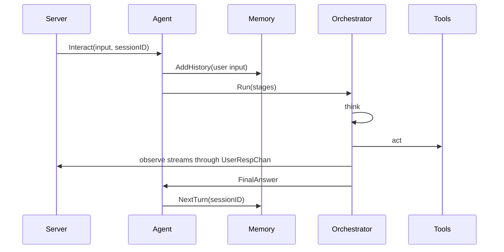

# Agent Component

Agent is the brain of Dubbo Admin AI. Server receives requests, and Tools and RAG provide capabilities, but Agent is what decides how to reason, whether to call tools, and when to stop.

## 1. Agent responsibilities

- receive user input and `sessionID`
- fetch context from Memory
- run the staged reasoning loop
- call tools and integrate results
- continuously send incremental feedback to Server through channels

The default implementation lives in `component/agent/react` and uses a ReAct-style multi-stage workflow.

## 2. Current default stages

According to `component/agent/agent.yaml`, the default stages are:

1. `think`
2. `act`
3. `observe`



The loop ends when `observe` produces `FinalAnswer` and that answer is not a heartbeat.

## 3. Internal structure

### `ReActAgent`

Owns:

- Genkit Registry
- Memory context
- Orchestrator
- Channels

### `OrderOrchestrator`

Responsible for:

- executing stages in order
- controlling before-loop, in-loop, and after-loop logic
- enforcing the maximum iteration count

### `Channels`

Used to decouple Agent from Server:

- `UserRespChan`: incremental user-visible content
- `FlowChan`: structured stage outputs
- `ErrorChan`: unified error channel

## 4. What happens during one interaction



## 5. How prompts are bound to stages

Each stage config includes:

- `flow_type`
- `prompt_file`
- `temperature`
- `enable_tools`

The rough build flow is:

1. read the prompt file
2. choose input and output types for that stage
3. attach `ToolRef` if tools are enabled
4. define the prompt and flow through Genkit

That is why Agent behavior is not hard-coded in Go alone. It is determined jointly by code structure, prompt files, and configuration.

## 6. How Agent works with Memory

`Interact()` first writes the user input into Memory, then stores session-related information in context. After that, each stage builds prompt context from `history.WindowMemory(sessionID)`.

That point is important: Agent does not manage conversation history by itself. It delegates that responsibility to Memory.

## 7. How Agent works with Server

Server does not execute LLM logic directly. It calls:

```go
agent.Interact(...)
```

Then it continuously consumes channels:

- incremental text becomes `content_block_delta`
- done signals become `content_block_stop`
- final output becomes `message_delta`
- errors become SSE `error`

That separation lets Agent focus on reasoning workflow while Server focuses on protocol output.

## 8. Current constraints worth noticing

- `Channels` are reused, so pay attention to `Reset()` and `Close()` when reading the code.
- max iteration count is a safety guard against runaway loops.
- stage output types must stay stable or the orchestrator will fail.
- tool invocation only works if the Tools component initialized successfully and exported `ToolRef`.

## 9. When to change Agent

If the thing you want to change is how the system reasons and orchestrates, Agent is the first place to inspect:

- you want to add a stage
- you want to change loop termination behavior
- you want to control tool-calling rhythm
- you want to improve intermediate output and final answer structure

If you only want to improve a capability itself, the first change is usually in Tools, RAG, or Prompt rather than Agent.
