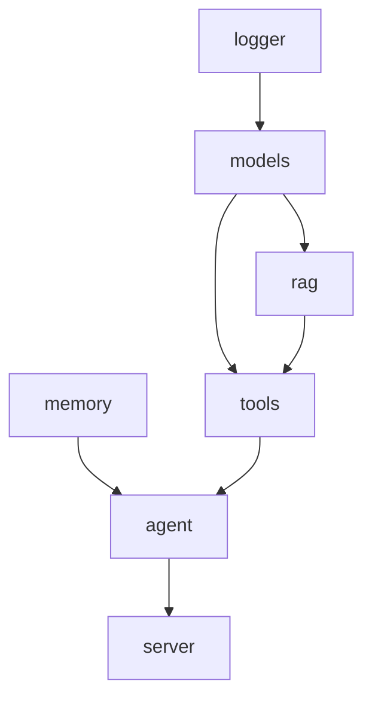

# Component Overview

This section breaks Dubbo Admin AI down into real runtime components instead of listing code directories mechanically. That makes it easier to answer three questions:

- What problem does this component solve?
- What does it depend on, and who depends on it?
- What are the most common mistakes when changing it?

## 1. Current component map

## 2. Component summary

| Component | Role | Typical dependencies | Provides |
| --- | --- | --- | --- |
| Logger | Initialize global logging | None | Unified `slog` output |
| Memory | Store short-term conversation history | None | Session history window |
| Models | Initialize model and embedding registry | Logger | Genkit Registry |
| RAG | Load, split, index, retrieve, rerank documents | Models | Retrieval capability |
| Tools | Aggregate tools and export `ToolRef` | Models, Memory, RAG | Callable tool set |
| Agent | Run the multi-stage reasoning loop | Tools, Memory, Models | Conversation orchestration |
| Server | Expose HTTP and SSE interfaces | Agent | API service |

## 3. Components are not flat

They form a typical "capabilities accumulate upward" structure:

- foundational capabilities at the bottom: Logger, Memory, Models
- composed capabilities in the middle: RAG, Tools
- orchestration and protocol at the top: Agent, Server

That structure makes fault ownership clearer:

- SSE issues are usually Server issues
- tool registration failures are usually Tools issues
- poor retrieval quality is often a RAG config or indexing issue
- "memory loss" in conversations is usually a Memory issue

## 4. Lifecycle consistency

All components follow the same lifecycle contract: `Validate -> Init -> Start -> Stop`.

So when reading any component, inspect it in this order:

1. what `Validate()` checks
2. what `Init()` initializes
3. whether `Start()` starts a service
4. whether `Stop()` releases resources

## 5. Design constraints

- `logger` affects the whole system through `slog.SetDefault`, not a local logger instance.
- `memory` is in-process state and is not persistent.
- `models` initializes the global Genkit Registry and is effectively a global capability component.
- `rag` is itself a composite component built from loader, splitter, indexer, retriever, and reranker.
- `tools` is not just a set of functions. It owns registration, discovery, and output normalization.
- `agent` does not expose HTTP directly. It sends incremental results to Server through channels.
- `server` does not own business reasoning. It only handles protocol conversion and session management.

## 6. How to read the following pages

- Want the basic components first: start with Logger, Memory, and Models.
- Want the enhanced capabilities: read RAG and Tools.
- Want the end-to-end conversation path: read Agent and Server.

Component details:

- [Logger](logger.md)
- [Memory](memory.md)
- [Models](models.md)
- [RAG](rag.md)
- [Tools](tools.md)
- [Agent](agent.md)
- [Server](server.md)
