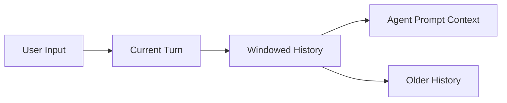

# Memory Component

The Memory component is what gives a session context. Without it, every Dubbo Admin AI request would look like the first interaction with the user.

## 1. What it stores

Memory currently stores in-process short-term conversation history. It is not a database and not a long-term knowledge base.

Its core responsibilities are:

- store messages by `sessionID`
- provide a recent context window
- advance the turn when one round of conversation completes

## 2. Core model

The implementation is organized around two ideas:

- `Turn`: the group of messages in one conversation round
- `HistoryMemory`: session-scoped history inside and outside the active window

You can think of it like this:



## 3. The most important facts about current behavior

- Memory is in-process memory. Restarting the service loses it.
- Data is isolated by `sessionID`.
- Concurrent access is protected by `RWMutex`.
- In `Interact()`, Agent writes the user input into history and calls `NextTurn(sessionID)` at the end.

## 4. Common operations

### `AddHistory(sessionID, msgs...)`

Append messages to the current turn of the given session.

### `WindowMemory(sessionID)`

Return messages in the current active window for prompt construction.

### `AllMemory(sessionID)`

Return all messages in both the window and archive. Good for debugging and export, not ideal as direct prompt context.

### `NextTurn(sessionID)`

Finish the current turn and move to the next one.

### `Clear(sessionID)`

Clear the windowed history for the given session.

## 5. Example config

```yaml
type: memory
spec:
  history_key: "chat_history"
  max_turns: 100
```

One detail matters here:

- the config contains `max_turns`
- current internal window behavior is not controlled by that field in a perfectly direct way

So you should not assume that setting `max_turns` to `100` guarantees a prompt context window of exactly 100 turns. This is a good example of why config and real behavior should be checked against code together.

## 6. How Agent uses Memory

Inside Agent `Interact()`, these steps happen:

1. put `sessionID` into context
2. serialize and write the current user input into history
3. read context from `WindowMemory(sessionID)` during each stage
4. call `NextTurn(sessionID)` when the interaction ends

So Memory is not an isolated cache. It is part of the Agent workflow.

## 7. Current limitations

- not persistent
- no summarization compression
- not shared across instances
- basic strategy for long conversations

If the project later needs production-grade long-lived conversations, Memory will likely need to evolve into a combination of window memory, summaries, and external storage.
