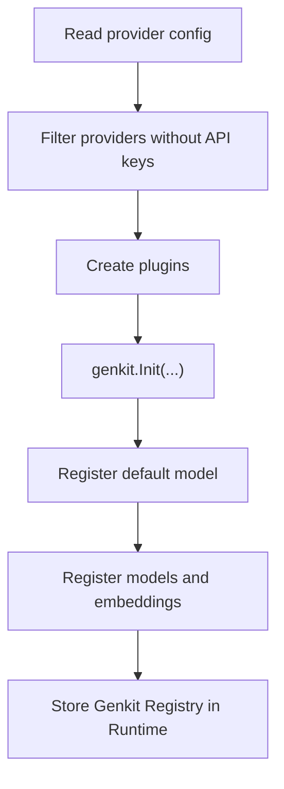

# Models Component

The Models component turns provider, model, and embedding definitions scattered across config into a unified registry that the rest of the system can actually use. Agent, RAG, and Tools are all built on top of it.

## 1. What problem it solves

Different model providers vary greatly in API style, authentication, and capabilities. If every business component integrated with upstream providers directly, the system would become hard to maintain quickly. Models exists to converge those differences into one entry point.

## 2. What capability it provides

- initialize the Genkit Registry
- register chat models
- register embedding models
- set the default model
- convert provider config into actual plugins

## 3. Provider shapes currently supported

From the config and implementation, the project is currently organized mainly around OpenAI-compatible endpoints and a few specific plugins:

- DashScope
- Gemini
- SiliconFlow
- Pinecone plugin capability

Whether they are actually active depends on whether API keys are present.

## 4. Initialization process



## 5. Example config

```yaml
type: models
spec:
  default_model: "dashscope/qwen-max"
  default_embedding: "dashscope/text-embedding-v4"
  providers:
    dashscope:
      api_key: "${DASHSCOPE_API_KEY}"
      base_url: "https://dashscope.aliyuncs.com/compatible-mode/v1"
```

Key fields:

- `default_model`: the model used by Agent by default
- `default_embedding`: the embedding model used by RAG and related capabilities
- `providers.*.models`: chat, code, or multimodal model list
- `providers.*.embedders`: embedding model list

## 6. Why it is a system-level component

Models is not only used internally. It provides the unified Genkit Registry for the whole project:

- Agent uses it to define prompts and execute flows
- Tools uses it to register tools
- RAG uses it for embedding and retrieval integration

Without Models, many later components may exist in code but cannot actually function.

## 7. Current limitations and caveats

- `genkit.Init()` is currently only suitable to run once, so Models behaves more like a global singleton capability.
- Provider extension is still relatively centralized and usually needs new plugin creation logic inside the component.
- Listing a model in config does not guarantee that model will work. Real availability still depends on provider API keys and upstream support.

## 8. What to check when troubleshooting Models

- whether the default model name is correct, usually `provider/model`
- whether the API key was really injected
- whether the provider `base_url` is reachable
- whether the model was registered into the Genkit Registry
- whether the upstream model type matches intended usage, such as `chat`, `code`, or `multimodal`
