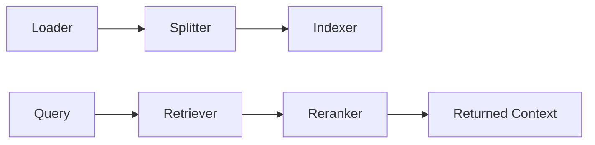
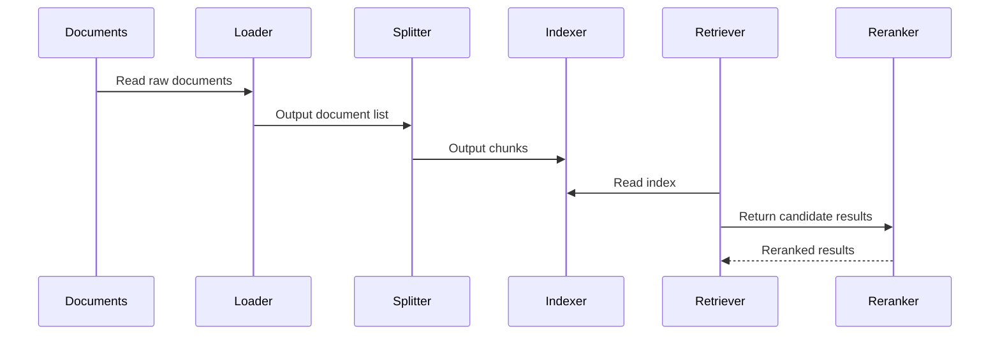

# RAG Component

The RAG component is not a single-point feature. It is a full pipeline from documents to retrieval results. Its goal is to turn external knowledge into context that the Agent can use reliably, not to dump raw text into prompts.

## 1. What sub-parts it contains

The current RAG component is assembled from five kinds of sub-components:

- Loader: reads raw documents
- Splitter: splits content into chunks
- Indexer: writes the index
- Retriever: performs recall
- Reranker: optionally reranks results



## 2. Where RAG sits in runtime

From the runtime perspective, `rag` is a composite component. It implements `runtime.Component` itself, but during `Init()` it also initializes its internal loader, splitter, indexer, retriever, and reranker.

That means RAG is not just holding references to a few helper objects. It really assembles the retrieval subsystem.

## 3. Current config example

```yaml
type: rag
spec:
  embedder:
    type: genkit
    spec:
      model: dashscope/text-embedding-v4
  loader:
    type: local
  splitter:
    type: recursive
  indexer:
    type: pinecone
  retriever:
    type: pinecone
  reranker:
    type: cohere
    spec:
      enabled: false
```

This shows several design choices:

- Embedding comes from Models and Genkit
- Document loading defaults to local files
- Indexing and retrieval are currently Pinecone-oriented
- Reranking is optional, not mandatory

## 4. Document processing pipeline



## 5. How index building runs

The indexing CLI lives in `cmd/index.go`.

Common command:

```bash
go run cmd/index.go
```

It will:

1. read `component/rag/rag.yaml`
2. initialize an independent Genkit Registry
3. build the RAG system
4. load documents from the configured directory
5. split the documents
6. write the target index

The default document directory is `reference/k8s_docs/concepts`.

## 6. Relationship with Agent and Tools

RAG is usually not called directly by the Agent. Instead, it is wrapped into tools and invoked by the Agent at the right stage. This has two benefits:

- retrieval strategy can stay encapsulated in the tool layer instead of leaking into prompts
- returned data can be normalized into structured output that Agent can observe and summarize more easily

## 7. Implementation boundary

One detail matters here: some config fields already exist in schema, but not all of them are fully wired into runtime logic. Some indexer or retriever storage detail fields are still closer to placeholders plus schema constraints than fully consumed runtime behavior.

So when changing RAG config, verify all three:

- whether `Validate()` accepts it
- whether `Init()` actually uses it
- whether retrieval behavior really changes

## 8. Most common issues

- index is built but retrieval is weak: usually an embedding model, splitting strategy, or top-k problem
- online answers do not cite knowledge: usually retrieval was not triggered by tools, or prompts did not integrate the results
- config appears to support a capability: but the actual code path may still be incomplete
