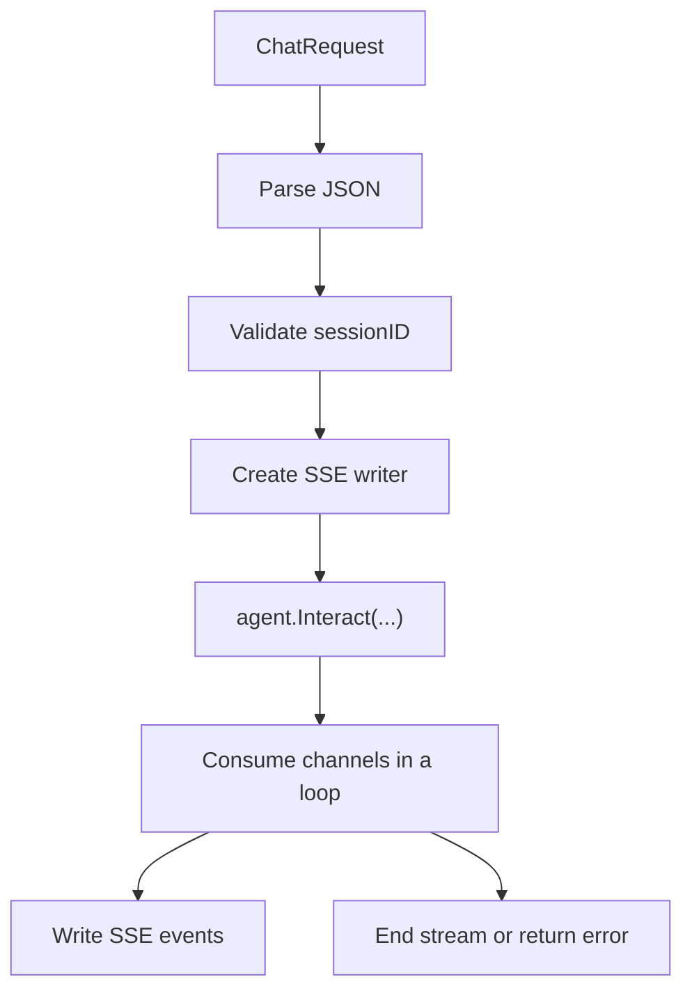

# Server Component

Server is the protocol shell of the system. It does not perform reasoning itself, but it converts external HTTP requests into Agent input and turns Agent streaming output into SSE that clients can consume.

## 1. What it does

- provide HTTP routes
- manage sessions
- provide SSE output
- call Agent and bridge channels
- expose health checks

## 2. Route structure

The current routes are registered in `component/server/engine/router.go`:

| Method | Path | Description |
| --- | --- | --- |
| `POST` | `/api/v1/ai/chat/stream` | Streaming chat |
| `POST` | `/api/v1/ai/sessions` | Create session |
| `GET` | `/api/v1/ai/sessions` | List sessions |
| `GET` | `/api/v1/ai/sessions/:sessionId` | Get session |
| `DELETE` | `/api/v1/ai/sessions/:sessionId` | Delete session |
| `GET` | `/health` | Health check |

## 3. Streaming chat path



On this path, Server's responsibility is to transport state outward correctly, not to make business decisions for Agent.

## 4. Session management

Session Manager is a key piece on the Server side:

- create `session_<uuid>`
- query sessions
- list active sessions
- delete sessions
- periodically clean sessions inactive for 24 hours

Also, `NewAgentHandler` currently calls `CreateMockSession()` automatically to create `session_test`. That is development-friendly, but should be considered carefully in production.

## 5. SSE output model

Server uses `StreamWriter` and `SSEHandler` to emit:

- `message_start`
- `content_block_start`
- `content_block_delta`
- `content_block_stop`
- `message_delta`
- `message_stop`
- `error`

This is more structured than sending plain text only, which makes it easier for the frontend to render blocks, manage status, and handle errors.

## 6. Boundary between Server and Agent

Server calls Agent in a very simple way:

```go
channels = h.agent.Interact(&schema.UserInput{Content: req.Message}, sessionID)
```

Then Server enters a `select` loop driven by three channels:

- `UserRespChan`
- `ErrorChan`
- `Request.Context().Done()`

That separation keeps protocol concerns and reasoning concerns cleanly split.

## 7. Start and stop

`ServerComponent.Start()` will:

1. get the `agent` component from runtime
2. initialize Gin
3. register routes and `/health`
4. start `http.Server.ListenAndServe()`

`Stop()` tries graceful shutdown first, then falls back to forced close after timeout.

## 8. Current limitations and risks

- `/health` only proves the service process is alive, not that dependencies are healthy.
- Session is in-process state and is not shared across multiple instances.
- Streaming responses are sensitive to gateway and proxy configuration.
- `Start()` depends on retrieving `agent` from runtime, so the real startup behavior must satisfy that dependency.
