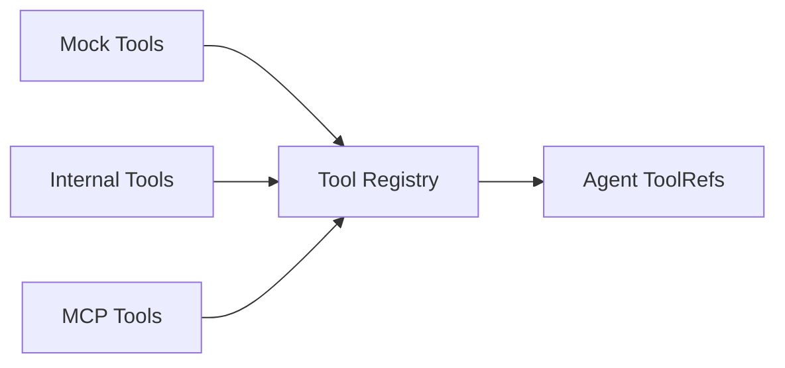

# Tools Component

The Tools component decides whether this Agent can only talk or can also inspect, query, and act. In Dubbo Admin AI, tools are not an add-on. They are the main entry for external capability.

## 1. What the Tools component does

- collect tools from different sources
- register them into Genkit
- export unified `ToolRef`
- provide the Agent with a callable tool list

## 2. Three tool sources

### Mock Tools

Used for development and testing so the Agent workflow can run without real backends.

### Internal Tools

Run in the same process and access other runtime components directly, such as Memory or RAG.

### MCP Tools

Integrated through the MCP protocol with external tool processes or services. This path is the most extensible, but also the most complex in deployment and security boundaries.



## 3. Initialization flow

The rough idea inside `Tools.Init()` is:

1. get the Genkit Registry
2. decide which Tool Managers are enabled from config
3. build the tool registry
4. aggregate the result into `[]ai.ToolRef`

Example config:

```yaml
type: tools
spec:
  enable_mock_tools: true
  enable_internal_tools: true
  enable_mcp_tools: false
  mcp_host_name: "mcp_host"
```

## 4. Why Internal Tools matter

Internal Tools are the bridge from internal system capability to Agent-usable tools. They are not external plugins. They wrap runtime capabilities that already exist into tools the Agent can call.

Typical examples:

- exporting session history from Memory
- retrieving document content through RAG

The main benefit is that the Agent does not need to understand runtime component details. It only needs tool names and input schemas.

## 5. Real-world meaning of MCP tools

MCP lets the system plug into an ecosystem of out-of-process tools. That is the most powerful extension path, but it also introduces:

- tool discovery and registration problems
- external command startup problems
- network and permission boundary problems
- recovery and reconnect problems

That is why local development usually keeps MCP disabled until the rest of the boundary is stable.

## 6. Why tool output should be normalized

Current tool results are normalized as much as possible into:

- `tool_name`
- `result`
- `summary`

The reason is simple: structured results are much easier for the Agent to consume in the Observe stage than raw unstructured text.

## 7. Current constraints

- Tool names must be unique, or registration conflicts.
- MCP registration failures may directly cause Tools initialization to fail.
- `ToolsConfig` and `ToolConfig` still show signs of evolution, so when reading config, trust the fields the current component actually consumes.

## 8. When to change Tools instead of Prompt

If you see the model repeatedly "knowing it should look something up, but being unable to do it", the real issue is usually not that Prompt is too short. It is more often:

- no suitable tool exists
- the tool schema is unstable
- the tool output is hard for the model to consume

In those cases, changing Tools is usually more effective than adding more prompt instructions.
