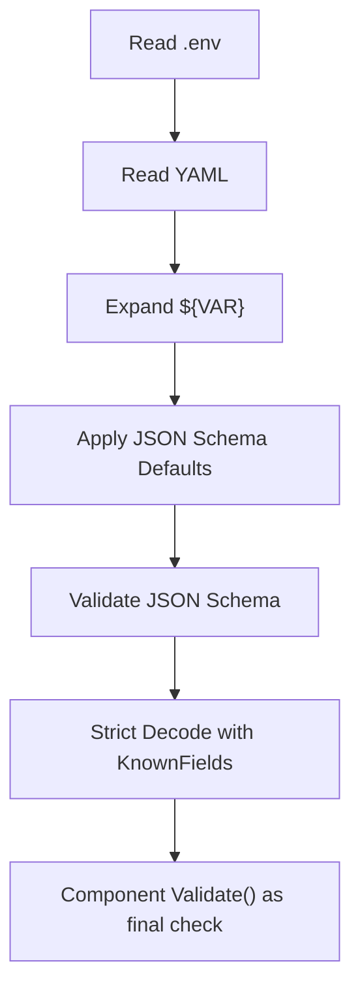

# Configuration Guide

The configuration system is one of the core parts of Dubbo Admin AI. It is not just a few YAML files being read. It is a full pipeline of environment expansion, schema validation, and strict decoding.

## 1. Configuration entry

The main entry is `config.yaml`:

```yaml
project: dubbo-admin-ai
version: 1.0.0
components:
  logger: component/logger/logger.yaml
  models: component/models/models.yaml
  server: component/server/server.yaml
  memory: component/memory/memory.yaml
  tools: component/tools/tools.yaml
  rag: component/rag/rag.yaml
  agent: component/agent/agent.yaml
```

It does not carry every detail directly. Its role is a component assembly manifest.

## 2. Configuration loading flow



## 3. Why this design is valuable

- It avoids unknown fields silently taking effect.
- It makes defaults explicit and controllable.
- It exposes config errors early during startup.
- It separates secrets from code.

## 4. Environment variable expansion

Config supports values such as:

```yaml
api_key: "${DASHSCOPE_API_KEY}"
```

That means:

- local development can use `.env`
- CI/CD and production can inject values directly through environment variables

## 5. Common config files today

- `component/logger/logger.yaml`
- `component/memory/memory.yaml`
- `component/models/models.yaml`
- `component/rag/rag.yaml`
- `component/tools/tools.yaml`
- `component/agent/agent.yaml`
- `component/server/server.yaml`

## 6. Easy-to-miss points when changing config

### Passing schema does not guarantee behavior changes

Some fields exist in schema but are not yet fully wired into runtime logic. After changing config, validate with logs, tests, or real behavior.

### Multiple configs of the same type do not necessarily mean real multi-instance support

The loader can map one component name to multiple config files, but runtime still stores by `Component.Name()`, and many components currently use fixed names.

### Missing environment variables may only surface at runtime

Some provider configs are skipped when API keys are missing instead of crashing the whole service. That creates the pattern "the service is up, but some capabilities are missing".

## 7. Recommended practice

- Start the service locally after config changes
- Update documentation together with important config changes
- Inject all sensitive fields through environment variables
- Use separate config and separate keys for different environments
- Keep a minimal runnable example for important fields
