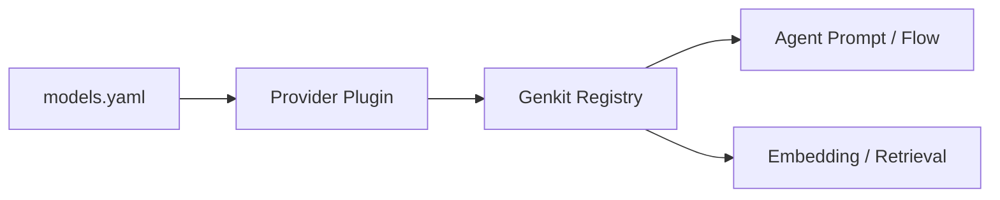

# Model Providers & Plugins

This page looks at the Models component from the perspective of extension and integration. The focus is not how the default config is written, but how different model providers are abstracted, registered, and used.

## 1. Why a provider abstraction is needed

The project needs to support multiple model sources, but upstream systems differ a lot:

- different API endpoints
- different authentication styles
- different streaming response details
- different model types

If business code is tightly coupled to one provider, switching later becomes expensive. That is why the project uses plugins and a unified registry to isolate these differences.

## 2. Current provider integration approach

The current implementation mainly integrates providers through the Genkit plugin system, then registers concrete models as uniformly callable actions.

## 3. How providers are expressed in config

In `component/models/models.yaml`, each provider has:

- `api_key`
- `base_url`
- `models`
- `embedders`

That means the project already separates provider-level config from the model catalog itself. One provider can therefore expose multiple models and embedding capabilities.

## 4. Plugin registration flow

During initialization, the rough process is:

1. iterate over providers
2. skip providers without API keys
3. create plugins
4. call `genkit.Init(...)`
5. register an action for each model
6. register an action for each embedder

This is a config-driven plus code-registered model.

## 5. Basic steps to add a new provider

1. Define the config structure and schema.
2. Implement plugin creation logic.
3. Register models and embeddings.
4. Expose the capability to Agent and RAG.
5. Add tests and error handling.

## 6. Common mistakes when extending providers

- model names and provider names do not match
- the same model gets registered by multiple providers
- streaming response differences leak upward and cause inconsistent behavior
- upstream rate limits, timeouts, or error codes are not mapped consistently

## 7. When to change the provider layer

If the thing you are solving is:

- new model integration
- new upstream platform integration
- unified error mapping
- unified retry, rate-limit, or timeout policy

then you should change the Provider or Models layer first, not Agent or Server.
