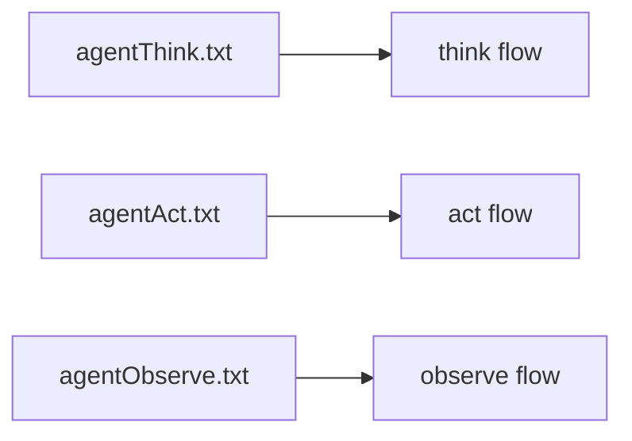

# Prompt System

In this project, a prompt is not just "a few strings". It is part of Agent behavior. Stage boundaries, tool availability, and output structure are often determined by prompts together with code.

## 1. Where prompts live in the system

The current ReAct Agent reads prompt files from `prompt_base_path` and builds a different prompt for each stage. The default path is:

```text
./prompts
```

That means prompts are not embedded constants. They can evolve independently through config and files.

## 2. What prompts actually do

- define role and boundary
- guide how the model should reason
- tell the model which tools are available
- constrain the output structure

For the Agent, prompts are not primarily about style. They are a behavior control surface.

## 3. Current prompt-to-stage mapping

In the default config:

- `think` maps to `agentThink.txt`
- `act` maps to `agentAct.txt`
- `observe` maps to `agentObserve.txt`



## 4. How prompts work with tools

In the `think` stage, if config allows tool usage, the system appends available tool names into extra prompt context. So a prompt contains both static instructions and runtime-injected tool context.

That means prompt quality depends on two things:

- the prompt file itself
- whether the tool set provided by the Tools component is well designed

## 5. Principles for prompt design

- Do not mix system rules with optional reference information
- Tell the model clearly when it should call tools and when it should not
- Keep output structure stable so upper layers do not fail during parsing
- Treat tool results as evidence, not higher-priority instructions

## 6. Why prompt problems are often mistaken for model problems

When a model "looks dumb", it is often not because the model is too weak, but because:

- the prompt does not provide clear decision rules
- tool descriptions are not clear enough
- the output structure is too loose
- stage responsibilities are not clearly separated

So when quality is unstable, prompts are often one of the highest-leverage places to improve.

## 7. When to change prompts and when not to

Good prompt-change scenarios:

- you want the model to distinguish more reliably between direct answer and tool invocation
- you want to change the output format
- you want to reduce hallucination or increase explainability

Bad "prompt-only" scenarios:

- there is no suitable tool
- RAG recall quality is poor
- the provider is unavailable
- runtime context is not being passed in at all
