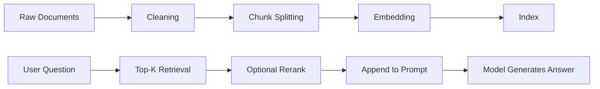

# RAG Subsystem

If the component page explains how RAG is assembled, this page explains why RAG exists and how to use it effectively.

The core value of RAG is not "dump the knowledge base into the model". It is turning external knowledge into the exact context needed for the current answer through a controllable and traceable pipeline.

## 1. When you should use RAG

These scenarios are a good fit for RAG instead of relying only on the model's internal knowledge:

- questions that should be answered from project docs, platform manuals, or operations knowledge bases
- knowledge that changes frequently
- answers that need to cite sources
- situations where you want to reduce hallucination

## 2. The RAG path



## 3. How RAG is invoked in this system

In the current project, RAG is usually wrapped as a tool capability first and then invoked by the Agent, instead of being exposed directly inside the Agent's main loop.

That has practical benefits:

- retrieval parameters can be encapsulated at the tool layer
- different tools can be tailored to different knowledge domains
- the Agent only decides whether to search, not how to search

## 4. Index-building entry

The project provides a dedicated CLI:

```bash
go run cmd/index.go
```

By default it reads `component/rag/rag.yaml`, then loads, splits, embeds, and indexes documents from the configured document directory.

## 5. Key parameters that affect quality

### chunk size / overlap

- Too large: noisy recall and wasted context
- Too small: semantics get fragmented and hit rate drops

### embedding model

- Keep indexing and online retrieval consistent when possible
- If you switch models, treat old-index compatibility as a risk

### top-k

- Too small misses information
- Too large pollutes the prompt

### reranker

- Helpful when there are many candidates
- Adds another cost step

## 6. RAG is not a silver bullet

Adding RAG does not automatically improve the system. Common failure reasons include:

- retrieved results are relevant but not used correctly by the prompt
- the tool does not trigger RAG when needed
- the source documents are poorly structured
- the index is not refreshed in time

So improving RAG usually means looking at three layers together:

- data layer: documents and indexes
- retrieval layer: recall and reranking
- orchestration layer: tool invocation and prompt integration

## 7. Engineering recommendations

- Include source information in retrieval results when possible
- Build dedicated tools for high-frequency knowledge domains
- Limit the number of returned chunks to avoid context pollution
- Create a fixed index update process instead of relying on occasional manual runs
