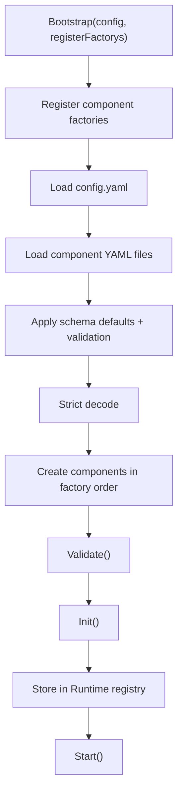
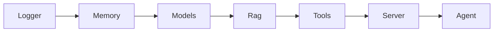
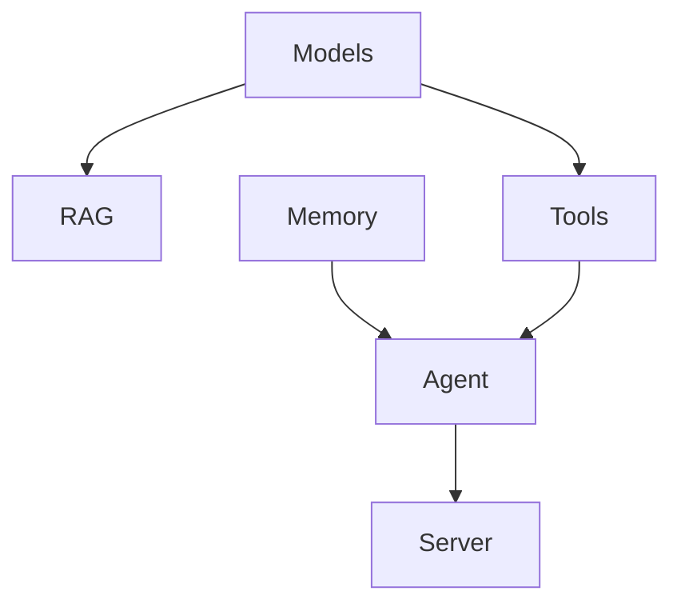

# Runtime & Components

This page explains the lowest-level assembly mechanism of the project, not the business features themselves: how config is loaded, how components are created, how dependencies are injected, and how lifecycle stages advance.

If you want to understand why the project starts the way it does and why components can find each other, this is the key page.

## 1. What Runtime is responsible for

`runtime` is the assembly center of the whole project. It does not contain business inference logic, but it decides when components are created, how they obtain dependencies, and when they start and stop.

Its core responsibilities are:

- manage component factories
- load the main config and component configs
- create component instances
- maintain the component registry
- store the Genkit Registry

## 2. Component lifecycle

Every component implements the same interface:

```go
type Component interface {
    Name() string
    Validate() error
    Init(*Runtime) error
    Start() error
    Stop() error
}
```

That means all components follow the same runtime contract.

### Semantics of each phase

- `Validate()`: only verify config and prerequisites; do not perform heavy initialization.
- `Init()`: resolve dependencies, create internal objects, and register global capabilities.
- `Start()`: start external services or background behavior.
- `Stop()`: release resources and try to exit gracefully.

## 3. Bootstrap flow



The main entry point is in `runtime/runtime.go`.

## 4. Config loading pipeline

The `config.Loader` design is fairly strict, which is one of the strengths of the project.

### Load order

1. Load `.env`
2. Read YAML
3. Expand environment variables
4. Apply JSON Schema defaults and validation
5. Strictly decode with `KnownFields(true)`

### What that means

- Missing but defaultable fields are filled automatically.
- Unknown fields are not silently ignored.
- Missing environment variables may still result in empty final values, depending on whether a component's `Validate()` rejects them.

## 5. Dependency injection pattern

The project mainly uses two injection modes.

### Mode 1: Runtime component registry

Inside `Init(rt)`, components obtain other components through:

```go
rt.GetComponent("tools")
rt.GetComponent("agent")
```

### Mode 2: Genkit Registry

The Models component creates and registers a Genkit Registry during initialization. Other components that need models, prompts, or tools access it through:

```go
rt.GetGenkitRegistry()
```

## 6. Current component order and dependency relationships

The factory registration order is fixed in `main.go`:



But that diagram only shows registration order, not the true dependency graph. A more accurate dependency view is:



That difference is one of the easiest places to get confused when reading the code.

## 7. One important limitation: multi-instance support is incomplete

`config.Loader` can load multiple config files for the same component type and generate logical names such as `agent-0` and `agent-1`, but the Runtime stores components by `Component.Name()`.

Most components currently return fixed names such as:

- `server`
- `agent`
- `models`

That means:

- the config layer appears to support multi-instance
- the runtime storage layer effectively overwrites by fixed names

So the current system should be understood as a single-instance component runtime, not a full multi-instance container.

## 8. Shutdown flow

After the main process receives `SIGINT` or `SIGTERM`, it iterates over `rt.Components` and calls `Stop()`.

The most important piece is Server:

- `Stop()` attempts graceful `Shutdown(ctx)`
- it waits up to 10 seconds
- it falls back to `Close()` on timeout

## 9. Pros and cons of this runtime design

### Advantages

- Clear component boundaries
- Easier testing and replacement
- Unified config and assembly flow

### Tradeoffs

- Startup order and dependency order still need to be kept aligned manually
- Multi-instance support is incomplete
- Some global objects, such as the Genkit Registry, are naturally not good candidates for repeated initialization

## 10. Recommended next pages

- To understand the system by component: read [Component Overview](components/index.md)
- To understand the Agent execution path: read [Agent Workflow](agent-workflow.md)
- To understand config behavior: read the [Configuration Guide](configuration.md)
