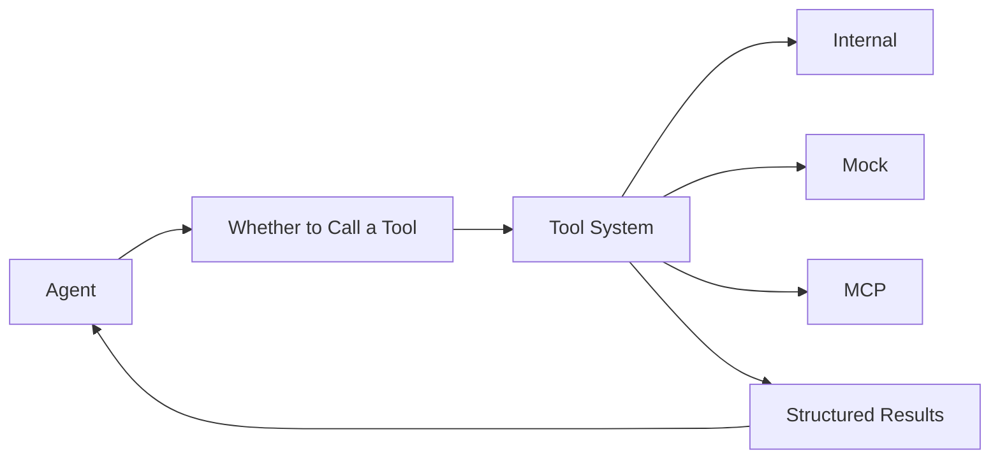

# Tooling System

The Tools component page explains how tools are implemented. This page explains why the system needs tools and how to design tool capabilities that an Agent can use effectively.

## 1. What happens when an Agent has no tools

If the Agent can only rely on internal model knowledge, it is naturally limited by:

- knowledge freshness
- no awareness of live system state
- inability to execute queries or operations

So the fundamental reason the tool system exists is simple: it lets the Agent perceive the external world.

## 2. Where the tool system sits in the architecture

## 3. What makes a good tool

- clear semantic name
- stable input schema
- unified output structure
- diagnosable errors
- clear timeout and permission boundaries

For the Agent, the ability to use a tool correctly depends heavily on tool design clarity, not only on model strength.

## 4. More tools are not always better

Too many tools create three problems:

- the model has a harder time choosing
- prompts become longer
- the high-risk invocation surface gets larger

So tools should usually be grouped by knowledge domain or responsibility, instead of exposing every low-level API directly to the Agent.

## 5. Recommended tool design

- wrap multiple low-level calls into one semantically complete tool
- include a `summary` in the output whenever possible
- add explicit safeguards for high-risk actions
- give every tool at least one minimal test case

## 6. When to add a new tool

When you see the Agent repeatedly needing some class of external information, and that information:

- cannot be obtained reliably from model memory
- cannot be solved by RAG alone
- has clear input and output boundaries

then you should add a tool instead of continuing to pile more instructions into prompts.
