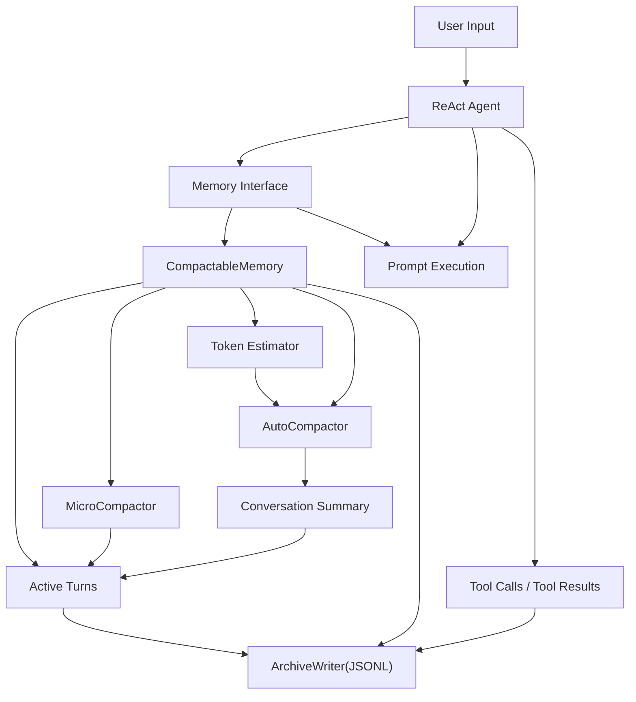

# Layered Memory Compaction Proposal

## 1. Background

The current project manages runtime context through `HistoryMemory` in `component/memory/history.go`. Its core model is turn-based message organization with a fixed-size sliding window that keeps only the most recent conversation turns. This is simple, but it already shows two structural problems:

- Messages outside the window become completely invisible to the runtime context. Users usually assume the Agent "remembers" earlier discussion, but the current behavior causes older conversation state to disappear from model context entirely, leading to abrupt behavior changes and confusing UX.
- Even within the retained window, there is a large amount of tool output, command results, and intermediate reasoning residue that is irrelevant to the current task. Those tokens continue to consume context budget and reduce the effective density of later turns.

This now needs to be addressed for three reasons:

- `HistoryMemory.NextTurn` currently returns an error when the window is full, which means the system degrades explicitly as the session grows instead of managing context smoothly.
- `component/agent/react/react.go` passes `history.WindowMemory(sessionID)` directly into the prompt, so memory quality directly affects the think, act, and observe stages in both quality and cost.
- As heavier toolchains and longer sessions are introduced, redundant context will amplify token cost even further, which makes compaction increasingly valuable.

If this is left unresolved, the system will continue to drift toward a "more expensive, more forgetful, more chaotic" failure mode. In the short term that means unstable long-session behavior. In the long term it will limit tool depth and usable session length for the Agent.

## 2. Goals

- Goal 1: introduce a unified abstraction for the Memory component while preserving the current `ChatHistoryMemory` behavior and adding a compactable `CompactableMemory`.
- Goal 2: implement a three-layer compaction strategy: low-cost per-turn micro compaction, threshold-triggered automatic compaction, and explicit user-triggered manual compaction.
- Goal 3: ensure memory compaction is "lossy in runtime, lossless in persistence": in-memory context may be replaced, but the full original session must continue to be appended into JSONL storage.
- Goal 4: establish benchmark and evaluation methods for token thresholds so that the automatic compaction trigger has a verifiable cost-benefit basis.

## 3. Non-goals

- Non-goal 1: this proposal does not introduce vector-retrieval long-term memory and does not solve semantic recall of arbitrary historical fragments.
- Non-goal 2: this proposal does not change the core ReAct flow and does not redesign think, act, or observe prompt orchestration.
- Non-goal 3: this proposal does not turn summary persistence into a training-data pipeline; it only preserves the foundation for later analysis and export.
- Non-goal 4: this proposal does not keep a hybrid context model of "summary plus the latest N raw messages".

## 4. Current State and Constraints

Technical state:

- `MemoryComponent` currently holds `*HistoryMemory` directly and does not program to an interface.
- `HistoryMemory` maintains both `windowMemory` and `historyMemory` by `Turn`, but actual inference uses only `WindowMemory(sessionID)`.
- Both `ReActAgent` and the Memory Tool depend directly on `*HistoryMemory`, so they are coupled to the current implementation details.
- There is currently no token estimator, compactor, summarizer, or archive writer capability in place.

Dependency state:

- The project already has an LLM invocation pipeline, so the existing model infrastructure can be reused to generate compact summaries.
- Message types are based on `github.com/firebase/genkit/go/ai`, and the new design must remain compatible with `ai.Message`.

Compatibility constraints:

- The current `ChatHistoryMemory` behavior must be preserved so that existing configs and tests do not all break.
- Existing Memory Tool behavior and session deletion flows must continue to work.
- Automatic compaction must never cause raw history loss; debugging, audit, and token accounting must still be possible from the full record.

## 5. Design

### 5.1 Overall Approach

Introduce a unified Memory abstraction and move "append messages", "get current context", "advance turn", "clear session", and "manual compaction" into the interface layer. The current `HistoryMemory` remains as `ChatHistoryMemory`; a new `CompactableMemory` becomes the enhanced implementation. Both expose the same outward interface. Internally, `CompactableMemory` composes three capabilities: `MicroCompactor`, `AutoCompactor`, and `ArchiveWriter`.

The three-layer compaction strategy is:

- `micro_compact`: runs after each turn and silently compacts older messages outside the current turn. The primary objective is to replace large old `tool_result` bodies while preserving the tool-call trail, short summary, status, and archive reference.
- `auto_compact`: triggers when estimated token usage crosses a threshold. It first ensures the full raw session has been written to JSONL, then invokes an LLM to generate a single conversation summary, and replaces the entire in-memory conversation history with that summary.
- `compact` tool: triggered explicitly by the user. Its semantics are effectively "compress the current session into a summary and continue". It reuses the automatic compaction flow, but with a different trigger source and a user-visible result.

After automatic compaction, runtime context keeps only the summarized representation, not "summary plus recent raw messages". This avoids the same facts appearing in both summary and raw history, which would otherwise create duplicated and potentially contradictory signals for the model.

### 5.2 Architecture Diagram or Flow



### 5.3 Key Changes

#### Module A: Memory abstraction layer

Introduce a unified interface:

```go
type Memory interface {
    Append(ctx context.Context, sessionID string, messages ...*ai.Message) error
    Context(ctx context.Context, sessionID string) ([]*ai.Message, error)
    NextTurn(ctx context.Context, sessionID string) error
    Compact(ctx context.Context, sessionID string, reason CompactReason) (*CompactResult, error)
    Clear(sessionID string) error
    IsEmpty(sessionID string) bool
}
```

- `MemoryComponent` should no longer expose `*HistoryMemory` directly, and should expose the `Memory` interface instead.
- For compatibility, a transitional `GetMemory()` method may be kept, but it should return the interface internally; call sites that depend on the concrete type should be migrated gradually.

#### Module B: `ChatHistoryMemory`

- Refactor the current `HistoryMemory` into `ChatHistoryMemory`, implementing the new `Memory` interface.
- This implementation keeps the current sliding-window semantics as the default compatibility mode.

#### Module C: `CompactableMemory`

- Maintain active turns, summary state, compaction metadata, and archive offsets per session.
- Append JSONL records synchronously on each `Append`.
- On each `NextTurn`, run `micro_compact` first, then estimate tokens, and invoke `auto_compact` if needed.
- Expose a manual `Compact` method for tool invocation.

#### Module D: JSONL archive

- Introduce a session archive writer, partitioned by session or date, using append-only JSONL.
- Suggested event types: `message`, `tool_call`, `tool_result`, `micro_compact`, `auto_compact`, `manual_compact`.
- Every compaction placeholder and summary should carry a traceable archive reference for later debugging.

#### Module E: Memory Tool

- Add a `memory_compact` tool that lets the user trigger session compaction proactively.
- `memory_all_by_session_id` should be adjusted to read from both archive and runtime memory so that raw history remains visible after compaction.

#### Module F: Benchmarking and tests

- Add benchmarks for different thresholds, tool output sizes, and summary lengths.
- The target is to validate: `saved_tokens_after_compact > compact_generation_cost`.

### 5.4 Data and Interface Changes

New interfaces:

- `Memory` unified interface.
- `Compactor` interface, to decouple micro compaction and summary compaction implementations.
- `ArchiveWriter` interface, to isolate JSONL persistence and future replacement implementations.

Field changes:

`MemorySpec` is expected to expand to:

```yaml
type: memory
spec:
  backend: compactable
  history_key: chat_history
  max_turns: 100
  micro_compact: true
  auto_compact:
    enabled: true
    threshold_tokens: 12000
    min_saving_tokens: 2000
    summary_model: dashscope/qwen-max
  archive:
    enabled: true
    path: ./build/memory-archive
```

- `threshold_tokens` is the trigger line. `min_saving_tokens` is the benefit guardrail to avoid frequent high-cost summaries for negligible savings.

Compatibility impact:

- Code that directly asserts `*HistoryMemory` must move to the interface.
- External HTTP and SSE protocols should remain unchanged; adding the `compact` tool expands behavior but keeps interface compatibility.

Migration path:

- Phase 1: introduce the `Memory` interface and adaptation layer while still defaulting to `chat_history`.
- Phase 2: add the `compactable` backend and config switch, enabled only where configured.
- Phase 3: complete the tool, benchmarks, and observability, then consider making the new backend the default after validation.

### 5.5 Error Handling and Fallback

Possible failure points:

- JSONL archive write failure.
- Token estimator error leading to unstable threshold decisions.
- LLM summary generation failure or poor summary quality.
- Micro compaction accidentally deleting tool-result details that are still needed.

Failure handling:

- If archive writing fails, do not perform automatic compaction. Avoid ending up in a state where memory is compacted but raw records are missing.
- If automatic compaction fails, keep the current uncompressed context and record a warning without interrupting the current response.
- If manual compaction fails, return an explicit error to the user instead of swallowing it silently.
- If micro compaction fails, fall back to the original messages and do not block the conversation flow.

Degradation strategy:

- The system must always be able to fall back to `ChatHistoryMemory`.
- If summary generation is unavailable, keep only `micro_compact` so context growth can still be delayed at lower cost.
- If context approaches the hard limit and automatic compaction keeps failing, explicitly ask the user to run manual compact or start a new session instead of surfacing an ambiguous model failure.

## 6. Compact Prompt Design Principles

The summary produced by compact is not a generic recap. It is working memory intended to support the next turns. Therefore, the prompt must preserve the following information consistently:

- Current user goals, constraints, preferences, and unresolved questions.
- Important decisions already made and why they were made.
- Important tools that were invoked, conclusions obtained, failed attempts, and rejected paths.
- Facts, variable names, file paths, interface names, and config items that are required to continue the conversation correctly.
- Clear separation between confirmed facts, assumptions to verify, and unfinished actions.

The output structure should be fixed into a few small sections, for example:

- `User Goal`
- `Confirmed Facts`
- `Decisions Made`
- `Open Issues`
- `Pending Actions`
- `Important References`

This matters because the summary must be machine-consumable, reusable, and testable, not just readable for humans.

## 7. Token Threshold and Benchmark Strategy

Whether automatic compaction is worthwhile should not be decided purely by intuition. It should be constrained by a benefit formula:

`estimated_saved_tokens_per_future_round * expected_future_rounds > compact_request_tokens + compact_response_tokens`

The initial implementation can use a more conservative engineering approximation:

- When context tokens exceed `threshold_tokens`, estimate the token count of the compacted summary first.
- Only perform automatic compaction when `current_tokens - summary_tokens >= min_saving_tokens`.
- `threshold_tokens` must reserve enough headroom for inference and must not sit too close to the model context limit.

Suggested benchmarks:

- `BenchmarkMemoryMicroCompact`
- `BenchmarkMemoryAutoCompactThreshold`
- `BenchmarkMemoryArchiveWrite`

Input data should cover:

- Small tool outputs, multiple tool outputs, and extra-long command outputs.
- Short, medium, and long sessions.
- Different summary lengths and different model settings.

The goal is not to find a single universally optimal threshold, but to produce a robust default range for the dominant session distributions.

## 8. Implementation Steps

1. Introduce the `Memory` interface and refactor `MemoryComponent`, `ReActAgent`, and the Memory Tool to use it.
2. Preserve and adapt the current `ChatHistoryMemory` so that existing tests continue to pass.
3. Implement `ArchiveWriter` and the JSONL event model, and first complete persistence of the full raw record.
4. Implement `micro_compact`, initially compacting only old `tool_result` content without rewriting user messages or final assistant responses.
5. Implement `auto_compact` and the compact prompt, completing the "replace full context with summary" flow.
6. Add the `memory_compact` tool and complete benchmarks, regression tests, and configuration docs.

## 9. Risks and Follow-up Work

- Summary quality will directly affect long-session behavior, so prompt tuning will need to continue against real conversation samples.
- If JSONL archive path management is weak, disk usage can grow uncontrollably; rotation, cleanup, and retrieval strategy should be added later.
- The semantics of `memory_all_by_session_id` must be redefined after compaction, otherwise the tool will conflict with the goal of keeping full history traceable.
- Long-term semantic-retrieval memory can be built later on top of this, but only after the unified Memory abstraction is stable.
