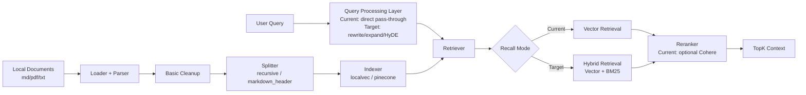

# RAG Retrieval Optimization Proposal

## 1. Background

The project already has a working RAG component. Its core pipeline is:

- `Loader` reads local `md`, `pdf`, and `txt` documents.
- `Splitter` performs recursive splitting or Markdown-header splitting.
- `Indexer` writes chunks into `localvec` or `pinecone`.
- `Retriever` performs vector recall based on embeddings.
- `Reranker` optionally uses Cohere for reranking.

This pipeline is enough for the basic workflow of "offline indexing plus online query-time retrieval", but it is still far from a production-grade RAG system that is stable, extensible, and measurable. Based on the current implementation and common RAG failure modes, the main gaps are:

- A single retrieval strategy causes recall bias. The current implementation only supports vector retrieval, without BM25 or hybrid recall. Recall quality is therefore unstable for short queries, entity-heavy queries, and acronym-style queries.
- There is no Query understanding layer. `Retrieve` sends the raw query directly into retrieval, without intent classification, query rewrite, query expansion, or HyDE preprocessing.
- Reranking exists but remains weak. The code already supports optional Cohere rerank, but it is disabled by default and only reranks plain text candidates, without using metadata or multi-path fallback strategies.
- Offline document processing is still basic. Current PDF parsing and Markdown cleanup are largely text-level preprocessing, without layout analysis, OCR, or table-structure recovery.
- Chunking strategies are limited. The system currently supports only recursive splitting and Markdown-header splitting. It does not yet support semantic chunking, preserving document hierarchy, or richer chunk metadata.
- There is no evaluation or observability loop. The current system has no Recall@K, MRR, NDCG, Precision@K, caching metrics, or performance metrics.

If these gaps are not made explicit in the proposal, later iterations will keep trying to compensate with prompts or model parameters, which only disguises a retrieval-quality problem as a generation-quality problem and makes troubleshooting increasingly expensive.

## 2. Goals

- Goal 1: clarify the actual capability boundary of the current RAG component so configuration placeholders are not mistaken for fully implemented features.
- Goal 2: define an evolution path from "basic vector RAG" to "measurable two-stage RAG" without breaking the current component assembly model.
- Goal 3: close the most important gaps across five areas: Query understanding, offline parsing, recall, reranking, and performance governance.
- Goal 4: keep the existing interfaces and runtime model broadly compatible so new capabilities can be enabled gradually through switches.

## 3. Non-goals

- Non-goal 1: this proposal does not rewrite the Agent main flow and does not turn every problem into a RAG invocation.
- Non-goal 2: this proposal does not require every academic optimization technique to be introduced at once; it focuses first on the current codebase's most important weaknesses.
- Non-goal 3: this proposal does not cover a systematic redesign of the generation model, prompt templates, or answer post-processing.
- Non-goal 4: this proposal does not commit to replacing the current vector-store backends immediately; `dev/localvec` and `pinecone` remain the primary paths for now.

## 4. Current State and Constraints

Technical state:

- `Loader` only supports local files and accepts `pdf`, `md`, and `txt`.
- `Parser` performs basic cleanup for Markdown and PDF, but does not restore structured layout information.
- `Splitter` supports `recursive` and `markdown_header`.
- `Indexer/Retriever` only support vector indexing and vector retrieval, with `localvec` or `pinecone` as backends.
- `Reranker` only supports `cohere`, and it is disabled by default.
- Runtime calls already support parameters such as `namespace`, `target_index`, `top_k`, `top_n`, and `batch_size`.
- Retrieval results currently only expose `content` and `relevance_score`, without recall source, chunk metadata, raw vector scores, or other debugging fields.

Dependency state:

- Embeddings depend on models registered in the Genkit Registry. The default sample uses `dashscope/text-embedding-v4`.
- Online vector retrieval depends on the `localvec` or `pinecone` plugin capabilities.
- Optional reranking depends on a Cohere API key.

Compatibility constraints:

- The current `RAG` component is already integrated into runtime as a composite component, so a large rewrite must not break component initialization or config assembly.
- The existing indexing CLI in `cmd/index.go` already depends on the `Load -> Split -> Index` flow, and the new design should remain compatible with that entry point as much as possible.
- Many existing config fields are still closer to schema placeholders than real runtime behavior, so the proposal must avoid promising capabilities that the code does not actually implement yet.

## 5. Design

### 5.1 Overall Approach

The overall approach is to keep the current five-stage RAG assembly boundary and gradually add two classes of capability on top of it:

- The first class is "make the current system correct": fill in Query understanding, metadata, evaluation, error handling, and observability so the existing vector-RAG path becomes more reliable.
- The second class is "make the future system stronger": add hybrid retrieval, two-stage recall, semantic chunking, document-structure recovery, and caching so the architecture can keep improving over time.

In other words, this is not a rewrite. It extends the existing `Loader -> Splitter -> Indexer -> Retriever -> Reranker` skeleton from single-path vector retrieval into a RAG system with cleaner offline processing, broader online recall, and more controllable ranking.

### 5.2 Architecture Diagram or Flow

### 5.3 Key Changes

#### Module A: Query understanding layer

- Add a Query-processing module to handle intent classification, query rewrite, query expansion, and HyDE in one place.
- Keep compatibility with the current `RAG.Retrieve(ctx, namespace, queries, opts...)` interface and prefer internal extension over forcing a new caller-facing API.
- The default strategy should be "fallback to the original query on failure", so Query optimization does not become a single point of failure in the main path.

#### Module B: offline document processing

- Keep the current Markdown and PDF text-cleanup logic, while adding extension points for structured parsing.
- In PDF scenarios, reserve support for layout analysis, OCR, and table recognition through parser extensions without directly complicating the runtime main path.
- In addition to chunk content, add metadata such as `source`, `title`, `header_path`, `page`, and `updated_at`.

#### Module C: chunking strategy

- Preserve the current `recursive` and `markdown_header` modes.
- Add a semantic chunking strategy with chunk overlap and structure-boundary constraints.
- Preserve section hierarchy metadata for Markdown-header chunks so document structure is not lost after indexing.

#### Module D: recall and ranking

- Keep the current vector-retrieval path as the default baseline.
- Add BM25 or an equivalent keyword retrieval capability to form hybrid retrieval.
- Add a unified merge layer after recall for deduplication, score normalization, and source tagging.
- Keep the optional rerank design, but upgrade it from "plain-text reranking" to "candidate-set reranking", and support reranking only the top N candidates.

#### Module E: performance and governance

- Make indexing support clearer batching strategies and asynchronous pipelines.
- Add embedding cache, retrieval-result cache, and answer cache to the online path.
- Add timeouts and feature switches for query rewrite, HyDE, and rerank.
- Introduce a unified evaluation set and offline evaluation tools so quality is not judged only by subjective experience.

### 5.4 Data and Interface Changes

New interfaces:

- `QueryProcessor`: handles intent classification, rewrite, expansion, and HyDE.
- `HybridRetriever`: aggregates vector retrieval and keyword retrieval.
- `ChunkMetadataBuilder`: produces structured metadata during chunking.
- `RetrievalEvaluator`: provides Recall@K, MRR, NDCG, Precision@K, and related evaluation capabilities.

Field changes:

- `RetrieveResult` should be extended with `metadata`, `source`, `retrieve_score`, `rerank_score`, and `recall_source`.
- Indexed documents should preserve metadata such as section path, document source, page number, and update time.

Compatibility impact:

- External query interfaces can remain unchanged, while the return structure expands in a backward-compatible way.
- Existing indexes should remain readable; missing new metadata should be treated as empty values.
- For callers, new capabilities should be enabled gradually through configuration switches.

Migration path:

- Step 1: extend the result structure and evaluation tools without changing the default recall strategy.
- Step 2: add metadata and stronger offline parsing while preserving existing splitter configuration.
- Step 3: add hybrid retrieval and query rewrite behind configuration switches for gradual rollout.
- Step 4: complete rerank, caching, and performance-governance support.

### 5.5 Error Handling and Fallback

Possible failure points:

- Unstable PDF parsing quality.
- Query rewrite or HyDE invocation failure.
- Failure in one branch of BM25, vector retrieval, or rerank.
- External vector store or Cohere API unavailability.

Failure handling:

- Mark documents with parsing failures using a quality state so they do not enter the main index blindly.
- Fall back to the original query if Query processing fails.
- Keep results from the surviving branch if one side of hybrid retrieval fails.
- Fall back to coarse recall results if rerank fails, without blocking the answer path.

Degradation strategy:

- Always preserve "single-path vector retrieval" as the minimum available path.
- Disable query expansion, HyDE, or rerank in high-latency scenarios.
- Fall back to `dev/localvec` or a no-rerank mode when external dependencies are unavailable.

## 6. Gap Between Current Implementation and Target Design

Already implemented:

- Local document loading.
- Basic PDF and Markdown cleanup.
- Recursive splitting and Markdown-header splitting.
- `localvec` / `pinecone` vector indexing and retrieval.
- Optional Cohere rerank.
- Runtime parameters such as namespace, target index, top-k, top-n, and batch size.

Not yet implemented but required in this proposal:

- BM25 and hybrid retrieval.
- Query rewrite, query expansion, HyDE, and intent classification.
- Layout analysis, OCR, and table-structure recovery.
- Semantic chunking and richer metadata.
- Caching, performance governance, and evaluation tooling.

Facts that must be stated explicitly:

- Some config fields such as `storage_path`, `index_format`, and `dimension` are not fully consumed by runtime today and are still closer to placeholders.
- Current retrieval results do not preserve enough intermediate information, which makes debugging questions like "why was this not recalled" or "why did this rank first" unnecessarily expensive.

## 7. Design Principles

- Principle 1: guarantee recall quality before optimizing ranking. Rerank cannot rescue the wrong candidate set.
- Principle 2: hybrid retrieval should be the long-term core strategy; vector retrieval and BM25 are complementary.
- Principle 3: offline data quality sets the upper bound; document parsing and chunking are not secondary concerns.
- Principle 4: every enhancement must have switches, timeouts, and fallback paths so the main path stays stable.
- Principle 5: the proposal must stay faithful to the current implementation and clearly distinguish "already supported", "config placeholder", and "planned work".

## 8. Evaluation System

Two evaluation layers should be added.

Offline evaluation metrics:

- `Recall@K`
- `MRR`
- `NDCG`
- `Precision@K`

Online observability metrics:

- Retrieval latency
- Rerank latency
- Cache hit rate
- Query rewrite hit rate
- Referenced-document hit rate
- Human-labeled accuracy

The benchmark set should at least cover the following query types:

- Short queries
- Colloquial queries
- Queries containing domain-specific terminology
- Entity, version, or configuration-item queries
- Tabular or structured-information queries

## 9. Implementation Steps

1. Clarify the real boundary between current implementation and configuration, and complete the documentation and result structure.
2. Add a retrieval evaluation set and offline evaluation scripts to establish a baseline.
3. Add metadata to chunks and strengthen PDF and Markdown parsing extension points.
4. Introduce query rewrite and hybrid retrieval, and validate recall gains through gradual rollout.
5. Complete rerank, merge, fallback, and timeout control.
6. Add caching and performance governance to control latency and cost.
7. Decide whether to replace the embedding model or introduce domain-specific tuning based on evaluation results.

## 10. Risks and Follow-up Work

- Hybrid retrieval, HyDE, and rerank will increase external-call cost and latency, so the default strategy must be controlled carefully.
- If document-structure recovery is incomplete, it may add parsing complexity without delivering meaningful gains.
- Embedding replacement and domain-specific tuning require an evaluation set; otherwise they easily become changes that "look more advanced but behave less reliably".
- If metadata and the evaluation system are not added quickly, all later optimizations will remain hard to compare objectively.
