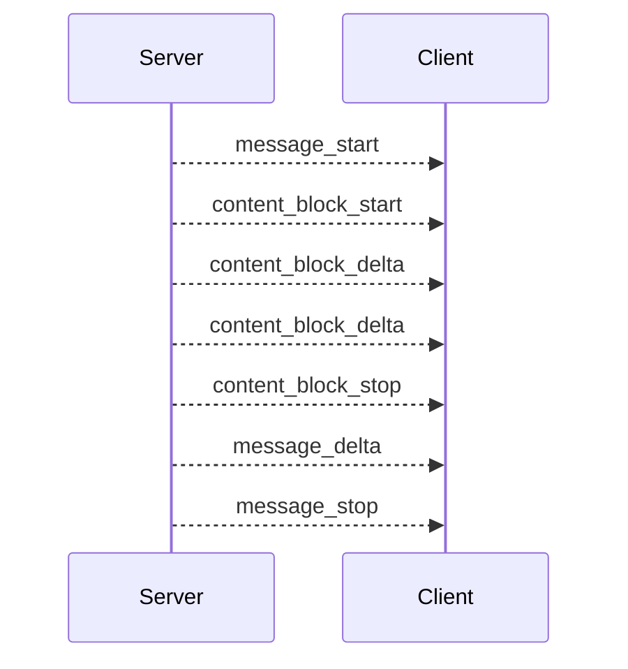

# API Docs

This page documents the HTTP interfaces and SSE event model currently exposed by Dubbo Admin AI. All public endpoints are provided by the `Server` component, under the base prefix:

```text
/api/v1/ai
```

## 1. Endpoint overview

| Method | Path | Description |
| --- | --- | --- |
| `POST` | `/api/v1/ai/sessions` | Create a new session |
| `GET` | `/api/v1/ai/sessions` | List active sessions |
| `GET` | `/api/v1/ai/sessions/:sessionId` | Get a single session |
| `DELETE` | `/api/v1/ai/sessions/:sessionId` | Delete a session and clear its history |
| `POST` | `/api/v1/ai/chat/stream` | Start a streaming chat request |
| `GET` | `/health` | Health check |

The standard JSON response envelope is:

```json
{
  "message": "success",
  "data": {},
  "request_id": "req_xxx",
  "timestamp": 1741233600
}
```

## 2. Create a session

### Request

```http
POST /api/v1/ai/sessions
```

### Example

```bash
curl -sS -X POST http://localhost:8880/api/v1/ai/sessions
```

### Example response

```json
{
  "message": "success",
  "data": {
    "session_id": "session_123",
    "created_at": "2026-03-06T12:00:00+08:00",
    "updated_at": "2026-03-06T12:00:00+08:00",
    "status": "active"
  },
  "request_id": "req_123",
  "timestamp": 1741233600
}
```

### Notes

- The server generates IDs in the form `session_<uuid>`.
- A session is considered expired after 24 hours of inactivity.
- In development mode, a `session_test` session is also created automatically for easier local integration.

## 3. List sessions

### Request

```http
GET /api/v1/ai/sessions
```

### Example response

```json
{
  "message": "success",
  "data": {
    "sessions": [
      {
        "session_id": "session_123",
        "created_at": "2026-03-06T12:00:00+08:00",
        "updated_at": "2026-03-06T12:05:00+08:00",
        "status": "active"
      }
    ],
    "total": 1
  },
  "request_id": "req_456",
  "timestamp": 1741233900
}
```

## 4. Get a single session

### Request

```http
GET /api/v1/ai/sessions/:sessionId
```

### Example

```bash
curl http://localhost:8880/api/v1/ai/sessions/session_test
```

If the session does not exist or has expired, the endpoint returns an error.

## 5. Delete a session

### Request

```http
DELETE /api/v1/ai/sessions/:sessionId
```

### Behavior

- Removes the session from the Session Manager.
- If the Agent can access Memory, it also calls `memory.Clear(sessionID)`.
- This is logical deletion plus history cleanup, not storage-layer deletion, because Memory is currently in-process only.

## 6. Start a streaming chat request

### Request

```http
POST /api/v1/ai/chat/stream
Content-Type: application/json
Accept: text/event-stream
```

### Request body

```json
{
  "message": "Please help me analyze possible reasons for service timeouts",
  "sessionID": "session_test"
}
```

Field semantics:

| Field | Type | Required | Description |
| --- | --- | --- | --- |
| `message` | string | Yes | User input |
| `sessionID` | string | Yes | An existing session ID |

### Example

```bash
curl -N -X POST http://localhost:8880/api/v1/ai/chat/stream \
  -H "Content-Type: application/json" \
  -H "Accept: text/event-stream" \
  -d '{"message":"hello","sessionID":"session_test"}'
```

## 7. SSE event model

The server transforms intermediate and final Agent output into SSE events. Common event types in the current implementation are:

| Event | Description |
| --- | --- |
| `message_start` | Start of one assistant message |
| `content_block_start` | Start of one content block |
| `content_block_delta` | Incremental text output |
| `content_block_stop` | End of one content block |
| `message_delta` | Message-level delta, usually including stop reason or usage |
| `message_stop` | End of the current message |
| `error` | Error during processing |

### Event order sketch



### Example event

```text
event: content_block_delta
data: {"type":"content_block_delta","index":0,"delta":{"type":"text_delta","text":"Analyzing the invocation chain..."}}
```

Client-side recommendations:

- Use the `event` field to decide event type instead of only concatenating `data`.
- Only treat the response as complete after receiving `message_stop`.
- Handle SSE `error` events and non-2xx HTTP statuses in one consistent way.

## 8. Error semantics

Common error sources:

- Invalid request body: `400 Bad Request`
- Missing or expired `sessionID`: `400 Bad Request`
- SSE writer creation failure: `500 Internal Server Error`
- Agent runtime failure: delivered through an `error` event

Once the streaming endpoint has started sending SSE, later business errors usually no longer come back as normal JSON. They are sent as SSE `error` events instead.

## 9. Health check

### Request

```http
GET /health
```

### Response

```json
{
  "status": "ok"
}
```

This endpoint only means the HTTP service is up. It does not prove that model providers, MCP tools, or vector backends are healthy. Production environments should add deeper dependency probes.
