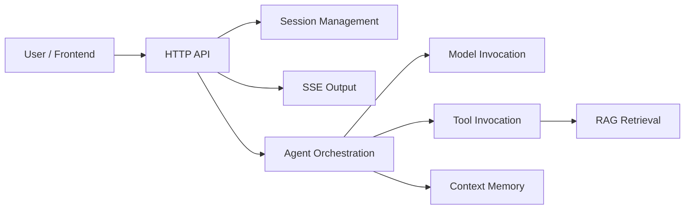

# User Guide

This section is for two groups:

- Integrators: people who need to know how to call the service, consume SSE, and manage sessions.
- Operators: people who need to know how to deploy it, what signals to watch, and where to look first during failures.

Dubbo Admin AI is not a thin wrapper around a single model API. Externally it looks like an HTTP service, but internally it goes through session validation, Agent orchestration, model inference, tool calls, and knowledge retrieval. Production issues are usually distributed across those stages as well.

## System overview

## What this section covers

- [API Docs](api.md): endpoint paths, request and response shapes, and SSE event semantics.
- [Deployment & Operations](deployment-operations.md): startup modes, production deployment advice, health checks, and operating signals.
- [YAML Configuration](yaml-configuration.md): field-by-field explanations for the main config and component YAML files.
- [Troubleshooting](troubleshooting.md): investigation paths from "service does not start" to "retrieval quality is poor".
- [FAQ](faq.md): common pitfalls that do not justify a full long-form document.

## Basic usage flow

1. Create a session.
2. Use `sessionID` to call the streaming chat endpoint.
3. The frontend assembles the answer in SSE event order.
4. The backend stores conversation history in Memory, so later requests can reuse the same session.

## When to switch to developer docs

The user docs are not enough when you start asking questions like:

- Why does a given stage call tools repeatedly?
- Why did a config field change but have no effect?
- Why does `max_turns` in Memory not match the real context-window behavior?
- Why does the runtime still behave like a single-instance system even though components appear multi-instance-capable?

Those questions need code-level understanding. Start with the [Architecture Overview](../developer-guide/architecture-overview.md).
