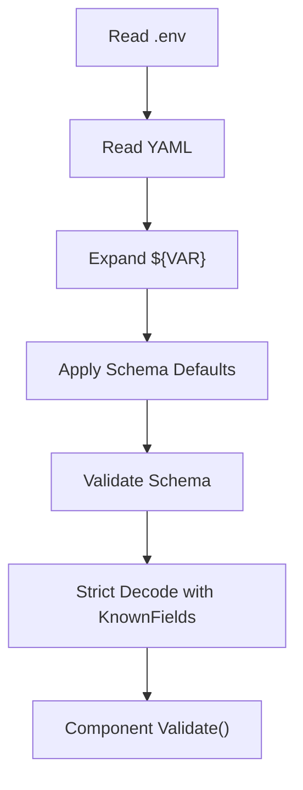

# YAML Configuration

This page explains the main `config.yaml` and the component YAML files it references. The goal is not to restate every schema line mechanically, but to answer two practical questions:

- Which fields matter most to real behavior?
- Which fields are worth checking first when startup or runtime behavior looks wrong?

## 1. Main config: `config.yaml`

This file is the assembly entry for the whole system. Its core job is to declare which component config files should be loaded.

Typical shape:

```yaml
project: dubbo-admin-ai
version: 1.0.0
components:
  logger: component/logger/logger.yaml
  models: component/models/models.yaml
  server: component/server/server.yaml
  memory: component/memory/memory.yaml
  tools: component/tools/tools.yaml
  rag: component/rag/rag.yaml
  agent: component/agent/agent.yaml
```

Key points:

- `components` is required.
- Each value is a path to one component YAML file.
- If a path is wrong, startup fails during config loading.

## 2. Config loading behavior

The config loader does more than "just parse YAML". The actual pipeline is:



This means:

- Missing fields may be auto-filled if schema provides defaults.
- Unknown fields are not silently ignored.
- Environment variables affect final config values before component validation runs.

## 3. `component/logger/logger.yaml`

Purpose: control global logging behavior.

Typical shape:

```yaml
type: logger
spec:
  level: info
```

Key field:

- `level`: supports `debug`, `info`, `warn`, `error`

Impact:

- This affects the global default `slog` logger for the whole process.
- If the level is invalid, startup fails in `Validate()`.

## 4. `component/memory/memory.yaml`

Purpose: control session history behavior.

Typical shape:

```yaml
type: memory
spec:
  history_key: chat_history
  max_turns: 100
```

Key fields:

- `history_key`: the identifier used for conversation history in context handling
- `max_turns`: intended upper bound for retained turns

Important caveat:

- `max_turns` exists in config, but current runtime behavior is not a perfect one-to-one reflection of that field. Treat it as a clue, then verify against the real code path.

## 5. `component/models/models.yaml`

Purpose: define providers, default model selection, and embeddings.

Typical shape:

```yaml
type: models
spec:
  default_model: "dashscope/qwen-max"
  default_embedding: "dashscope/text-embedding-v4"
  providers:
    dashscope:
      api_key: "${DASHSCOPE_API_KEY}"
      base_url: "https://dashscope.aliyuncs.com/compatible-mode/v1"
```

Fields that matter most:

- `default_model`: the model Agent uses by default
- `default_embedding`: the embedding model used by RAG and related paths
- `providers.*.api_key`: whether a provider is actually usable
- `providers.*.base_url`: upstream API endpoint
- `providers.*.models`: available model list
- `providers.*.embedders`: available embedding list

Common misunderstanding:

- A provider being listed in YAML does not mean it will be active. Providers without usable API keys are usually skipped during initialization.

## 6. `component/rag/rag.yaml`

Purpose: define the retrieval pipeline.

Typical shape:

```yaml
type: rag
spec:
  embedder:
    type: genkit
    spec:
      model: dashscope/text-embedding-v4
  loader:
    type: local
  splitter:
    type: recursive
  indexer:
    type: pinecone
  retriever:
    type: pinecone
  reranker:
    type: cohere
    spec:
      enabled: false
```

Fields worth checking first:

- `embedder.spec.model`
- `loader.type`
- `splitter.type`
- `indexer.type`
- `retriever.type`
- `reranker.spec.enabled`

Operational meaning:

- If chat works but knowledge retrieval does not, this file is usually where you start.
- Some schema fields may still be more like placeholders than fully wired runtime parameters.

## 7. `component/tools/tools.yaml`

Purpose: control which tool sources are enabled.

Typical shape:

```yaml
type: tools
spec:
  enable_mock_tools: true
  enable_internal_tools: true
  enable_mcp_tools: false
  mcp_host_name: "mcp_host"
```

Key fields:

- `enable_mock_tools`
- `enable_internal_tools`
- `enable_mcp_tools`
- `mcp_host_name`

Recommended local baseline:

- Keep mock and internal tools enabled
- Keep MCP disabled until the rest of the path is stable

## 8. `component/agent/agent.yaml`

Purpose: control Agent behavior.

You should care most about:

- `model`
- `prompt_base_path`
- `max_iterations`
- `stages`

Each stage usually includes:

- `flow_type`
- `prompt_file`
- `temperature`
- `enable_tools`

What can go wrong:

- Wrong model names break flow creation
- Wrong prompt paths or prompt file names break initialization
- Wrong stage structure can break the orchestrator

## 9. `component/server/server.yaml`

Purpose: control service exposure behavior.

You should care most about:

- `host`
- `port`
- `read_timeout`
- `write_timeout`
- `debug`
- `cors_origins`

Important note:

- Some fields may exist in config and schema, but current middleware behavior may still be simpler than what the config suggests. Validate through actual runtime behavior.

## 10. What to verify after config changes

After changing config, do not stop at "schema validation passed". Verify these too:

1. The service actually starts
2. The intended provider or component is actually initialized
3. The runtime behavior really changed
4. Related docs and examples were updated with the same assumptions

That matters because schema validity, runtime wiring, and real behavior are related, but not identical.
