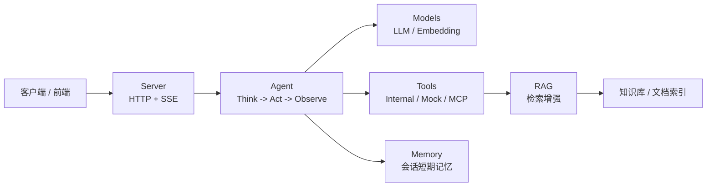

# Dubbo Admin AI 文档

Dubbo Admin AI 是 Dubbo Admin 面向 AI 场景的一组运行时与服务能力。它把模型推理、工具调用、知识检索、会话管理和流式输出整合成一个可部署的服务，目标不是“单纯聊天”，而是让系统具备面向运维、排障和知识问答的可执行能力。

如果你第一次接触这个项目，建议先把它理解成三层：

- 接入层：HTTP API + SSE 流式输出，负责接收请求、管理会话、把中间结果推送给客户端。
- 编排层：Agent 负责思考、决定是否调用工具、整合结果并输出答案。
- 能力层：Models、Tools、Memory、RAG 提供模型、工具、短期记忆和知识检索能力。

## 阅读入口

- 想把服务跑起来：从[快速开始](quick-start.md)开始。
- 想了解 API 和详细 yaml 配置参数：从[用户指南](wiki/user-guide/index.md)开始。
- 想理解架构和代码：从[开发者指南](wiki/developer-guide/architecture-overview.md)开始。

## 文档范围

- 面向使用者的说明：如何部署、如何接入和如何排障。
- 面向开发者的说明：运行时生命周期、组件边界、Agent 工作流、RAG 子系统、工具系统和配置机制。
- 面向演进的说明：为什么这样设计，当前约束是什么，后续准备怎么改。

## 关键信息

- 服务默认监听 `http://localhost:8880`。
- API 入口前缀为 `/api/v1/ai`。
- 流式接口使用 `text/event-stream`。
- 启动流程由 `config.yaml` 加载组件配置，再由 runtime 按工厂注册顺序创建并初始化组件。
- 默认组件顺序为 `logger -> memory -> models -> rag -> tools -> server -> agent`。

## 配置概览

如果你只是想先建立配置全貌，不需要一开始就读完所有 YAML，优先关注这几份文件：

- `config.yaml`：总装配入口，决定要加载哪些组件配置。
- `component/models/models.yaml`：决定默认模型、embedding 和 Provider 密钥。
- `component/server/server.yaml`：决定服务监听地址、端口和超时。
- `component/agent/agent.yaml`：决定 Agent 使用的模型、Prompt 路径和最大迭代次数。
- `component/tools/tools.yaml`：决定是否启用 mock、internal、MCP 工具。
- `component/rag/rag.yaml`：决定知识检索链路的 embedding、切分、索引和重排。

想看逐字段解释和完整 YAML 解析，直接进入[YAML 配置详解](wiki/user-guide/yaml-configuration.md)或[开发者配置指南](wiki/developer-guide/configuration.md)。

## 文档结构

- 首页：帮助你快速建立项目全貌。
- 快速开始：最短启动路径和第一个请求。
- 用户指南：面向接入、部署和运维。
- 开发者指南：面向架构理解、代码维护和能力扩展。
