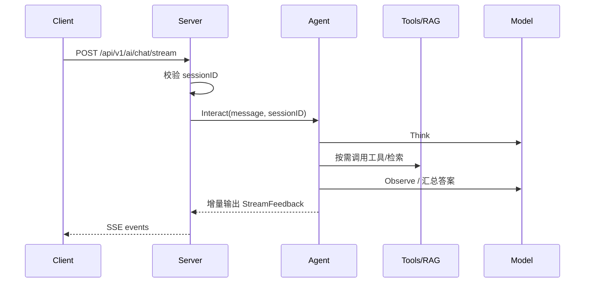

# 快速开始

本页的目标很明确：用最少的步骤把 Dubbo Admin AI 跑起来，并完成一次真实的流式对话请求。

## 1. 前置条件

- Go `1.24.1+`
- 至少一个可用的模型 API Key
- 本地可访问对应模型提供方

项目默认配置里已经预置了多个 Provider 配置项，但真正生效的是“你填了 API Key 的那部分”。最小可用场景下，只需要保证 `DASHSCOPE_API_KEY` 或其他任意一个 Key 可用即可。

## 2. 准备环境变量

```bash
cp .env.example .env
```

然后至少填一个密钥，例如：

```bash
DASHSCOPE_API_KEY=your_key_here
```

配置文件中的敏感字段通过 `${VAR}` 展开，所以 `.env` 只是本地开发时的便捷方式，生产环境应改用环境变量或密钥管理系统。

## 3. 关键配置项

如果你只是想把服务跑起来，不需要先理解所有 YAML，但至少应该知道下面这些配置会直接影响“能不能启动”和“启动后表现如何”。

### 3.1 主配置

配置文件：`config.yaml`

这是总装配文件，用来声明系统要加载哪些组件配置。

最重要的是 `components` 字段：

```yaml
components:
  logger: component/logger/logger.yaml
  models: component/models/models.yaml
  server: component/server/server.yaml
  memory: component/memory/memory.yaml
  tools: component/tools/tools.yaml
  rag: component/rag/rag.yaml
  agent: component/agent/agent.yaml
```

如果这里的路径写错，服务会在启动时直接失败。

### 3.2 Models 配置

配置文件：`component/models/models.yaml`

这是最关键的一份配置，因为它决定模型是否可用。

你至少要关注：

- `default_model`：默认聊天模型
- `default_embedding`：默认 embedding 模型
- `providers.*.api_key`：各 Provider 的密钥
- `providers.*.base_url`：上游接口地址

最小关注示例：

```yaml
spec:
  default_model: "dashscope/qwen-max"
  default_embedding: "dashscope/text-embedding-v4"
  providers:
    dashscope:
      api_key: "${DASHSCOPE_API_KEY}"
      base_url: "https://dashscope.aliyuncs.com/compatible-mode/v1"
```

如果 `default_model` 指向的 Provider 没有可用密钥，服务虽然可能启动，但聊天能力会不可用。

### 3.3 Server 配置

配置文件：`component/server/server.yaml`

这份配置决定服务监听地址。

最重要的是：

- `host`
- `port`
- `read_timeout`
- `write_timeout`

例如：

```yaml
spec:
  host: "localhost"
  port: 8880
```

如果你要让其他机器访问，通常不能继续使用 `localhost`。

### 3.4 Agent 配置

配置文件：`component/agent/agent.yaml`

这份配置决定 Agent 使用哪个模型、最多循环多少轮、从哪里读 Prompt。

最重要的是：

- `model`
- `prompt_base_path`
- `max_iterations`
- `stages`

如果 `prompt_base_path` 或 `prompt_file` 对不上，Agent 初始化会失败。

### 3.5 Tools 配置

配置文件：`component/tools/tools.yaml`

这份配置决定是否启用 mock、internal、MCP 工具。

最常用的开关是：

- `enable_mock_tools`
- `enable_internal_tools`
- `enable_mcp_tools`

本地开发通常建议先保持：

```yaml
enable_mock_tools: true
enable_internal_tools: true
enable_mcp_tools: false
```

因为 MCP 依赖外部工具进程，问题面更大。

### 3.6 RAG 配置

配置文件：`component/rag/rag.yaml`

这份配置决定知识检索能力是否可用。

你至少要关注：

- `embedder.spec.model`
- `loader.type`
- `splitter.type`
- `indexer.type`
- `retriever.type`
- `reranker.spec.enabled`

如果你只是先跑聊天能力，RAG 可以先按默认配置保持不动；如果要做知识问答，再重点检查它。

### 3.7 Memory 配置

配置文件：`component/memory/memory.yaml`

这份配置主要影响会话历史行为。

你通常只需要知道：

- `history_key`：上下文存储标识
- `max_turns`：希望保留的最大轮数配置

它影响连续对话体验，但不是启动阻塞项。

### 3.8 启动前检查

第一次启动时，只优先确认四件事：

1. `config.yaml` 路径都对
2. `models.yaml` 至少有一个可用 Provider
3. `server.yaml` 端口没有冲突
4. `agent.yaml` 的模型名和 prompt 路径都对

其余配置先保持默认，跑通后再逐步调整。

## 4. 启动服务

```bash
go run main.go --config ./config.yaml
```

默认监听地址：

```text
http://localhost:8880
```

启动成功后，你可以先检查健康状态：

```bash
curl http://localhost:8880/health
```

预期返回：

```json
{"status":"ok"}
```

## 5. 启动前端页面进行聊天

如果你希望直接在页面里体验聊天，而不是手动用 `curl` 调接口，可以启动仓库里的前端项目 `ui-vue3`。

前端开发环境参考 `ui-vue3/README.md`，当前项目至少需要：

- Node.js `18+`
- Yarn `1.22.x`

在仓库根目录下执行：

```bash
cd ../ui-vue3
yarn
yarn dev
```

前端默认启动在：

```text
http://localhost:8881/admin
```

联调关系如下：

- 前端开发服务：`http://localhost:8881`
- AI 后端服务：`http://localhost:8880`
- `ui-vue3` 会把 `/api/v1/ai` 代理到 `http://localhost:8880`

页面打开后，点击右下角的 AI 浮动按钮，会弹出 `Dubbo Admin AI` 聊天抽屉。前端会自动调用：

- `POST /api/v1/ai/sessions` 创建会话
- `POST /api/v1/ai/chat/stream` 发起流式聊天

如果页面能打开但无法聊天，优先检查两点：

- AI 后端是否已经在 `8880` 端口启动
- 浏览器访问的是否是 `http://localhost:8881/admin`

## 6. 创建会话

Dubbo Admin AI 的对话接口要求先创建 session。服务端会维护会话元信息，并把历史上下文交给 Memory 组件管理。

```bash
curl -sS -X POST http://localhost:8880/api/v1/ai/sessions
```

典型响应：

```json
{
  "message": "success",
  "data": {
    "session_id": "session_xxx",
    "created_at": "2026-03-06T12:00:00+08:00",
    "updated_at": "2026-03-06T12:00:00+08:00",
    "status": "active"
  },
  "request_id": "req_xxx",
  "timestamp": 1741233600
}
```

开发环境里，服务初始化时还会创建一个默认会话 `session_test`，方便你直接测试流式接口。

## 7. 发起一次流式对话

```bash
curl -N -X POST http://localhost:8880/api/v1/ai/chat/stream \
  -H "Content-Type: application/json" \
  -H "Accept: text/event-stream" \
  -d '{"message":"帮我分析 Dubbo 服务调用失败的常见原因","sessionID":"session_test"}'
```

注意两点：

- 字段名是 `sessionID`，不是 `session_id`。
- 使用 `curl -N`，否则你可能看不到实时流式输出。

你会看到类似下面的 SSE 事件：

```text
event: message_start
data: {"type":"message_start", ...}

event: content_block_start
data: {"type":"content_block_start", ...}

event: content_block_delta
data: {"type":"content_block_delta", "delta":{"text":"正在分析..."}}

event: message_delta
data: {"type":"message_delta", ...}

event: message_stop
data: {"type":"message_stop"}
```

## 8. 请求流程



## 9. 常见启动问题

- 服务启动失败：优先检查 `.env`、`config.yaml` 和组件 YAML 是否正确。
- 前端启动失败：优先检查 Node 和 Yarn 版本，以及是否在 `ui-vue3` 目录执行了 `yarn`。
- 页面打不开：确认前端开发服务运行在 `8881`，并使用 `/admin` 路径访问。
- 页面能打开但无法聊天：确认 Vite 代理目标 `http://localhost:8880` 对应的 AI 后端已启动。
- 启动后模型不可用：优先检查 `component/models/models.yaml` 里的 `default_model`、`api_key` 和 `base_url`。
- Agent 初始化失败：优先检查 `component/agent/agent.yaml` 的 `model`、`prompt_base_path` 和 `stages`。
- 创建会话失败：先确认服务已经监听在 `8880` 端口。
- 流式接口没有输出：确认请求头里带了 `Accept: text/event-stream`，并检查模型 Provider 是否可访问。
- 模型报错：通常是 API Key 无效、模型名不匹配或网络出站受限。

## 10. 下一步读什么

- 想接 API：看[用户指南总览](wiki/user-guide/index.md)
- 想了解请求和 SSE 结构：看[API 文档](wiki/user-guide/api.md)
- 想理解系统为什么这么跑：看[架构总览](wiki/developer-guide/architecture-overview.md)
- 想改配置：看[配置指南](wiki/developer-guide/configuration.md)
