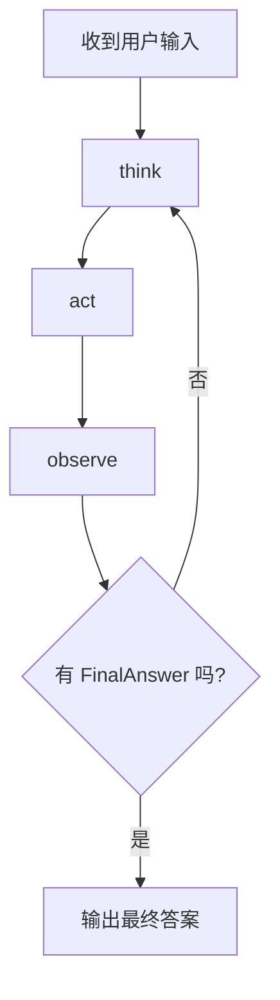
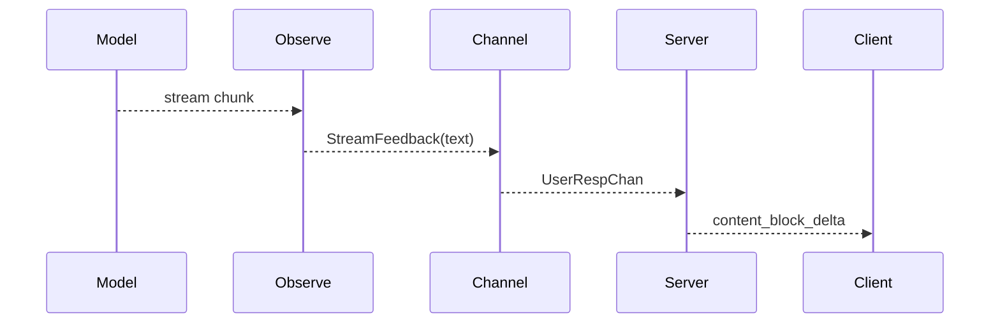

# Agent 工作流

本页不再从“组件职责”看 Agent，而是专门解释一轮对话在内部如何推进。换句话说，这里讨论的是行为流程，而不是对象结构。

## 1. 工作流的核心思想

Dubbo Admin AI 当前使用 ReAct 风格循环，把一次复杂问题拆成：

- 思考：理解问题、判断是否需要外部能力
- 行动：调用工具或检索
- 观察：整合结果、生成中间总结或最终答案

这种设计优于“单次提示词一把梭”的原因是，它给了系统一个受控的外部能力调用窗口。

## 2. 默认流程图

## 3. 每个阶段做什么

### think

- 理解用户问题
- 判断问题类型
- 选择可能需要的工具
- 输出下一步动作建议

### act

- 根据 `think` 的结果决定是否真的调用工具
- 执行工具并收集结果
- 形成结构化 `ToolOutputs`

### observe

- 阅读工具结果
- 生成中间总结
- 逐步流式输出给用户
- 在条件满足时生成最终答案

## 4. 终止条件

循环不会无限执行。当前终止条件主要有两个：

- `observe` 输出 `FinalAnswer`
- 达到 `max_iterations`

其中 `max_iterations` 是一个非常重要的安全护栏，避免模型反复陷入“想调用工具但得不到有效结果”的死循环。

## 5. 流式输出是在哪一层产生的

真正的流式输出发生在 `observe` 阶段的 streaming flow 中。它会一边从模型拿流式 chunk，一边通过 `UserRespChan` 把文本送给 Server。

## 6. 上下文是怎么进入工作流的

Agent 并不是每个阶段都直接拿“原始用户输入”，而是把历史窗口消息一起带入 prompt。这个上下文来自 Memory 组件，按 `sessionID` 读取。

因此工作流质量不仅取决于 prompt 和模型，也取决于：

- session 是否复用
- 窗口历史是否合理
- 是否正确推进 turn

## 7. 工具为什么不是每次都调用

Agent 工作流并不把工具调用视为默认路径。当前实现里，只有当 `think` 阶段认为问题不是普通问答，且给出了建议工具时，`act` 才会真正尝试调用工具。

这能避免两个问题：

- 简单问题也走重型外部调用，浪费时间和成本
- 工具被模型过度调用，导致循环复杂化

## 8. 观察这个工作流最有效的办法

线上排障时，建议按阶段看日志和耗时：

- `think` 是否成功产生结构化判断
- `act` 是否真的发出了 tool request
- `observe` 是否开始流式输出
- 是否在某轮之后稳定结束

如果你只看最终答案，很难判断问题出在“模型不会想”“工具不会调”还是“结果不会整合”。
