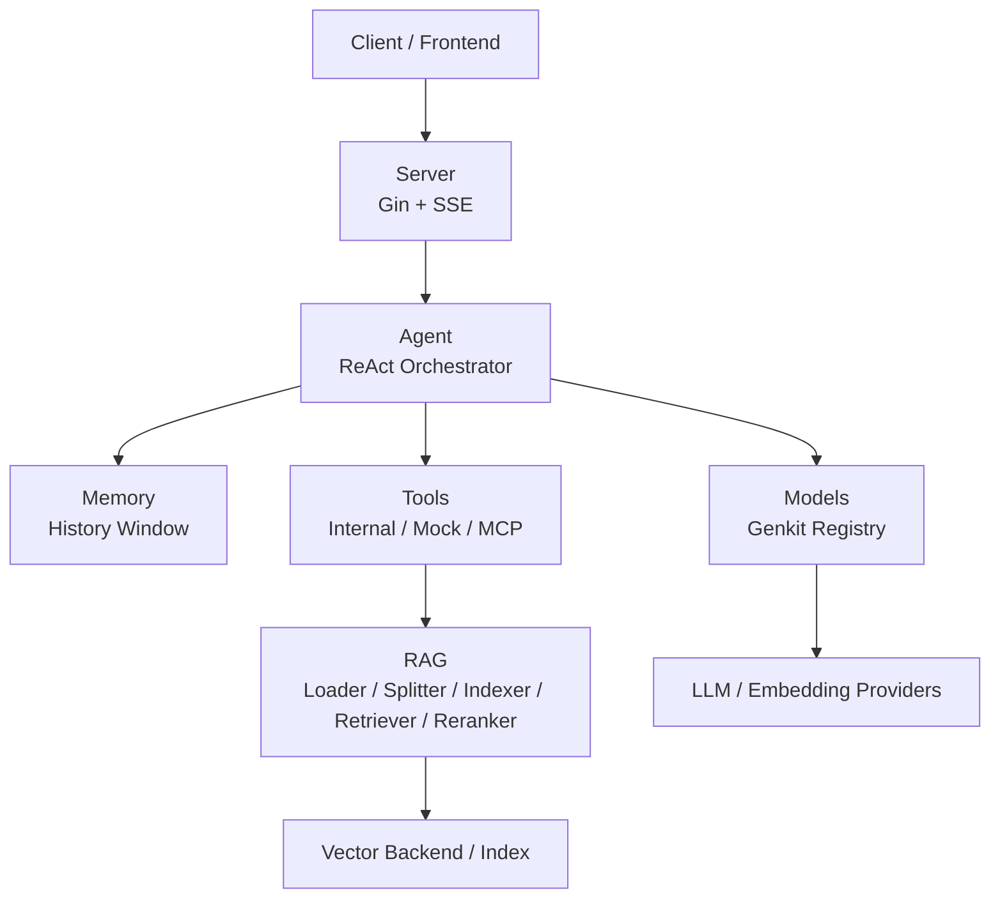
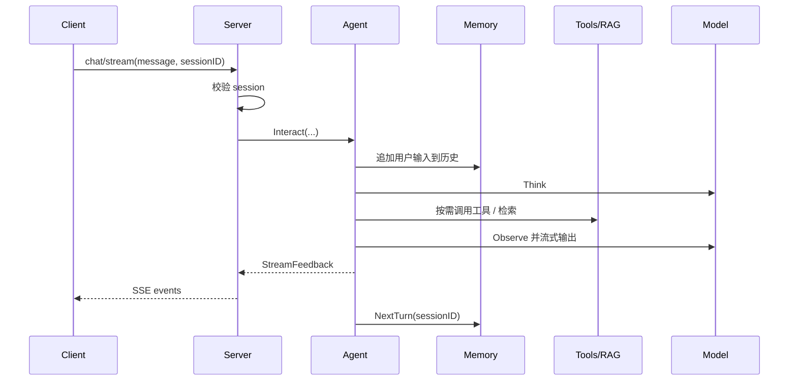

# 架构总览

如果只用一句话概括 Dubbo Admin AI 的架构，它是一个“组件化运行时驱动的流式 Agent 服务”：Server 负责对外 API 和 SSE，Agent 负责多阶段编排，Models / Tools / Memory / RAG 提供能力支撑，runtime 负责把这些组件装配起来。

## 1. 为什么项目被拆成这些层

这种拆法解决的是三个实际问题：

- 对外协议和内部能力要解耦，避免每次换模型或工具都改 HTTP 层。
- 推理流程要可编排，不能把所有逻辑都塞进一个 prompt。
- 能力要可替换，模型、工具、检索和记忆都应该能独立演进。

## 2. 系统全貌

## 3. 一次请求怎么走

最关键的主链路是 `POST /api/v1/ai/chat/stream`。

这条链路的设计重点在于：HTTP 层并不直接理解“思考”和“工具调用”，它只消费 Agent 产出的流式反馈。

## 4. 运行时如何装配系统

运行时入口是 `runtime.Bootstrap(configPath, registerFactorys)`。它做四件事：

1. 注册组件工厂。
2. 读取 `config.yaml` 和各组件 YAML。
3. 按工厂顺序创建组件并执行 `Validate -> Init`。
4. 把组件存入注册表，再统一执行 `Start()`。

默认工厂注册顺序定义在 `main.go`：

1. `logger`
2. `memory`
3. `models`
4. `rag`
5. `tools`
6. `server`
7. `agent`

这里要注意一个事实：文档上的“依赖关系”和运行时的“实际启动顺序”不完全等价。比如 `server` 在注册顺序里早于 `agent`，但 `server.Start()` 会从 runtime 取 `agent`，而 `Start()` 的遍历顺序来自 `sync.Map.Range`，严格说并不保证顺序稳定。

## 5. 组件分工

### Server

- 提供 HTTP API
- 维护 Session
- 把 Agent 输出转成 SSE

### Agent

- 驱动 `think -> act -> observe` 阶段循环
- 决定是否调用工具
- 管理中间输出和最终答案

### Models

- 初始化 Genkit Registry
- 注册各 Provider 的模型和 Embedding
- 提供统一模型调用入口

### Tools

- 聚合 internal、mock、MCP 三类工具
- 暴露 `ToolRef` 给 Agent

### Memory

- 保存进程内短期对话历史
- 按 session 输出窗口上下文

### RAG

- 负责文档加载、切分、索引、检索和可选重排

## 6. 为什么说这是“组件化运行时”

因为项目真正的装配单位不是包、不是接口文件，而是满足 `runtime.Component` 生命周期的组件：

- `Name()`
- `Validate()`
- `Init(*Runtime)`
- `Start()`
- `Stop()`

这个模型的好处是清楚，坏处是也带来一些现实限制，比如当前绝大多数组件 `Name()` 返回固定值，导致天然更偏向单实例。

## 7. 设计上的强项

- 配置加载链路严格，降低“配置看起来写对了，运行却默默错了”的风险。
- 组件边界清楚，文档和代码比较容易对齐。
- 流式输出是第一等能力，不是事后补出来的。
- RAG、Tools、Models 都可以相对独立演进。

## 8. 当前最重要的架构约束

- Session 和 Memory 是进程内状态，不支持天然共享。
- `genkit.Init()` 当前只适合初始化一次，Provider 扩展方式仍偏集中式。
- Runtime 注册表按组件名存储，限制多实例能力。
- 部分配置字段已经进入 schema，但尚未完整贯穿执行逻辑。

## 9. 阅读建议

- 想看启动与生命周期：继续读[运行时与组件](runtime-components.md)
- 想按模块深入：去看[组件架构总览](components/index.md)
- 想看 Agent 具体循环：去看[Agent 工作流](agent-workflow.md)
