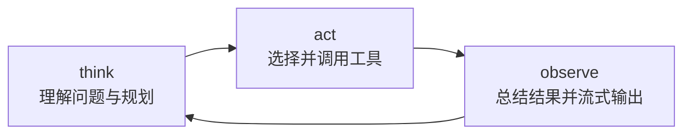
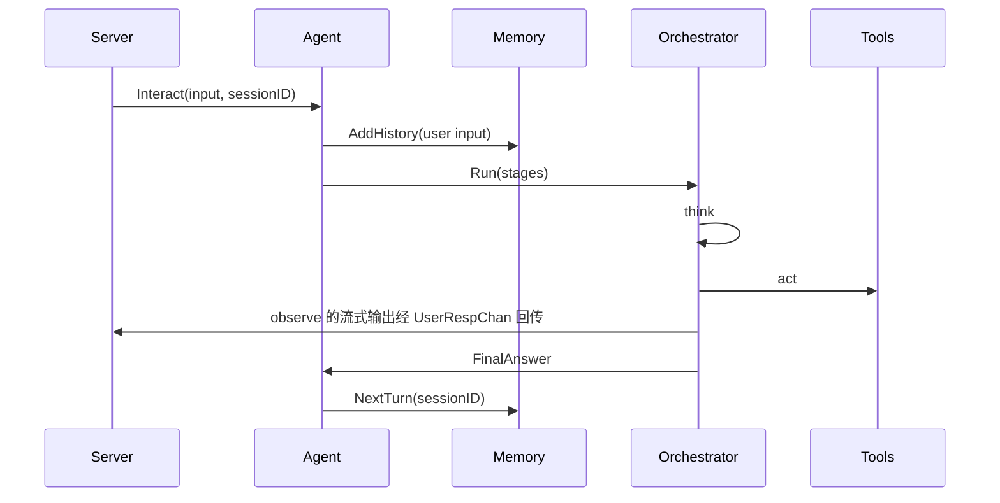

# Agent 组件

Agent 是 Dubbo Admin AI 的中枢。Server 负责接请求，Tools 和 RAG 负责提供能力，但真正决定“这一轮该怎么思考、要不要调用工具、何时结束”的，是 Agent。

## 1. Agent 的职责

- 接收用户输入和 `sessionID`
- 从 Memory 获取上下文
- 按 stage 执行推理循环
- 调用工具并整合结果
- 通过 channel 持续向 Server 输出增量反馈

默认实现位于 `component/agent/react`，采用 ReAct 风格的多阶段工作流。

## 2. 当前默认阶段

从配置 `component/agent/agent.yaml` 看，默认阶段为：

1. `think`
2. `act`
3. `observe`



当 `observe` 产生 `FinalAnswer` 且不是 heartbeat 时，循环结束。

## 3. Agent 内部结构

### `ReActAgent`

负责持有：

- Genkit Registry
- Memory Context
- Orchestrator
- Channels

### `OrderOrchestrator`

负责：

- 按顺序执行 stage
- 控制 before loop / in loop / after loop
- 限制最大迭代次数

### `Channels`

用于和 Server 解耦：

- `UserRespChan`：给用户看的增量内容
- `FlowChan`：stage 之间传递结构化输出
- `ErrorChan`：统一错误通道

## 4. 一轮交互内部发生了什么



## 5. Prompt 和 stage 是怎么绑定的

每个 stage 都配置了：

- `flow_type`
- `prompt_file`
- `temperature`
- `enable_tools`

构建过程大致是：

1. 读取 prompt 文件
2. 选择该 stage 的输入输出类型
3. 若允许工具，则附带 `ToolRef`
4. 用 Genkit 定义 prompt 和 flow

这也是为什么 Agent 的行为不是写死在代码里的，它由“代码结构 + prompt 文件 + 配置”共同决定。

## 6. Agent 如何和 Memory 协作

`Interact()` 会先把用户输入写入 Memory，再把 session 相关信息放到 context 中。之后每个阶段执行 prompt 时，都通过 `history.WindowMemory(sessionID)` 构造上下文。

这一点非常关键：Agent 不是自己维护历史，而是把历史管理委托给 Memory。

## 7. Agent 如何和 Server 协作

Server 并不直接执行 LLM，而是调用：

```go
agent.Interact(...)
```

然后不断消费 channel：

- 收到增量文本就写 `content_block_delta`
- 收到 done 信号就写 `content_block_stop`
- 收到 final 输出就写 `message_delta`
- 收到错误就转成 SSE `error`

这使得 Agent 可以专注于“推理工作流”，Server 专注于“协议输出”。

## 8. 当前最值得注意的约束

- `Channels` 会复用，读代码时要注意 `Reset()` 和 `Close()` 的行为。
- 最大迭代次数是安全护栏，避免循环失控。
- Stage 输出类型必须稳定，否则会在 orchestrator 中出错。
- 工具调用能力是否真正可用，取决于 Tools 组件是否已经初始化并导出 `ToolRef`。

## 9. 什么时候该改 Agent

当你要改变的是“系统如何思考与编排”时，优先看 Agent：

- 要新增一个 stage
- 要改变循环终止条件
- 要控制工具调用节奏
- 要优化中间输出与最终输出结构

如果只是想增强某个能力本身，通常应该改 Tools、RAG 或 Prompt，而不是先动 Agent 框架。
