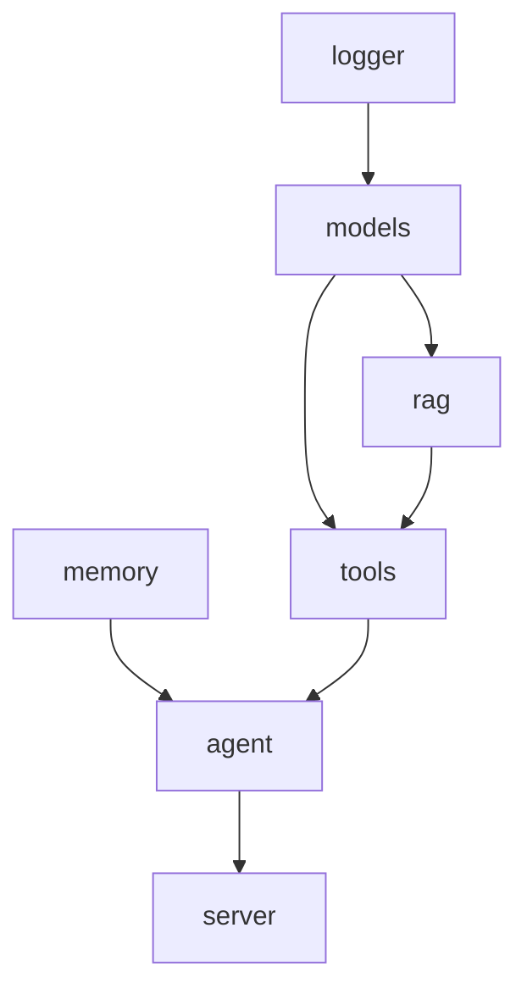

# 组件架构总览

本节把 Dubbo Admin AI 拆成几个真正可运行的组件来看，而不是按代码目录机械罗列。这样更容易回答三个问题：

- 这个组件解决什么问题？
- 它依赖谁，又被谁依赖？
- 修改它时最容易踩什么坑？

## 1. 当前组件地图

## 2. 组件一览

| 组件 | 作用 | 典型依赖 | 对外提供 |
| --- | --- | --- | --- |
| Logger | 初始化全局日志 | 无 | 统一 `slog` 输出 |
| Memory | 保存短期对话历史 | 无 | 会话历史窗口 |
| Models | 初始化模型与 embedding 注册表 | Logger | Genkit Registry |
| RAG | 文档加载、切分、索引、检索、重排 | Models | 检索能力 |
| Tools | 聚合各种工具并导出 ToolRef | Models、Memory、RAG | 可调用工具集合 |
| Agent | 执行多阶段推理循环 | Tools、Memory、Models | 对话编排能力 |
| Server | 暴露 HTTP/SSE 接口 | Agent | API 服务 |

## 3. 组件之间不是“平铺”关系

它们形成的是一个典型的“能力逐层向上汇聚”的结构：

- 底层提供基础能力：Logger、Memory、Models
- 中层组合增强能力：RAG、Tools
- 上层负责编排和协议：Agent、Server

这种结构的好处是，一个问题通常能比较清楚地落到某一层。例如：

- SSE 不通是 Server 问题
- 工具注册异常是 Tools 问题
- 检索质量差往往是 RAG 配置或索引问题
- 对话“失忆”通常是 Memory 问题

## 4. 组件生命周期的一致性

所有组件都遵守 `Validate -> Init -> Start -> Stop` 这一套协议，所以看任意组件时，建议都按下面顺序读：

1. `Validate()` 校验什么
2. `Init()` 初始化什么
3. `Start()` 是否启动服务
4. `Stop()` 是否释放资源

## 5. 设计约束

- `logger` 通过 `slog.SetDefault` 影响整个系统，不是局部 logger。
- `memory` 是进程内状态，不持久化。
- `models` 会初始化全局 Genkit Registry，属于“全局能力组件”。
- `rag` 本身是复合组件，内部还拆成 loader、splitter、indexer、retriever、reranker。
- `tools` 不只是一组函数，它承担“注册、发现、统一输出”的职责。
- `agent` 不直接暴露 HTTP，而是通过 channel 把增量结果交给 server。
- `server` 不负责业务推理，只负责协议层转换和会话管理。

## 6. 如何阅读下面这些页面

- 想先看基础组件：从 Logger、Memory、Models 开始。
- 想看增强能力：看 RAG 和 Tools。
- 想看端到端对话链路：看 Agent 和 Server。

组件详情见：

- [Logger](logger.md)
- [Memory](memory.md)
- [Models](models.md)
- [RAG](rag.md)
- [Tools](tools.md)
- [Agent](agent.md)
- [Server](server.md)
