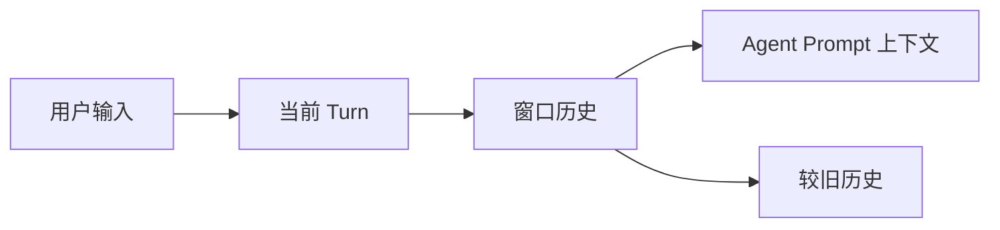

# Memory 组件

Memory 组件负责“让会话有上下文”。没有它，Dubbo Admin AI 每次请求都会像第一次见到用户一样。

## 1. 存储内容

当前 Memory 存的是进程内的短期对话历史，不是数据库，也不是长期知识库。

它的核心职责是：

- 按 `sessionID` 保存对话消息
- 以窗口方式提供最近若干轮上下文
- 在一轮对话结束时推进 turn

## 2. 核心模型

内部实现围绕两个概念：

- `Turn`：一轮对话中的消息集合
- `HistoryMemory`：按 session 维护窗口内和窗口外历史

可以把它理解成：



## 3. 当前行为最关键的事实

- Memory 是进程内内存结构，服务重启会丢失。
- 数据按 `sessionID` 隔离。
- 并发访问通过 `RWMutex` 保护。
- Agent 在 `Interact()` 中把用户输入写入历史，在结束时调用 `NextTurn(sessionID)`。

## 4. 常用操作

### `AddHistory(sessionID, msgs...)`

把消息追加到当前会话当前 turn。

### `WindowMemory(sessionID)`

返回当前窗口中的消息，供 prompt 构造上下文。

### `AllMemory(sessionID)`

返回窗口内和历史中的全部消息，适合调试和导出，不适合直接当 prompt 上下文。

### `NextTurn(sessionID)`

结束当前轮次，推进到下一轮。

### `Clear(sessionID)`

清空该 session 的窗口历史。

## 5. 配置示例

```yaml
type: memory
spec:
  history_key: "chat_history"
  max_turns: 100
```

这里需要特别注意：

- 文档配置里有 `max_turns`
- 但当前实现内部窗口行为并不完全由这个配置直接控制

这意味着你不能简单地认为“把 `max_turns` 改成 100，prompt 上下文窗口就一定变成 100 轮”。这正是一个典型的“配置和真实行为需要对照代码理解”的地方。

## 6. Agent 如何使用它

在 Agent `Interact()` 中会发生这些动作：

1. 把 `sessionID` 放入 context
2. 将当前用户输入序列化后写入历史
3. 每个 stage 执行时从 `WindowMemory(sessionID)` 取上下文
4. 结束后执行 `NextTurn(sessionID)`

因此 Memory 不是独立存在的缓存，而是 Agent 工作流的一部分。

## 7. 当前限制

- 不持久化
- 没有摘要压缩
- 多实例之间不共享
- 长对话时上下文策略较基础

如果后续要做生产级长期会话能力，Memory 很可能需要演进为“窗口记忆 + 摘要 + 外部存储”的组合模型。
