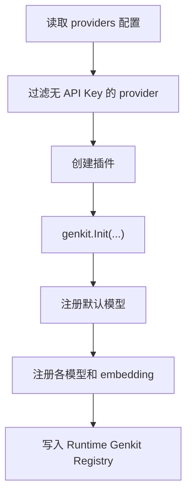

# Models 组件

Models 组件负责把“散落在配置里的 Provider、模型、Embedding 定义”变成系统真正可用的统一模型注册表。Agent、RAG、Tools 等后续能力，几乎都建立在它之上。

## 1. 它解决什么问题

不同模型提供方的接口、鉴权和能力差异很大。如果每个业务组件都直接对接上游，系统很快会变得难以维护。Models 组件的作用就是把这些差异收敛到统一入口。

## 2. 它提供什么能力

- 初始化 Genkit Registry
- 注册聊天模型
- 注册 embedding 模型
- 设定默认模型
- 把 Provider 配置转成真正可调用的插件

## 3. 当前支持的 Provider 形态

从配置和实现看，当前主要围绕 OpenAI 兼容接口和少数特定插件组织：

- DashScope
- Gemini
- SiliconFlow
- Pinecone 插件能力

其中是否真正生效，取决于 API Key 是否存在。

## 4. 初始化过程



## 5. 配置示例

```yaml
type: models
spec:
  default_model: "dashscope/qwen-max"
  default_embedding: "dashscope/text-embedding-v4"
  providers:
    dashscope:
      api_key: "${DASHSCOPE_API_KEY}"
      base_url: "https://dashscope.aliyuncs.com/compatible-mode/v1"
```

几个关键字段：

- `default_model`：Agent 默认使用的模型
- `default_embedding`：RAG 等能力使用的 embedding 模型
- `providers.*.models`：聊天 / 代码 / 多模态模型列表
- `providers.*.embedders`：嵌入模型列表

## 6. 为什么它是“系统级组件”

因为 Models 组件不仅供自己使用，还为整个项目提供统一的 Genkit Registry：

- Agent 用它定义 prompt 和执行 flow
- Tools 用它注册工具
- RAG 用它做 embedding 和检索接入

也就是说，没有 Models，后面的很多组件即使代码存在，也无法真正工作。

## 7. 当前限制和注意事项

- `genkit.Init()` 当前只适合初始化一次，所以 Models 更像一个全局单例能力。
- Provider 扩展方式仍比较集中，需要在组件内部增加插件创建逻辑。
- 配置里列出模型不代表模型一定可用，最终还要看 Provider API Key 和上游能力是否匹配。

## 8. 排查 Models 问题时看什么

- 默认模型名是否正确，比如 `provider/model`
- API Key 是否实际注入
- Provider `base_url` 是否可访问
- 对应模型是否被注册到 Genkit Registry
- 上游模型类型是否和预期用途一致，比如 `chat`、`code`、`multimodal`
