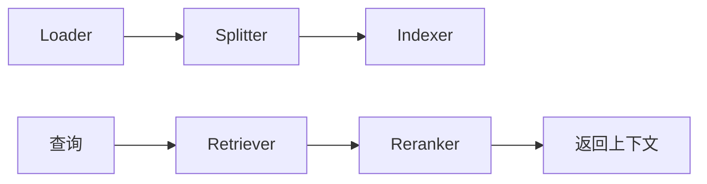
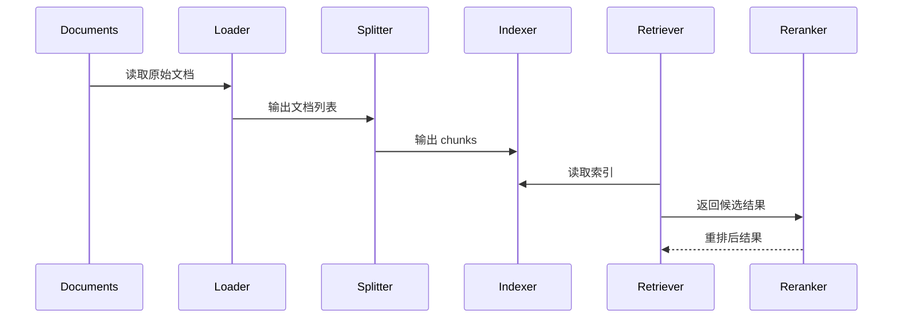

# RAG 组件

RAG 组件不是一个“单点功能”，而是一条从文档到检索结果的完整流水线。它的目标是把外部知识变成 Agent 可以可靠使用的上下文，而不是把一堆文本粗暴塞进 Prompt。

## 1. 它由哪些子部件组成

当前 RAG 组件内部由五类子组件拼装而成：

- Loader：负责读取原始文档
- Splitter：负责切分 chunk
- Indexer：负责写入索引
- Retriever：负责召回
- Reranker：负责可选重排



## 2. RAG 在运行时中的位置

从运行时角度看，`rag` 是一个复合组件。它自身实现 `runtime.Component`，但在 `Init()` 时会继续初始化内部的 loader、splitter、indexer、retriever、reranker。

这意味着 RAG 不是简单地引用几个对象，而是负责把整个检索子系统真正组装起来。

## 3. 当前配置示例

```yaml
type: rag
spec:
  embedder:
    type: genkit
    spec:
      model: dashscope/text-embedding-v4
  loader:
    type: local
  splitter:
    type: recursive
  indexer:
    type: pinecone
  retriever:
    type: pinecone
  reranker:
    type: cohere
    spec:
      enabled: false
```

从这份配置可以看出当前设计特点：

- Embedding 能力来自 Models/Genkit
- 文档加载默认是本地文件
- 索引与检索当前偏向 Pinecone 形态
- Reranker 可选，不是强制启用

## 4. 文档处理链路



## 5. 索引构建如何执行

索引 CLI 在 `cmd/index.go`。

常用命令：

```bash
go run cmd/index.go
```

它会：

1. 读取 `component/rag/rag.yaml`
2. 独立初始化一套 Genkit Registry
3. 构建 RAG System
4. 加载目录文档
5. 切分文档
6. 写入目标索引

默认索引目录是 `reference/k8s_docs/concepts`。

## 6. 和 Agent/Tools 的关系

当前 RAG 通常不是直接由 Agent 调用，而是通过 Tools 封装成工具能力，供 Agent 在合适阶段调用。这样做有两个好处：

- 检索策略可以在工具层封装，而不是散落在 prompt 里。
- 返回结果可以统一成结构化输出，便于 Agent 观察和总结。

## 7. 实现边界

文档里要特别说明一点：配置里有些字段已经存在，但未必全部贯穿到运行逻辑。尤其是某些 indexer/retriever 的存储细节参数，更像“能力占位 + Schema 约束”，而不是全部都被执行代码完整消费。

因此改 RAG 配置时，建议同时验证：

- `Validate()` 是否认可
- `Init()` 是否使用
- 检索结果是否实际变化

## 8. 最常见问题

- 索引建好了但召回差：通常是 embedding 模型、切分策略或 top-k 问题。
- 线上问答不引用知识：通常是工具没有触发检索，或 prompt 没有把结果整合进去。
- 配置看似支持某能力：但实际代码可能还没完整接入。
