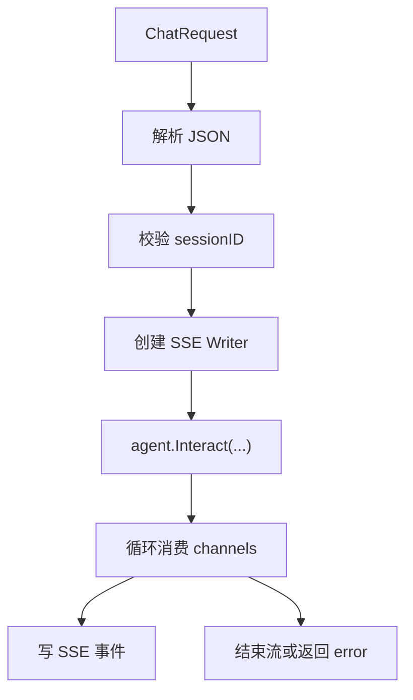

# Server 组件

Server 是系统的“协议层外壳”。它不负责真正的推理，但它负责把外部 HTTP 请求变成 Agent 可执行的输入，再把 Agent 的流式输出转换为客户端能消费的 SSE。

## 1. 它负责什么

- 提供 HTTP 路由
- 管理 Session
- 提供 SSE 输出
- 调用 Agent 并桥接 channel
- 提供健康检查

## 2. 路由结构

当前路由由 `component/server/engine/router.go` 注册：

| 方法 | 路径 | 说明 |
| --- | --- | --- |
| `POST` | `/api/v1/ai/chat/stream` | 流式对话 |
| `POST` | `/api/v1/ai/sessions` | 创建会话 |
| `GET` | `/api/v1/ai/sessions` | 列出会话 |
| `GET` | `/api/v1/ai/sessions/:sessionId` | 查询会话 |
| `DELETE` | `/api/v1/ai/sessions/:sessionId` | 删除会话 |
| `GET` | `/health` | 健康检查 |

## 3. 流式对话处理链路



在这条链路里，Server 的职责是“把状态正确搬运出去”，不是替 Agent 做业务判断。

## 4. Session 管理

Session Manager 是 Server 侧的重要支撑：

- 创建 `session_<uuid>`
- 查询 session
- 列出有效 session
- 删除 session
- 定时清理 24 小时未活动会话

另外，当前 `NewAgentHandler` 会自动调用 `CreateMockSession()` 创建 `session_test`，这是一个开发友好但生产上需要谨慎看待的行为。

## 5. SSE 输出模型

Server 使用 `StreamWriter` 和 `SSEHandler` 输出以下事件：

- `message_start`
- `content_block_start`
- `content_block_delta`
- `content_block_stop`
- `message_delta`
- `message_stop`
- `error`

这种设计比“直接输出纯文本流”更结构化，便于前端做分块渲染、状态控制和错误处理。

## 6. Server 和 Agent 的边界

Server 调用 Agent 的方式很简单：

```go
channels = h.agent.Interact(&schema.UserInput{Content: req.Message}, sessionID)
```

随后 Server 进入一个 select 循环，根据三个通道驱动行为：

- `UserRespChan`
- `ErrorChan`
- `Request.Context().Done()`

这层解耦使得协议层和推理层分离得比较清楚。

## 7. 启动与关闭

`ServerComponent.Start()` 会：

1. 从 runtime 获取 `agent` 组件
2. 初始化 Gin
3. 注册路由和 `/health`
4. 启动 `http.Server.ListenAndServe()`

`Stop()` 会尝试优雅关闭，超时后强制关闭。

## 8. 当前限制和风险点

- `/health` 只说明服务进程可用，不说明依赖可用。
- Session 是进程内状态，不支持多实例共享。
- 流式响应对网关和代理配置很敏感。
- `Start()` 时依赖从 runtime 获取 `agent`，这要求组件启动顺序在实际运行中能满足依赖。
