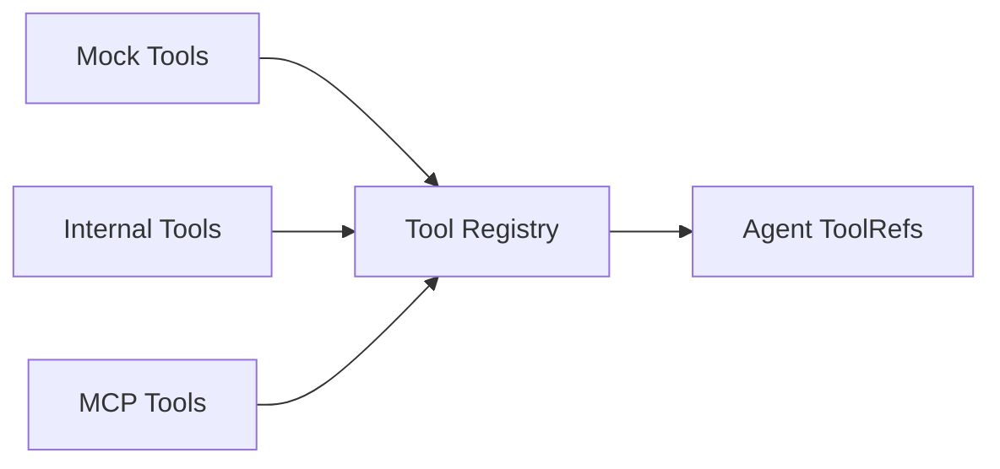

# Tools 组件

Tools 组件决定了这个 Agent 是“只会说”，还是“能查、能看、能执行”。在 Dubbo Admin AI 里，工具不是附属品，而是 Agent 获得外部能力的主入口。

## 1. Tools 组件做了哪几件事

- 收集不同来源的工具
- 把它们注册到 Genkit
- 统一导出 `ToolRef`
- 给 Agent 一份可调用工具清单

## 2. 三类工具来源

### Mock Tools

用于开发和测试，帮助在没有真实后端的情况下跑通 Agent 工作流。

### Internal Tools

运行在同一进程内，直接访问 runtime 中的其他组件，例如 Memory 或 RAG。

### MCP Tools

通过 MCP 协议接入外部工具进程或服务，扩展能力最强，但部署和安全边界也最复杂。



## 3. 初始化流程

Tools 组件 `Init()` 的思路是：

1. 获取 Genkit Registry
2. 根据配置决定启用哪些 Tool Manager
3. 构建工具注册表
4. 汇总为 `[]ai.ToolRef`

配置示例：

```yaml
type: tools
spec:
  enable_mock_tools: true
  enable_internal_tools: true
  enable_mcp_tools: false
  mcp_host_name: "mcp_host"
```

## 4. Internal Tools 为什么重要

Internal Tool 是系统内部能力的桥梁。它不是“外部插件”，而是把已经存在于 runtime 的能力包装成 Agent 可调用的工具。

典型例子：

- 从 Memory 导出会话历史
- 通过 RAG 检索文档内容

这种设计有一个好处：Agent 不需要知道 runtime 组件细节，只需要知道工具名和输入 schema。

## 5. MCP 工具的现实意义

MCP 让系统可以接入进程外的工具生态，这是扩展性最强的一条路，但它同时带来：

- 工具发现与注册问题
- 外部命令启动问题
- 网络和权限边界问题
- 失败恢复与重连问题

因此本地开发阶段通常默认关闭 MCP，更适合在能力边界清楚后再接入。

## 6. 工具输出为什么要统一

当前工具调用结果会尽量整理成：

- `tool_name`
- `result`
- `summary`

这样做的原因很直接：Agent 在 Observe 阶段更容易消费结构化结果，而不是去猜测一段杂乱文本是什么意思。

## 7. 当前约束

- 工具名必须唯一，否则注册冲突。
- MCP 工具注册失败可能直接导致 Tools 初始化失败。
- `ToolsConfig` 和 `ToolConfig` 结构存在演进痕迹，阅读配置时要以当前组件实际消费的字段为准。

## 8. 什么时候该改 Tools，而不是改 Prompt

当你发现模型反复“知道应该查什么，但查不到”时，通常不是 Prompt 不够长，而是：

- 没有合适的工具
- 工具 schema 不稳定
- 工具输出不利于模型消费

这时优先改 Tools，通常比继续堆 prompt 更有效。
