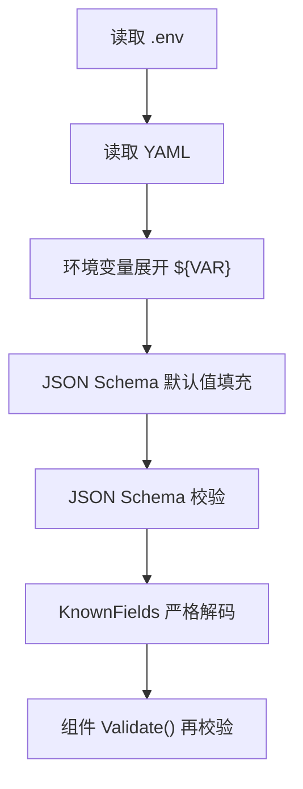

# 配置指南

Dubbo Admin AI 的配置体系是这个项目的核心之一。它不是简单地读取几份 YAML，而是一条“环境变量展开 + Schema 校验 + 严格解码”的完整管线。

## 1. 配置入口

主入口是 `config.yaml`：

```yaml
project: dubbo-admin-ai
version: 1.0.0
components:
  logger: component/logger/logger.yaml
  models: component/models/models.yaml
  server: component/server/server.yaml
  memory: component/memory/memory.yaml
  tools: component/tools/tools.yaml
  rag: component/rag/rag.yaml
  agent: component/agent/agent.yaml
```

它不直接承载所有细节，而是起“组件装配清单”的作用。

## 2. 配置加载流程



## 3. 这种设计的价值

- 避免未知字段静默生效
- 让默认值显式且可控
- 让配置错误尽早在启动期暴露
- 把敏感信息和代码分离

## 4. 环境变量展开

配置支持：

```yaml
api_key: "${DASHSCOPE_API_KEY}"
```

这意味着：

- 本地开发可以通过 `.env` 提供值
- CI/CD 和生产环境可以通过环境变量直接注入

## 5. 当前常见配置文件

- `component/logger/logger.yaml`
- `component/memory/memory.yaml`
- `component/models/models.yaml`
- `component/rag/rag.yaml`
- `component/tools/tools.yaml`
- `component/agent/agent.yaml`
- `component/server/server.yaml`

## 6. 配置时最容易忽略的点

### Schema 通过，不代表行为一定变化

有些字段在 Schema 中存在，但未必完整进入运行时逻辑。修改配置后，最好结合日志、测试或实际行为验证。

### 同类型多组件不一定真的支持多实例

Loader 层面支持一个组件名对应多个配置文件，但 runtime 最终按 `Component.Name()` 存储，当前很多组件名是固定值。

### 环境变量缺失可能只在运行时暴露

某些 provider 配置会因为缺少 API Key 被跳过，而不是直接导致整个服务无法启动。这样会造成“服务起来了，但能力不完整”的现象。

## 7. 推荐实践

- 配置改动后先本地启动一次
- 关键配置同时写进文档
- 敏感字段一律环境变量注入
- 多环境使用独立配置和独立密钥
- 对重要字段保留最小可运行示例
