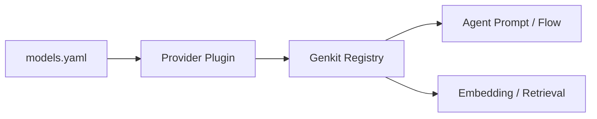

# 模型 Provider 与插件

本页从“扩展和接入”的视角看 Models 组件。它关注的不是默认配置怎么写，而是不同模型提供方如何被抽象、注册和使用。

## 1. 为什么需要 Provider 抽象

项目需要同时支持多个模型来源，但上游差异很多：

- API 地址不同
- 鉴权方式不同
- 流式返回细节不同
- 模型类型不同

如果业务代码直接绑死某一家 Provider，后续切换成本会很高。因此项目通过插件和统一注册表做隔离。

## 2. 当前 Provider 接入思路

当前实现主要通过 Genkit 插件体系接入 Provider，再把具体模型注册成统一可调用 action。

## 3. 配置层如何表达 Provider

在 `component/models/models.yaml` 中，每个 Provider 具备：

- `api_key`
- `base_url`
- `models`
- `embedders`

这意味着项目已经把“Provider 配置”和“模型清单”分开。这样做的好处是，一个 Provider 可以承载多种模型和 embedding 能力。

## 4. 插件注册过程

初始化时大致会发生：

1. 遍历 providers
2. 跳过没有 API Key 的 provider
3. 创建插件
4. 调用 `genkit.Init(...)`
5. 为每个模型注册 action
6. 为每个 embedder 注册 action

这是一种“配置驱动 + 代码注册”的模式。

## 5. 扩展一个新 Provider 的基本步骤

1. 定义配置结构和 schema。
2. 实现插件创建逻辑。
3. 注册模型和 embedding。
4. 把能力暴露给 Agent / RAG。
5. 补测试和错误处理。

## 6. 扩展时最容易出错的地方

- 模型名和 Provider 名不一致
- 同一个模型被多个 Provider 重复注册
- 流式响应格式差异导致上层行为不一致
- 上游限流、超时、错误码没有做统一映射

## 7. 什么时候该改 Provider 层

如果你要解决的是：

- 新模型接入
- 新上游平台接入
- 统一错误映射
- 统一重试 / 限流 / 超时策略

那就应该优先改 Provider / Models 层，而不是在 Agent 或 Server 做特殊兼容。
