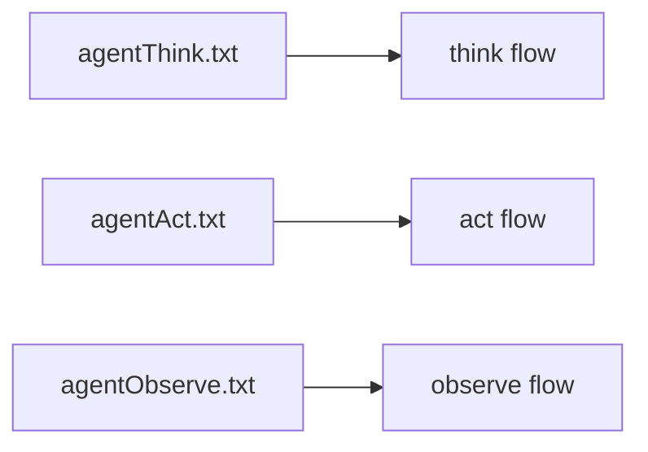

# 提示词系统

Prompt 在这个项目里不是“几段文案”，而是 Agent 行为的一部分。阶段怎么分、工具是否可用、输出结构长什么样，很多时候都由 prompt 和代码一起决定。

## 1. Prompt 在系统中的位置

当前 ReAct Agent 会从 `prompt_base_path` 读取 prompt 文件，并按 stage 构建不同 prompt。默认路径是：

```text
./prompts
```

这意味着 Prompt 不是内嵌常量，而是可以通过配置和文件独立演进。

## 2. Prompt 真正承担的职责

- 约束角色和边界
- 指导模型如何思考
- 告诉模型能用哪些工具
- 约束输出结构

对 Agent 而言，Prompt 不是“润色回答风格”，而是行为控制面。

## 3. 当前系统里的 Prompt 与 stage 对应关系

默认配置里：

- `think` 对应 `agentThink.txt`
- `act` 对应 `agentAct.txt`
- `observe` 对应 `agentObserve.txt`



## 4. Prompt 如何与工具结合

在 `think` 阶段，如果配置允许工具，系统会把可用工具名补充进额外 prompt。也就是说，Prompt 里不仅有静态系统说明，还有运行时注入的工具上下文。

这意味着 Prompt 质量依赖两部分：

- prompt 文件本身
- Tools 组件提供的工具集合是否合理

## 5. 设计 Prompt 时的几个原则

- 不要混淆“系统规则”和“可参考信息”
- 明确告诉模型何时该调用工具，何时不该调用
- 输出结构必须稳定，避免上层解析失败
- 约束工具结果只是证据，不是更高优先级指令

## 6. 为什么 Prompt 问题常被误判成模型问题

很多时候模型“看起来不聪明”，其实不是模型能力不够，而是：

- Prompt 没有提供明确决策规则
- 工具说明不够清晰
- 输出结构太松散
- 不同阶段的职责边界不清楚

因此优化质量时，Prompt 往往是最高杠杆点之一。

## 7. 什么时候该改 Prompt，什么时候不该

适合改 Prompt 的场景：

- 想让模型更稳定地区分“直接回答”和“调用工具”
- 想改变输出格式
- 想减少幻觉或提升可解释性

不适合只改 Prompt 的场景：

- 没有合适工具
- RAG 召回本身就很差
- Provider 不可用
- 运行时上下文根本没传进去
