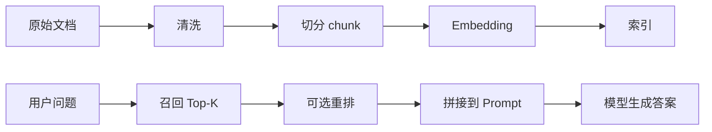

# RAG 子系统

如果说组件页讲的是“RAG 是怎么拼出来的”，那本页讲的是“RAG 为什么存在，以及该怎么用好它”。

RAG 的核心价值不是把知识库塞给模型，而是用一条可控、可追溯的流程，把“外部知识”转成“本轮回答需要的上下文”。

## 1. 什么时候应该用 RAG

下面这些场景适合用 RAG，而不是单靠模型参数记忆：

- 需要依据项目文档、平台手册或运维知识库回答问题
- 知识会频繁变化
- 回答需要引用来源
- 需要降低模型幻觉

## 2. RAG 的工作路径



## 3. 这套系统里 RAG 如何被调用

当前项目里，RAG 更多是被包装成工具能力后再供 Agent 调用，而不是直接裸露在 Agent 主循环里。这样做的实际收益是：

- 检索参数可在工具层封装
- 可为不同知识域定制不同工具
- Agent 只需要决定“要不要查”，不需要知道“怎么查”

## 4. 建索引的入口

项目提供独立 CLI：

```bash
go run cmd/index.go
```

默认会读取 `component/rag/rag.yaml`，并对默认文档目录执行加载、切分、嵌入和索引写入。

## 5. 影响效果的几个关键参数

### chunk size / overlap

- 太大：召回噪声高，上下文浪费
- 太小：语义被切碎，命中率下降

### embedding model

- 建索引和在线检索最好保持一致
- 模型切换后要警惕旧索引兼容性

### top-k

- 太小会漏信息
- 太大容易污染 Prompt

### reranker

- 候选多时有帮助
- 也会增加一次额外开销

## 6. RAG 不是银弹

引入 RAG 后，系统质量并不一定自动提升。常见失败原因包括：

- 检索结果虽然相关，但没有被 Prompt 正确利用
- 工具没有在需要时触发 RAG
- 文档本身结构混乱
- 索引更新不及时

所以优化 RAG 往往要同时看三层：

- 数据层：文档和索引
- 检索层：召回与重排
- 编排层：工具调用与 Prompt 整合

## 7. 工程实践建议

- 检索结果尽量带来源信息
- 对高频知识域做专门工具封装
- 控制返回 chunk 数量，避免上下文污染
- 为索引更新建立固定流程，而不是手工偶发执行
