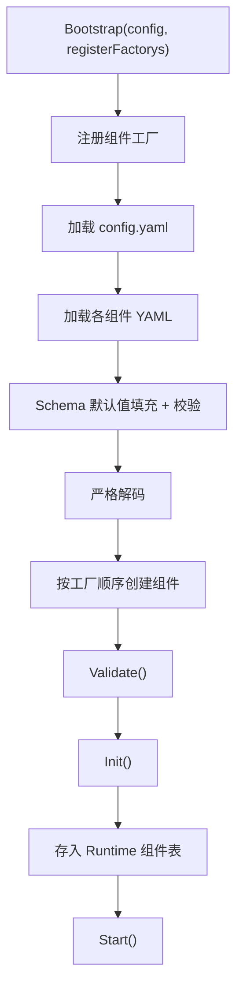
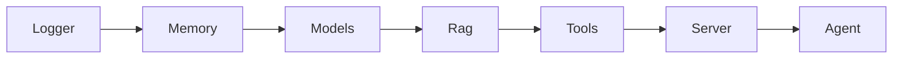
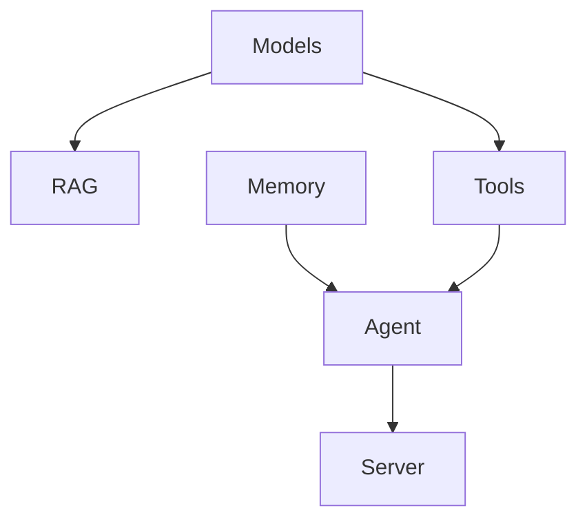

# 运行时与组件

本页解释的不是“业务功能”，而是项目最底层的装配机制：配置如何加载、组件如何创建、依赖如何注入、生命周期如何推进。

如果你想真正理解“项目为什么会这样启动、为什么这些组件能彼此找到”，这一页是关键入口。

## 1. Runtime 负责什么

`runtime` 是整个项目的装配中心，不承载业务推理逻辑，但它决定了所有组件何时被创建、如何获取依赖、何时启动和停止。

Runtime 的核心职责：

- 管理组件工厂
- 加载主配置和组件配置
- 创建组件实例
- 维护组件注册表
- 保存 Genkit Registry

## 2. 组件生命周期

项目里每个组件都实现统一接口：

```go
type Component interface {
    Name() string
    Validate() error
    Init(*Runtime) error
    Start() error
    Stop() error
}
```

这意味着所有组件遵守同一套运行时协议。

### 各阶段语义

- `Validate()`：只做配置和前置条件校验，不做重资源初始化。
- `Init()`：拉取依赖、创建内部对象、注册全局能力。
- `Start()`：启动对外服务或后台行为。
- `Stop()`：释放资源并尝试优雅退出。

## 3. 启动流程



启动主入口在 `runtime/runtime.go`。

## 4. 配置加载管线

配置加载器 `config.Loader` 的设计相对严格，这也是项目的一大优点。

### 加载顺序

1. 加载 `.env`
2. 读取 YAML
3. 执行环境变量展开
4. 使用 JSON Schema 做默认值填充和校验
5. 用 `KnownFields(true)` 严格解码

### 这意味着什么

- 缺失可默认字段时，会自动补默认值。
- 未知字段不会被静默忽略。
- 环境变量缺失时，最终值可能为空，需要看组件自己的 `Validate()` 是否拦截。

## 5. 依赖注入模式

项目主要有两种注入方式。

### 方式一：Runtime 组件注册表

组件在 `Init(rt)` 中通过：

```go
rt.GetComponent("tools")
rt.GetComponent("agent")
```

来获取其他组件实例。

### 方式二：Genkit Registry

Models 组件初始化时会创建并注册 Genkit Registry，其他需要模型、prompt、tool 的组件通过：

```go
rt.GetGenkitRegistry()
```

取得统一注册表。

## 6. 当前组件顺序和依赖关系

工厂注册顺序在 `main.go` 固定：



但这张图只代表“注册顺序”，不是严格的“启动依赖图”。更准确的依赖关系是：



这也是阅读代码时最容易混淆的地方。

## 7. 一个重要限制：多实例能力并不完整

虽然 `config.Loader` 支持同一类型组件配置多个文件，并生成类似 `agent-0`、`agent-1` 的逻辑名字，但最终 Runtime 存储组件时使用的是 `Component.Name()`。

而当前大多数组件返回的名字都是固定值，比如：

- `server`
- `agent`
- `models`

这意味着：

- 配置层看起来支持多实例
- 运行时存储层实际上会发生覆盖

所以当前系统应按“单实例组件运行时”来理解，而不是完整的多实例组件容器。

## 8. 停机流程

主进程收到 `SIGINT` 或 `SIGTERM` 后，会遍历 `rt.Components` 调用 `Stop()`。

其中比较关键的是 Server：

- `Stop()` 会尝试 `Shutdown(ctx)` 做优雅退出
- 最长等待 10 秒
- 超时后 fallback 到 `Close()`

## 9. 这套运行时设计的利弊

### 好处

- 组件边界清楚
- 测试和替换更方便
- 配置与装配流程统一

### 代价

- 启动顺序和依赖顺序需要人工保持一致
- 多实例支持不完整
- 某些全局对象，比如 Genkit Registry，天然不适合被多次初始化

## 10. 读完这一页后建议继续看

- 按组件理解：看[组件架构总览](components/index.md)
- 理解 Agent 执行链路：看[Agent 工作流](agent-workflow.md)
- 理解配置行为：看[配置指南](configuration.md)
