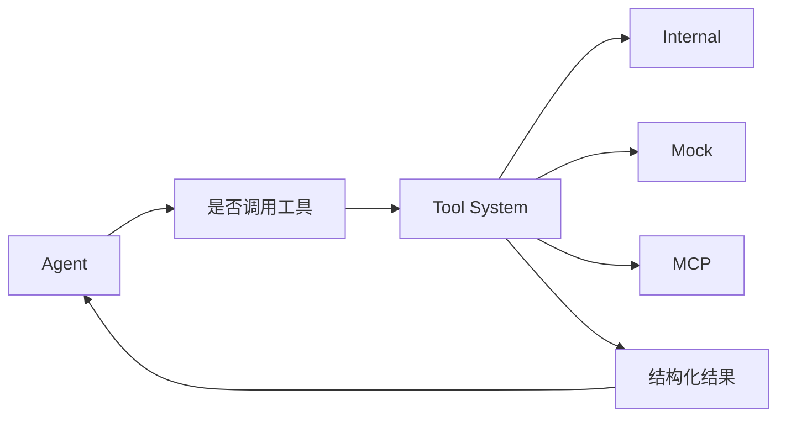

# 工具系统

Tools 组件页讲的是“怎么实现”，本页讲的是“为什么要有工具系统，以及如何设计一套对 Agent 友好的工具能力”。

## 1. 没有工具的 Agent 会遇到什么问题

如果 Agent 只能依赖模型内部知识，它会天然受限于：

- 知识时效性
- 对运行时系统状态的无感知
- 无法执行查询或操作

所以工具系统存在的根本原因是：让 Agent 能感知外部真实世界。

## 2. 工具系统在架构中的位置

## 3. 一个好工具的标准

- 名字语义清晰
- 输入 schema 稳定
- 输出结构统一
- 错误可诊断
- 超时和权限边界明确

对 Agent 来说，“能不能正确用工具”很大程度上取决于工具设计是否清晰，而不是模型本身是否足够强。

## 4. 工具系统不是越多越好

工具过多会带来三个问题：

- 模型选择困难
- prompt 变长
- 高风险调用面变大

因此建议按知识域或职责封装工具，而不是把所有底层 API 都直接暴露给 Agent。

## 5. 推荐的工具设计方式

- 把多个底层调用封装成一个语义完整的工具
- 输出尽量携带 `summary`
- 对高风险动作做明确保护
- 给每个工具补最小测试样例

## 6. 什么时候该新增工具

当你发现 Agent 反复需要某类外部信息，且这类信息：

- 不能稳定从模型记忆中得到
- 不能仅靠 RAG 解决
- 具备明确的输入和输出边界

这时就应该考虑新增工具，而不是继续增加 Prompt 说明。
