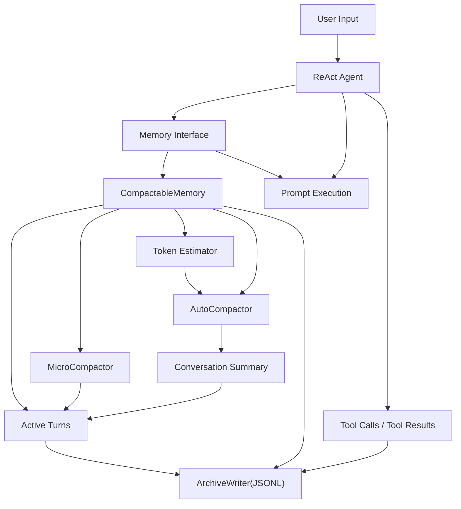

# Memory 分层压缩 Proposal

## 1. 背景

当前项目的上下文管理由 `component/memory/history.go` 中的 `HistoryMemory` 提供，核心机制是按 turn 组织消息，并通过固定大小的滑动窗口保留最近若干轮对话。这个实现简单直接，但已经暴露出两个结构性问题：

- 窗口之外的消息在运行时上下文中完全不可见。用户通常默认 Agent “记得”之前聊过的内容，但当前实现会让较早对话直接从模型上下文中消失，造成行为跳变和体验困惑。
- 即使保留了窗口内消息，其中也包含大量对当前问题无关的工具输出、命令结果和中间推理残留。这些内容持续占用 token，降低后续轮次的有效上下文密度。

这个问题现在必须处理，原因有三点：

- 当前 `HistoryMemory.NextTurn` 在窗口满时直接返回错误，意味着会话长度增长后系统会显式退化，而不是平滑管理上下文。
- `component/agent/react/react.go` 直接将 `history.WindowMemory(sessionID)` 传给 prompt，内存质量会直接影响 think、act、observe 三个阶段的效果和成本。
- 后续如果引入更重的工具链和更长的会话，冗余上下文会进一步放大 token 开销，压缩收益会越来越明显。

如果不处理，系统将持续面临“越聊越贵、越聊越忘、越聊越乱”的问题：短期表现为长会话效果不稳定，长期则会限制 Agent 的工具深度和会话时长。

## 2. 目标

- 目标 1：为 Memory 组件引入统一抽象接口，在保留当前 `ChatHistoryMemory` 能力的前提下，新增可压缩的 `CompactableMemory`。
- 目标 2：实现三层上下文压缩策略，包括每轮低成本微压缩、超阈值自动压缩、用户显式触发的手动压缩。
- 目标 3：保证内存压缩是“运行时有损、持久化无损”：内存中的上下文可以被替换，但完整原始会话仍持续追加写入 JSONL。
- 目标 4：建立 token 阈值的 benchmark 与评估方法，使自动压缩触发点具备可验证的成本收益依据。

## 3. 非目标

- 非目标 1：本次不引入向量检索式长期记忆，不解决“基于语义召回任意历史片段”的问题。
- 非目标 2：本次不修改 Agent 的核心 ReAct 流程，不重新设计 think、act、observe 的 prompt 编排。
- 非目标 3：本次不把摘要持久化格式扩展成训练数据管道，只保证后续具备分析和导出的基础。
- 非目标 4：本次不保留“摘要 + 最近 N 条原文消息”的混合上下文模式。

## 4. 现状与约束

技术现状：

- `MemoryComponent` 当前直接持有 `*HistoryMemory`，没有面向接口编程。
- `HistoryMemory` 以 `Turn` 为单位维护 `windowMemory` 和 `historyMemory`，但实际推理只使用 `WindowMemory(sessionID)`。
- `ReActAgent` 和 Memory Tool 都直接依赖 `*HistoryMemory`，耦合到当前实现细节。
- 目前没有 token 估算器、压缩器、摘要器、归档写入器等配套能力。

依赖现状：

- 项目已接入 LLM 调用链，可复用现有模型基础设施生成 compact 摘要。
- 消息类型基于 `github.com/firebase/genkit/go/ai`，新方案需要继续兼容 `ai.Message`。

兼容性约束：

- 必须保留当前 `ChatHistoryMemory` 行为，避免现有配置和测试全部失效。
- 现有 Memory Tool 与 session 删除逻辑需要继续可用。
- 自动压缩不能导致历史原文丢失，调试、审计和 token 统计必须仍可基于完整记录完成。

## 5. 方案设计

### 5.1 总体方案

引入统一的 Memory 抽象，将“消息追加”“获取当前上下文”“推进 turn”“清理会话”“手动压缩”等能力收敛到接口层。当前 `HistoryMemory` 作为 `ChatHistoryMemory` 保留；新增 `CompactableMemory` 作为增强实现，对外暴露同一组接口，对内组合三类能力：`MicroCompactor`、`AutoCompactor`、`ArchiveWriter`。

三层压缩策略如下：

- `micro_compact`：每轮结束后执行，对除当前 turn 之外的旧消息进行静默微压缩。核心目标是替换旧 `tool_result` 的大块正文，仅保留工具调用轨迹、简要摘要、状态和归档引用。
- `auto_compact`：当 token 估算超过阈值时触发。先确保完整原始会话已经写入 JSONL，再调用 LLM 生成单段会话摘要，用该摘要整体替换内存中的全部消息历史。
- `compact` 工具：由用户显式触发，语义等价于“把当前会话压成摘要后继续聊”。它复用自动压缩流程，但触发源不同，返回结果对用户可见。

自动压缩后的上下文只保留“摘要表示”，不与最近 N 条原始消息并存。这样可以避免同一事实在“摘要”和“原始对话”中同时出现，给模型造成重复且可能矛盾的信号。

### 5.2 架构图或流程图



### 5.3 关键改动

#### 模块 A：Memory 抽象层

新增统一接口：

```go
type Memory interface {
    Append(ctx context.Context, sessionID string, messages ...*ai.Message) error
    Context(ctx context.Context, sessionID string) ([]*ai.Message, error)
    NextTurn(ctx context.Context, sessionID string) error
    Compact(ctx context.Context, sessionID string, reason CompactReason) (*CompactResult, error)
    Clear(sessionID string) error
    IsEmpty(sessionID string) bool
}
```

- `MemoryComponent` 不再直接暴露 `*HistoryMemory`，而是暴露 `Memory` 接口。
- 为兼容旧代码，可保留 `GetMemory()` 过渡期方法，但内部返回接口；直接依赖具体类型的调用点逐步替换。

#### 模块 B：`ChatHistoryMemory`

- 把当前 `HistoryMemory` 整理为 `ChatHistoryMemory`，实现新的 `Memory` 接口。
- 该实现保持当前滑动窗口语义，作为默认兼容模式。

#### 模块 C：`CompactableMemory`

- 维护每个 session 的活动 turn、摘要状态、压缩元数据和归档偏移。
- 每次 `Append` 时同步追加 JSONL 记录。
- 每次 `NextTurn` 先执行 `micro_compact`，再估算 token，必要时执行 `auto_compact`。
- 提供手动 `Compact` 方法，供 tool 调用。

#### 模块 D：JSONL 归档

- 新增会话归档写入器，按 session 维度或日期分片，采用 append-only JSONL。
- 建议记录事件类型：`message`、`tool_call`、`tool_result`、`micro_compact`、`auto_compact`、`manual_compact`。
- 每条压缩占位符和摘要都携带可回溯的 archive 引用，便于后续调试。

#### 模块 E：Memory Tool

- 新增 `memory_compact` 工具，允许用户主动触发会话压缩。
- `memory_all_by_session_id` 应调整为从归档与内存组合读取，避免“压缩后看不到原始历史”。

#### 模块 F：Benchmark 与测试

- 新增 benchmark，对不同阈值、不同工具输出规模、不同摘要长度进行收益评估。
- 目标是验证：`saved_tokens_after_compact > compact_generation_cost`。

### 5.4 数据与接口变化

新增接口：

- `Memory` 统一接口。
- `Compactor` 接口，用于微压缩与摘要压缩能力解耦。
- `ArchiveWriter` 接口，用于 JSONL 持久化与后续替换实现。

字段变更：

`MemorySpec` 建议扩展为：

```yaml
type: memory
spec:
  backend: compactable
  history_key: chat_history
  max_turns: 100
  micro_compact: true
  auto_compact:
    enabled: true
    threshold_tokens: 12000
    min_saving_tokens: 2000
    summary_model: dashscope/qwen-max
  archive:
    enabled: true
    path: ./build/memory-archive
```

- `threshold_tokens` 是触发线，`min_saving_tokens` 是收益保护阈值，避免为节省很少 token 却频繁做高成本摘要。

兼容性影响：

- 直接断言 `*HistoryMemory` 的代码需要改为使用接口。
- 对外 HTTP/SSE 协议原则上不变；新增 `compact` 工具后，行为能力增强但接口兼容。

迁移方式：

- 第一阶段先引入接口与适配层，默认仍使用 `chat_history`。
- 第二阶段增加 `compactable` 后端与配置开关，只对开启的环境生效。
- 第三阶段补齐工具、benchmark、观测指标，并在验证后考虑切换默认后端。

### 5.5 错误处理与降级

可能失败的环节：

- JSONL 归档写入失败。
- token 估算器误差导致阈值判断不稳定。
- compact 摘要 LLM 调用失败或摘要质量不佳。
- 微压缩错误地删除了仍然需要的工具结果细节。

失败后的处理方式：

- 归档写入失败时，不执行自动压缩，避免出现“内存被压缩但原始记录缺失”的不可恢复状态。
- 自动压缩失败时，保留当前未压缩上下文并记录告警，不中断本轮响应。
- 手动压缩失败时，向用户返回明确错误，不静默吞掉。
- 微压缩失败时，回退到原始消息，不阻塞对话流程。

降级策略：

- 系统始终允许退回 `ChatHistoryMemory` 模式。
- 当摘要不可用时，仅保留 `micro_compact`，以低成本方式延缓上下文膨胀。
- 当上下文接近硬上限且自动压缩持续失败时，显式提示用户执行手动 compact 或开启新会话，而不是返回含糊的模型错误。

## 6. compact Prompt 设计原则

compact 的摘要不是“泛化总结”，而是“供后续轮次继续工作的工作记忆”。因此 prompt 需要稳定保留以下信息：

- 当前用户目标、限制条件、偏好和未决问题。
- 已做出的关键决策及其理由。
- 已调用过的重要工具、得到的结论、失败尝试与排除路径。
- 未来继续对话所必需的事实、变量名、文件路径、接口名和配置项。
- 明确区分“已确认事实”“待验证假设”“未完成动作”。

建议输出结构固定为几个小节，例如：

- `User Goal`
- `Confirmed Facts`
- `Decisions Made`
- `Open Issues`
- `Pending Actions`
- `Important References`

这样做的原因是摘要必须可机器消费、可复用、可测试，而不是仅对人类可读。

## 7. token 阈值与 Benchmark 方案

自动压缩是否值得做，不应只靠经验阈值，应以收益公式约束：

`estimated_saved_tokens_per_future_round * expected_future_rounds > compact_request_tokens + compact_response_tokens`

初始实现可采用更保守的工程近似：

- 当上下文 token 超过 `threshold_tokens` 时，先估算压缩后的摘要 token。
- 只有当 `current_tokens - summary_tokens >= min_saving_tokens` 时才真正执行自动压缩。
- `threshold_tokens` 需要预留模型推理 headroom，不能贴近模型最大上下文。

建议新增 benchmark：

- `BenchmarkMemoryMicroCompact`
- `BenchmarkMemoryAutoCompactThreshold`
- `BenchmarkMemoryArchiveWrite`

输入数据应覆盖：

- 小工具输出、多工具输出、超长命令输出。
- 短会话、中会话、长会话。
- 不同摘要长度和不同模型配置。

目标不是找“唯一最优阈值”，而是给出一个对主流会话分布足够稳健的默认区间。

## 8. 实施步骤

1. 引入 `Memory` 接口并改造 `MemoryComponent`、`ReActAgent`、Memory Tool 的调用方式。
2. 保留并适配当前 `ChatHistoryMemory`，确保现有测试继续通过。
3. 实现 `ArchiveWriter` 和 JSONL 事件模型，先打通完整原始记录持久化。
4. 实现 `micro_compact`，默认只压缩旧 `tool_result`，不改写用户消息和模型最终答复。
5. 实现 `auto_compact` 和 compact prompt，完成“摘要替换全部上下文”的流程。
6. 新增 `memory_compact` 工具，并补齐 benchmark、回归测试和配置文档。

## 9. 风险与后续任务

- 摘要质量将直接影响长会话表现，需要通过真实对话样本持续调优 prompt。
- 如果 JSONL 归档路径管理不当，可能造成磁盘膨胀，需要后续补充轮转、清理和检索策略。
- `memory_all_by_session_id` 在压缩后的语义要重新定义，否则工具行为会与“完整历史可追溯”的目标冲突。
- 后续可以在此基础上继续扩展语义检索式长期记忆，但应建立在统一 Memory 抽象已经稳定的前提上。
