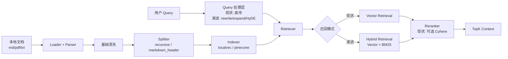

# RAG 组件功能 Proposal

## 1. 背景

当前项目已经落地了一套可运行的 RAG 组件，核心链路是：

- `Loader` 读取本地 `md`、`pdf`、`txt` 文档
- `Splitter` 进行递归切分或 Markdown 标题切分
- `Indexer` 将 chunk 写入 `localvec` 或 `pinecone`
- `Retriever` 基于 embedding 做向量召回
- `Reranker` 可选使用 Cohere 做重排

这条链路已经能支撑“离线建索引 + 在线按 query 检索”的基础功能，但离“稳定、可扩展、可评估”的生产级 RAG 还有明显差距。结合当前实现和通用 RAG 问题，主要痛点集中在以下几类：

- 单一检索策略导致召回偏差。当前实现只有向量检索，没有 BM25，也没有混合召回；短 query、实体词 query、缩写 query 的召回质量容易不稳定。
- 缺少 Query 理解层。当前 `Retrieve` 直接拿原始 query 去检索，没有意图识别、query rewrite、query expansion、HyDE 等预处理能力。
- 精排能力存在但较弱。代码里已经支持可选 Cohere rerank，但默认关闭，且只对召回出的纯文本做重排，没有利用 metadata，也没有多策略降级。
- 离线数据处理仍然基础。当前 PDF 解析和 Markdown 清洗主要是文本级预处理，没有 layout analysis、OCR、表格结构识别等能力。
- 分块策略不够丰富。当前仅支持递归切分和 Markdown 标题切分，尚未支持语义分块、按文档结构保留章节层级、增强 chunk metadata。
- 缺少评估与观测。当前没有 Recall@K、MRR、NDCG、Precision@K 等评测闭环，也没有缓存与性能指标体系。

如果不把这些问题明确纳入 proposal，后续继续堆 prompt 或模型参数，只会把问题从“检索质量不足”伪装成“生成效果不稳定”，排障成本会越来越高。

## 2. 目标

- 目标 1：明确当前项目 RAG 组件已经提供的能力边界，避免把配置占位误认为完整能力。
- 目标 2：在不破坏现有组件装配方式的前提下，给出一条从“基础向量 RAG”演进到“可评估的两阶段 RAG”的方案。
- 目标 3：围绕 Query 理解、离线解析、召回、精排、性能治理五个环节补齐关键缺口。
- 目标 4：保持现有接口和运行时模型基本兼容，支持按开关逐步启用新能力。

## 3. 非目标

- 非目标 1：本 proposal 不重写 Agent 主流程，也不把所有问题都改造成 RAG 调用。
- 非目标 2：本 proposal 不要求一次性引入所有学术优化技巧，优先解决当前代码中的核心短板。
- 非目标 3：本 proposal 不覆盖生成模型、Prompt 模板和答案后处理的系统性改造。
- 非目标 4：本 proposal 不承诺立即替换现有向量库后端，`dev/localvec` 与 `pinecone` 仍是现阶段主路径。

## 4. 现状与约束

技术现状：

- `Loader` 仅支持本地文件，支持 `pdf`、`md`、`txt` 三类输入。
- `Parser` 对 Markdown 和 PDF 做了基础清洗，但没有结构化版面恢复。
- `Splitter` 支持 `recursive` 和 `markdown_header` 两种切分策略。
- `Indexer/Retriever` 仅支持向量索引与向量检索，后端为 `localvec` 或 `pinecone`。
- `Reranker` 仅支持 `cohere`，且默认关闭。
- 运行时支持 `namespace`、`target_index`、`top_k`、`top_n`、`batch_size` 等调用级参数。
- 检索结果结构目前只有 `content` 和 `relevance_score`，且未保留召回来源、chunk metadata、原始向量分数等调试信息。

依赖现状：

- embedding 依赖 Genkit Registry 中已注册的模型，默认示例使用 `dashscope/text-embedding-v4`。
- 在线向量检索依赖 `localvec` 或 `pinecone` 插件能力。
- 可选精排依赖 Cohere API Key。

兼容性约束：

- 现有 `RAG` 组件已经以复合组件方式集成到运行时，不能通过一次大改破坏组件初始化和配置装配。
- 现有索引 CLI `cmd/index.go` 已依赖 `Load -> Split -> Index` 流程，新方案应尽量兼容该入口。
- 当前不少配置字段更偏 schema 占位，proposal 需要避免承诺超出实际代码能力的行为。

## 5. 方案设计

### 5.1 总体方案

总体思路是保留当前 RAG 组件的五段式装配边界，在其上逐步补齐两类能力：

- 第一类是“把现在做对”：补全 Query 理解、metadata、评估、错误处理和观测，让现有向量 RAG 更稳定。
- 第二类是“把后续做强”：引入混合检索、两阶段召回、语义分块、文档结构恢复和缓存，形成可持续优化的架构。

换句话说，这不是推翻当前实现，而是在 `Loader -> Splitter -> Indexer -> Retriever -> Reranker` 的既有骨架上，把单路向量检索扩展为“离线处理更干净、在线召回更全面、排序更可控”的 RAG 系统。

### 5.2 架构图或流程图

### 5.3 关键改动

#### 模块 A：Query 理解层

- 新增 query 处理模块，统一承接意图识别、query rewrite、query expansion、HyDE。
- 保持对现有 `RAG.Retrieve(ctx, namespace, queries, opts...)` 的兼容，优先在内部扩展，不强制改调用方接口。
- 默认策略为“失败回退原 query”，避免把 query 优化变成主链路单点故障。

#### 模块 B：离线文档处理

- 保留当前 Markdown/PDF 文本清洗逻辑，新增结构化解析扩展点。
- 在 PDF 场景预留 layout analysis、OCR、表格识别能力，先通过 parser 扩展，不直接侵入运行时主干。
- chunk 除正文外，补充 `source`、`title`、`header_path`、`page`、`updated_at` 等 metadata。

#### 模块 C：分块策略

- 现有 `recursive` 和 `markdown_header` 保留。
- 新增语义分块策略，支持 chunk overlap 与结构边界约束。
- 对 Markdown 标题切分结果保留章节层级 metadata，避免进入索引后丢失结构信息。

#### 模块 D：召回与排序

- 保留现有向量检索路径作为默认基线。
- 引入 BM25 或等价关键词检索能力，形成混合检索。
- 在召回后增加统一 merge 层，处理去重、分数归一化、来源标记。
- 继续沿用可选 rerank 设计，但把它从“纯文本重排”升级为“候选集精排”，并支持只对前 N 个候选执行。

#### 模块 E：性能与治理

- 索引构建支持更明确的批量策略和异步流水线。
- 在线链路增加 embedding 缓存、检索结果缓存和答案缓存。
- 为 query rewrite、HyDE、rerank 增加超时和开关。
- 引入统一评测集和离线评估工具，避免效果判断只靠主观体验。

### 5.4 数据与接口变化

新增接口：

- `QueryProcessor`：统一处理意图识别、改写、扩写、HyDE。
- `HybridRetriever`：聚合向量检索与关键词检索。
- `ChunkMetadataBuilder`：在切分阶段产出结构化 metadata。
- `RetrievalEvaluator`：提供 Recall@K、MRR、NDCG、Precision@K 等评估能力。

字段变更：

- `RetrieveResult` 建议扩展 `metadata`、`source`、`retrieve_score`、`rerank_score`、`recall_source`。
- 索引文档建议保留章节路径、文档来源、页码、更新时间等 metadata。

兼容性影响：

- 对外查询接口可保持不变，但返回数据结构建议向后兼容扩展。
- 旧索引可以继续读取；新 metadata 缺失时按空值处理。
- 对调用方来说，新能力优先通过配置开关渐进启用。

迁移方式：

- 第一步：先扩展结果结构和评估工具，不改默认召回策略。
- 第二步：新增 metadata 和更强的离线解析，但保留旧 splitter 配置。
- 第三步：引入混合检索和 query rewrite，以开关方式灰度启用。
- 第四步：补齐 rerank、缓存和性能治理。

### 5.5 错误处理与降级

可能失败的环节：

- PDF 解析质量不稳定。
- query rewrite 或 HyDE 调用失败。
- BM25、向量检索或 rerank 其中一路失败。
- 外部向量库或 Cohere API 不可用。

失败后的处理方式：

- 解析失败的文档标记质量状态，避免直接进入主索引。
- Query 处理失败回退原始 query。
- 混合检索任一路失败时保留另一路结果。
- rerank 失败时回退粗召回结果，不阻断回答。

降级策略：

- 默认始终保留“单路向量检索”作为最低可用路径。
- 高延迟场景下关闭 query expansion、HyDE 或 rerank。
- 外部依赖不可用时回退到 `dev/localvec` 或无 rerank 模式。

## 6. 当前实现与目标方案的差距

已实现：

- 本地文档加载
- PDF/Markdown 基础清洗
- 递归切分与 Markdown 标题切分
- `localvec` / `pinecone` 向量索引与检索
- 可选 Cohere rerank
- namespace、target index、top-k、top-n、batch size 等运行时参数

未实现但需要纳入 proposal：

- BM25 和混合检索
- query rewrite、query expansion、HyDE、意图识别
- layout analysis、OCR、表格结构恢复
- 语义分块与丰富 metadata
- 缓存体系、性能治理、评估体系

需要特别说明的事实：

- 当前配置里部分 `storage_path`、`index_format`、`dimension` 字段并未被运行时完整消费，更多是配置占位。
- 当前检索结果未保留足够的中间信息，导致调试“为什么没召回/为什么排前面”成本较高。

## 7. 设计原则

- 原则 1：先保证召回质量，再优化排序。rerank 不能拯救错误候选集。
- 原则 2：混合检索应作为中长期核心策略，向量检索与 BM25 是互补关系。
- 原则 3：离线数据质量决定上限，文档解析和分块不是附属问题。
- 原则 4：所有增强能力都要有开关、超时、降级路径，避免伤害主链路稳定性。
- 原则 5：proposal 必须忠于当前实现，区分“已支持”“配置占位”“计划补齐”。

## 8. 评估体系

建议补齐两套评估。

离线评估指标：

- `Recall@K`
- `MRR`
- `NDCG`
- `Precision@K`

在线观测指标：

- 检索耗时
- rerank 耗时
- 缓存命中率
- query rewrite 命中率
- 引用文档命中率
- 人工标注正确率

基准集至少覆盖以下 query 类型：

- 短 query
- 口语化 query
- 包含专业术语的 query
- 实体词/版本号/配置项 query
- 表格型或结构化信息 query

## 9. 实施步骤

1. 梳理当前实现与配置真实边界，补全文档与结果结构。
2. 增加 retrieval 评测集和离线评估脚本，建立基线。
3. 为 chunk 增加 metadata，并补强 PDF/Markdown 解析扩展点。
4. 引入 query rewrite 和混合检索，先灰度验证召回收益。
5. 完善 rerank、merge、降级与超时控制。
6. 引入缓存和性能治理，控制时延与成本。
7. 视评估结果决定是否替换 embedding 模型或做领域微调。

## 10. 风险与后续任务

- 混合检索、HyDE、rerank 会增加外部调用成本与时延，需要严格控制默认策略。
- 文档结构恢复如果做得不彻底，可能把解析复杂度引入系统但没有显著收益。
- embedding 替换和领域微调需要评测集支撑，否则很容易“看起来更高级，实际更不稳定”。
- 若不尽快补齐 metadata 与评估体系，后续所有优化都很难客观比较。
