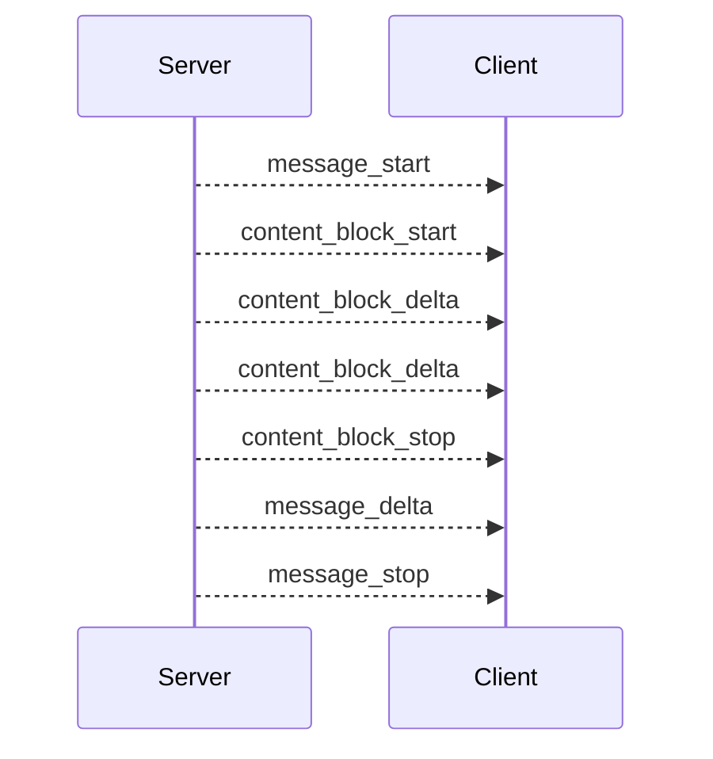

# API 文档

本页说明 Dubbo Admin AI 当前对外暴露的 HTTP 接口和 SSE 事件模型。所有接口都由 `Server` 组件提供，基础前缀为：

```text
/api/v1/ai
```

## 1. 接口总览

| 方法 | 路径 | 说明 |
| --- | --- | --- |
| `POST` | `/api/v1/ai/sessions` | 创建新会话 |
| `GET` | `/api/v1/ai/sessions` | 列出当前有效会话 |
| `GET` | `/api/v1/ai/sessions/:sessionId` | 查询单个会话 |
| `DELETE` | `/api/v1/ai/sessions/:sessionId` | 删除会话并清空对应历史 |
| `POST` | `/api/v1/ai/chat/stream` | 发起流式对话 |
| `GET` | `/health` | 健康检查 |

统一响应格式如下：

```json
{
  "message": "success",
  "data": {},
  "request_id": "req_xxx",
  "timestamp": 1741233600
}
```

## 2. 创建会话

### 请求

```http
POST /api/v1/ai/sessions
```

### 示例

```bash
curl -sS -X POST http://localhost:8880/api/v1/ai/sessions
```

### 响应示例

```json
{
  "message": "success",
  "data": {
    "session_id": "session_123",
    "created_at": "2026-03-06T12:00:00+08:00",
    "updated_at": "2026-03-06T12:00:00+08:00",
    "status": "active"
  },
  "request_id": "req_123",
  "timestamp": 1741233600
}
```

### 说明

- 服务端会生成 `session_<uuid>` 形式的 ID。
- 会话超过 24 小时无活动会被视为过期。
- 开发模式下还会自动创建一个 `session_test` 便于联调。

## 3. 列出会话

### 请求

```http
GET /api/v1/ai/sessions
```

### 响应示例

```json
{
  "message": "success",
  "data": {
    "sessions": [
      {
        "session_id": "session_123",
        "created_at": "2026-03-06T12:00:00+08:00",
        "updated_at": "2026-03-06T12:05:00+08:00",
        "status": "active"
      }
    ],
    "total": 1
  },
  "request_id": "req_456",
  "timestamp": 1741233900
}
```

## 4. 查询单个会话

### 请求

```http
GET /api/v1/ai/sessions/:sessionId
```

### 示例

```bash
curl http://localhost:8880/api/v1/ai/sessions/session_test
```

如果 session 不存在或已过期，接口会返回错误。

## 5. 删除会话

### 请求

```http
DELETE /api/v1/ai/sessions/:sessionId
```

### 行为说明

- 从 Session Manager 中删除会话。
- 如果 Agent 持有可访问的 Memory，会同时执行 `memory.Clear(sessionID)`。
- 这是“逻辑删除 + 清理历史”，不是持久化存储层面的删除，因为当前 Memory 本身是进程内内存结构。

## 6. 发起流式对话

### 请求

```http
POST /api/v1/ai/chat/stream
Content-Type: application/json
Accept: text/event-stream
```

### 请求体

```json
{
  "message": "请帮我分析服务超时的可能原因",
  "sessionID": "session_test"
}
```

字段说明：

| 字段 | 类型 | 必填 | 说明 |
| --- | --- | --- | --- |
| `message` | string | 是 | 用户输入 |
| `sessionID` | string | 是 | 已存在的会话 ID |

### 示例

```bash
curl -N -X POST http://localhost:8880/api/v1/ai/chat/stream \
  -H "Content-Type: application/json" \
  -H "Accept: text/event-stream" \
  -d '{"message":"hello","sessionID":"session_test"}'
```

## 7. SSE 事件模型

服务端将 Agent 的中间与最终输出转换为 SSE 事件流。当前实现中常见事件类型如下：

| 事件 | 说明 |
| --- | --- |
| `message_start` | 一条 assistant 消息开始 |
| `content_block_start` | 一个内容块开始 |
| `content_block_delta` | 增量文本输出 |
| `content_block_stop` | 一个内容块结束 |
| `message_delta` | 消息级增量，通常携带 stop reason 或 usage |
| `message_stop` | 当前消息结束 |
| `error` | 处理过程中出现错误 |

### 事件顺序示意



### 事件示例

```text
event: content_block_delta
data: {"type":"content_block_delta","index":0,"delta":{"type":"text_delta","text":"正在分析调用链路..."}}
```

客户端实现建议：

- 以 `event` 字段判断事件类型，而不是只拼接 `data`。
- 仅当收到 `message_stop` 时，才认为本轮输出完成。
- 对 `error` 事件和非 2xx HTTP 状态都要统一处理。

## 8. 错误语义

常见错误来源：

- 请求体不合法：`400 Bad Request`
- `sessionID` 不存在或过期：`400 Bad Request`
- SSE writer 创建失败：`500 Internal Server Error`
- Agent 运行异常：通过 `error` 事件下发

需要注意的是，流式接口一旦开始输出 SSE，后续的业务异常通常不会再通过普通 JSON 响应返回，而是以 `error` 事件形式传给客户端。

## 9. 健康检查

### 请求

```http
GET /health
```

### 响应

```json
{
  "status": "ok"
}
```

这个接口只代表 HTTP 服务已启动，不代表模型 Provider、MCP 工具或向量后端一定可用。生产环境应补充更细的依赖探活。
