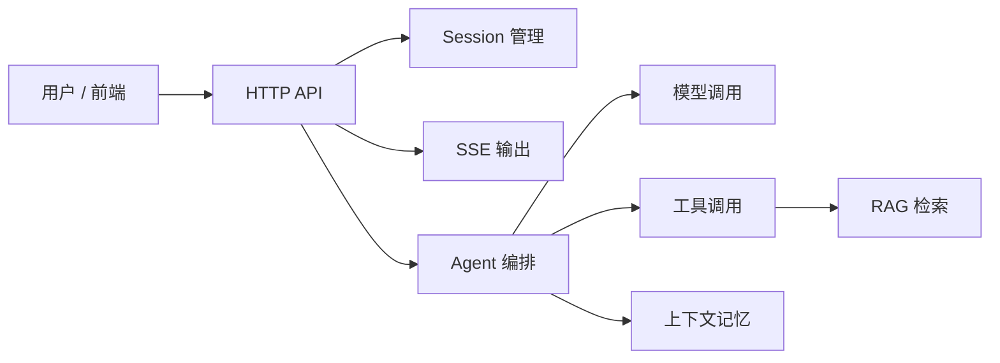

# 用户指南

本节面向两类人：

- 接入方：需要知道怎么调用服务、怎么消费 SSE、怎么管理会话。
- 运维方：需要知道怎么部署、看什么指标、遇到故障先查哪里。

Dubbo Admin AI 不是单个模型接口的简单封装。它对外看起来是一个 HTTP 服务，但内部会经历会话校验、Agent 编排、模型推理、工具调用和知识检索，所以线上问题通常也会分布在这些环节。

## 系统概览

## 内容范围

- [API 文档](api.md)：接口路径、请求结构、响应结构、SSE 事件说明。
- [部署与运维](deployment-operations.md)：启动方式、生产部署建议、健康检查和运行观察点。
- [YAML 配置详解](yaml-configuration.md)：逐字段解释主配置和各组件 YAML。
- [故障排查](troubleshooting.md)：从“服务起不来”到“检索效果差”的定位路径。
- [FAQ](faq.md)：容易踩坑但不值得单独写成长文的问题。

## 使用流程

1. 创建会话。
2. 使用 `sessionID` 调用流式对话接口。
3. 前端按 SSE 事件顺序拼接内容。
4. 服务端把对话历史保存在 Memory 中，后续请求继续复用该 session。

## 开发者文档入口

当你遇到下面这些问题时，用户文档通常不够，需要转到开发者指南：

- 为什么某个阶段会重复调用工具？
- 为什么配置里的某个字段改了却不生效？
- 为什么 Memory 的 `max_turns` 和实际上下文窗口行为不一致？
- 为什么组件明明支持多实例，运行时却还是单实例？

这类问题需要结合代码实现理解，入口见[架构总览](../developer-guide/architecture-overview.md)。
