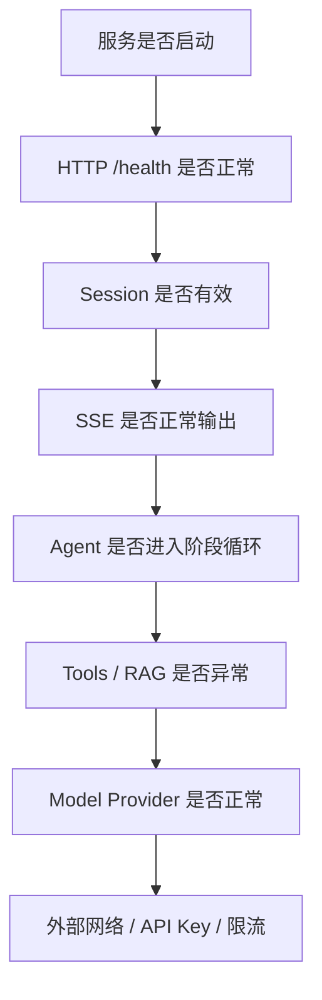

# 故障排查

排查 Dubbo Admin AI 的问题，最有效的方法不是“看哪里报错就修哪里”，而是按请求链路从外到内定位：HTTP 层、Session、Agent、Tools、RAG、Models、外部依赖。

## 排查顺序



## 1. 服务无法启动

### 现象

执行以下命令后直接退出或报错：

```bash
go run main.go --config ./config.yaml
```

### 排查顺序

1. `config.yaml` 路径是否正确。
2. 各组件 YAML 是否存在，类型字段是否正确。
3. `.env` 是否存在关键变量。
4. Schema 目录是否存在。
5. 端口是否被占用。

### 常见原因

- YAML 缩进错误
- 组件 `type` 写错
- 配置字段名拼写错误，被严格解码拦下
- `read_timeout`、`port` 等字段值非法

## 2. `/health` 正常，但创建会话失败

### 现象

`POST /api/v1/ai/sessions` 返回异常。

### 排查重点

- 路由前缀是否正确：`/api/v1/ai`
- 网关是否改写了路径
- 服务是否部署在你以为的那一版

如果 `/health` 正常但会话接口失败，问题多半不在模型层，而在路由、代理或版本一致性。

## 3. 流式接口直接返回“Invalid session ID”

### 现象

`POST /api/v1/ai/chat/stream` 返回 `400`，提示 session 无效。

### 原因

- 没有先创建会话
- 使用了错误的字段名
- 会话已过期
- 会话已被删除

### 正确请求体

```json
{
  "message": "hello",
  "sessionID": "session_test"
}
```

注意是 `sessionID`，不是 `session_id`。

## 4. SSE 建立了，但一直没有内容

### 现象

连接建立成功，但客户端长时间等不到增量文本。

### 优先排查

1. 客户端是否带了 `Accept: text/event-stream`
2. 是否使用支持实时输出的客户端，比如 `curl -N`
3. 代理层是否缓存或截断响应
4. Agent 是否卡在模型调用或工具调用
5. Provider 是否超时或限流

### 常见误区

- 只看到 HTTP 200 就以为服务正常，实际上流式链路可能早已卡住。
- 代理默认开启缓冲，导致服务端已经 flush 了，客户端仍然看不到。

## 5. 模型调用失败

### 常见表现

- 返回 `error` SSE 事件
- 日志里出现上游 Provider 报错
- 长时间无输出后结束

### 常见原因

- API Key 无效或过期
- 模型名与 Provider 不匹配
- 出网受限
- 上游限流
- 上游接口格式变化

### 排查建议

1. 先确认 API Key 是否存在。
2. 再确认 `component/models/models.yaml` 中的 provider 和 model 名是否一致。
3. 检查是否最近切换过默认模型。
4. 查看 Provider 返回的原始错误信息。

## 6. 工具调用异常

### 症状

- 模型判断需要工具，但工具阶段报错。
- 结果里反复出现工具失败信息。
- Agent 多次循环仍无法结束。

### 排查重点

- Tools 组件是否初始化成功
- 工具名是否注册成功且无冲突
- input schema 是否与模型生成参数匹配
- 外部依赖是否可访问
- MCP 工具是否已启动或可发现

如果使用的是 internal tool，还要确认对应依赖组件已经初始化，比如 memory 或 rag。

## 7. RAG 检索效果差

### 症状

- 回答不引用知识库
- 检索结果空或相关性差
- 回答明显不基于最新文档

### 排查顺序

1. 索引是否已经构建。
2. 在线检索使用的 embedder 是否和建索引时一致。
3. chunk 大小和 overlap 是否合理。
4. top-k 是否过小或过大。
5. reranker 是否开启，配置是否正确。

### 建议命令

```bash
go run cmd/index.go
```

## 8. 会话上下文不连续

### 现象

连续提问时，系统像“失忆”一样。

### 真实原因通常有三种

- 用了新的 `sessionID`
- 服务实例重启，进程内 Memory 丢失
- 当前窗口记忆只有有限轮次，旧消息被移出窗口

这不是简单的前端问题，而是当前 Memory 设计决定的结果。

## 9. 排查时最值得看的日志

建议优先找这些关键信息：

- 请求 ID / session ID
- 进入哪个接口
- Agent 当前阶段
- 工具名称和执行结果摘要
- Provider 错误码和耗时
- 是否触发 `error` SSE 事件

## 10. 一条实用的定位原则

如果问题出现在：

- 建连前：看 HTTP、路由、端口、代理
- 建连后无内容：看 SSE、Agent、Model
- 有内容但质量差：看 Prompt、Tools、RAG、模型配置
- 只在生产出现：优先怀疑代理超时、密钥权限、网络边界和限流
