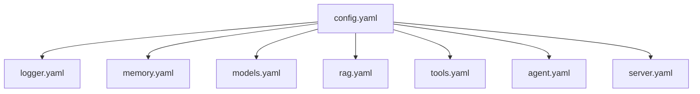

# YAML 配置详解

本页专门解释 Dubbo Admin AI 的 YAML 配置。它面向两类需求：

- 你想知道某个字段到底控制什么。
- 你已经能启动服务，但准备系统性调整模型、工具、RAG 或服务参数。

## 1. 配置结构概览

项目配置分成两层：

- `config.yaml`：总装配入口，声明要加载哪些组件配置。
- `component/**.yaml`：各组件的具体配置。



配置加载时会经历：

1. 读取 `.env`
2. 展开 `${VAR}`
3. Schema 默认值填充与校验
4. 严格解码未知字段

## 2. 主配置

配置文件：`config.yaml`

这份文件只做一件事：定义本次运行需要装配的组件。

```yaml
project: dubbo-admin-ai
version: 1.0.0
components:
  logger: component/logger/logger.yaml
  models: component/models/models.yaml
  server: component/server/server.yaml
  memory: component/memory/memory.yaml
  tools: component/tools/tools.yaml
  rag: component/rag/rag.yaml
  agent: component/agent/agent.yaml
```

字段说明：

- `project`：项目名，用于标识配置所属项目。
- `version`：配置版本标记。
- `components`：组件名到 YAML 路径的映射。

使用建议：

- 先保证路径正确，再调整组件内容。
- 不要随意移除某个组件，除非你已经确认运行时依赖允许它缺失。

## 3. 日志配置

配置文件：`component/logger/logger.yaml`

```yaml
type: logger
spec:
  level: "info"
```

字段说明：

- `type`：组件类型，必须与工厂注册名一致。
- `spec.level`：日志级别，支持 `debug`、`info`、`warn`、`error`。

使用建议：

- 开发环境用 `debug` 或 `info`。
- 生产环境通常从 `info` 开始。

## 4. Memory 配置

配置文件：`component/memory/memory.yaml`

```yaml
type: memory
spec:
  history_key: "chat_history"
  max_turns: 100
```

字段说明：

- `history_key`：历史对象在 context 中使用的键名。
- `max_turns`：期望的最大轮数配置。

注意：

- 当前实现里，`max_turns` 和实际窗口行为不是完全一一对应，不能简单理解成“Prompt 固定保留 100 轮历史”。

## 5. Models 配置

配置文件：`component/models/models.yaml`

这是最关键的一份业务配置。

```yaml
type: models
spec:
  default_model: "dashscope/qwen-max"
  default_embedding: "dashscope/text-embedding-v4"
  providers:
    dashscope:
      api_key: "${DASHSCOPE_API_KEY}"
      base_url: "https://dashscope.aliyuncs.com/compatible-mode/v1"
```

关键字段说明：

- `default_model`：默认聊天模型，通常是 `provider/model` 格式。
- `default_embedding`：默认 embedding 模型。
- `providers.<name>.api_key`：Provider 密钥。
- `providers.<name>.base_url`：Provider 接口地址。
- `providers.<name>.models[]`：聊天、代码、多模态模型列表。
- `providers.<name>.embedders[]`：embedding 模型列表。

子字段说明：

- `name`：展示名或别名。
- `key`：真正传给 Provider 的模型标识。
- `type`：模型类型，例如 `chat`、`code`、`multimodal`、`text`。
- `dimensions`：embedding 维度。

使用建议：

- `default_model` 必须在对应 Provider 中可注册。
- 至少保证一个 Provider 的 `api_key` 非空且可用。
- 调整 embedding 模型前，先评估现有索引是否需要重建。

## 6. RAG 配置

配置文件：`component/rag/rag.yaml`

```yaml
type: rag
spec:
  embedder:
    type: genkit
    spec:
      model: dashscope/text-embedding-v4
  loader:
    type: local
  splitter:
    type: recursive
    spec:
      chunk_size: 1000
      overlap_size: 100
```

关键字段说明：

- `embedder.type`：embedding 能力来源。
- `embedder.spec.model`：向量化模型。
- `loader.type`：文档加载方式。
- `splitter.type`：切分策略。
- `splitter.spec.chunk_size`：chunk 大小。
- `splitter.spec.overlap_size`：chunk 重叠大小。
- `indexer.type`：索引写入后端。
- `retriever.type`：检索后端。
- `reranker.type`：重排器类型。
- `reranker.spec.enabled`：是否启用重排。
- `reranker.spec.model`：重排模型。
- `reranker.spec.api_key`：重排服务密钥。

使用建议：

- 建索引和在线检索尽量使用同一 embedding 模型。
- `chunk_size` 过大通常会降低检索精度。
- 如果只是先验证主链路，RAG 可先保持默认。

## 7. Tools 配置

配置文件：`component/tools/tools.yaml`

```yaml
type: tools
spec:
  enable_mock_tools: true
  enable_internal_tools: true
  enable_mcp_tools: false
  mcp_host_name: "mcp_host"
  mcp_timeout: 30
  mcp_max_retries: 3
```

字段说明：

- `enable_mock_tools`：是否启用 mock 工具。
- `enable_internal_tools`：是否启用进程内工具。
- `enable_mcp_tools`：是否启用 MCP 工具。
- `mcp_host_name`：MCP host 注册名。
- `mcp_timeout`：MCP 调用超时秒数。
- `mcp_max_retries`：MCP 最大重试次数。

使用建议：

- 本地开发先关闭 MCP。
- 生产环境启用 MCP 前，先明确外部命令、权限和网络边界。

## 8. Agent 配置

配置文件：`component/agent/agent.yaml`

```yaml
type: agent
spec:
  agent_type: "react"
  model: "dashscope/qwen3.5-plus"
  prompt_base_path: "./prompts"
  max_iterations: 10
```

关键字段说明：

- `agent_type`：Agent 实现类型，当前默认是 `react`。
- `model`：Agent 默认使用的模型。
- `prompt_base_path`：Prompt 文件目录。
- `max_iterations`：最大循环次数。
- `stage_channel_buffer_size`：阶段 channel 缓冲大小。
- `mcp_host_name`：预留给 MCP 相关能力的主机名配置。
- `stages[]`：阶段定义列表。

每个 `stages[]` 子项包括：

- `name`
- `flow_type`
- `prompt_file`
- `temperature`
- `top_p`
- `max_tokens`
- `timeout`
- `enable_tools`

使用建议：

- `prompt_base_path` 和 `prompt_file` 必须能定位到真实文件。
- `max_iterations` 不宜过大。
- 不需要工具的阶段应显式关闭 `enable_tools`。

## 9. Server 配置

配置文件：`component/server/server.yaml`

```yaml
type: server
spec:
  port: 8880
  host: "localhost"
  debug: false
  cors_origins: ["*"]
  read_timeout: 30
  write_timeout: 30
```

字段说明：

- `host`：监听地址。
- `port`：监听端口。
- `debug`：Gin 运行模式。
- `cors_origins`：允许的跨域来源。
- `read_timeout`：读超时秒数。
- `write_timeout`：写超时秒数。

使用建议：

- 本地开发可用 `localhost`。
- 容器或远程部署通常应改成 `0.0.0.0`。
- SSE 场景下 `write_timeout` 不要设置过短。

## 10. 配置排查顺序

改 YAML 后如果系统行为不符合预期，建议按这个顺序排查：

1. 文件路径是否正确。
2. `type` 是否匹配对应组件。
3. 环境变量是否已正确展开。
4. Schema 是否允许该字段。
5. 当前执行逻辑是否真正使用了该字段。

最后一项最容易被忽略。某个字段“能写”不代表“已经完整生效”。
